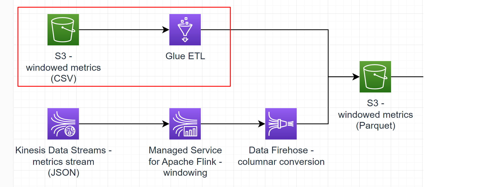

# Sub-task 1 - ingesting with Glue ETL

# Learning prerequisites
* [Data engineering with AWS](https://learn.epam.com/detailsPage?id=b478ad0c-a4cc-4d27-a093-1d4661bfc19e) (EPAM Learn course, it will be assigned to you by the organizers)
  * **NOTE**: Although only sections 1-2 are required for this sub-task, this course gives a high-level overview of most services you will use
    in subsequent sub-tasks. It's very convenient to see the big picture beforehand, so take your time to complete it.
* [AWS Glue Getting Started](https://explore.skillbuilder.aws/learn/course/internal/view/elearning/8171/getting-started-with-aws-glue) (AWS Skill Builder)

# Goal
* write a Python script to transform windowed metric documents from CSV files to Parquet files
* run the script using Glue ETL
* optional - write another Glue ETL job to ingest plain metrics documents from CSV and calculating windows on them

# Instructions

## Step 0 - create shared artefacts
The following things are required as part of the final exam evaluation for **all the AWS practical tasks**. Also, this will help to keep things
organised and easy to track.
* Code project
  * create a code project in your favourite IDE
  * it's recommended to create one module/folder per task in it
  * put it under version control - use either EPAM GitLab or any online repo like GitHub - just be ready to share access with your mentor/peer
* S3 location for tracking code that will run in AWS - **we will refer to it as Source Code Bucket in upcoming tasks**
  * you may create multiple S3 buckets per type of code (Python, Java, CloudFormation, etc)
  * or you may choose to have one bucket with folders in it
  * **make sure to include your name** (e.g. `ybaranouski` or `Yauhen_B` or else) in the bucket name
  * you will upload the following things there
    * any Python scripts/libraries
    * Cloud Formation templates - if you choose to automate resource creation (optional)
    * pre-built JARs

## Step 1 - setting up the inputs and outputs
* create S3 buckets
  * **make sure the bucket names include your name** (e.g. `ybaranouski` or `Yauhen_B` or else)
  * create a bucket for storing the windowed metrics in the CSV format
  * create a bucket for storing the windowed metrics in the Parquet format
  * use the CSV metrics task provided by the [test data generator and copy](../materials/test-data-generator-prebuilt) the resulting files to the CSV bucket

## Step 2 - create an ETL job
* follow [this guide](https://docs.aws.amazon.com/prescriptive-guidance/latest/patterns/three-aws-glue-etl-job-types-for-converting-data-to-apache-parquet.html) to create a Glue ETL job
* **PAY ATTENTION TO THE FOLLOWING PITFALLS**:
  * do not use nor Visual Editor, nor Notebooks - these will cost you money 

## Step 3 - run the ETL job
* run the job once for every generated CSV
  * use the CSV bucket as the _input_loc_ parameter for this
  * use the Parquet bucket as the _output_loc_ parameter
* make sure your _output_loc_ has the following format: `<bucket-name>/<component-name>/`, for example `ybaranouski-dt4j-metrics-table/order-service/`
* make sure you've chosen **Script editor** section for editing Python code (other options can bring about opening interactive session and be a cause of extra charges)
* make sure to choose the **Python shell** job type and **0.0625 DPU** of compute

# Cost management recommendations
* make sure the ETL job is shut down

# Intermediate exam
None. A demo expected for **task 2**.

# To know for the final exam Q&A
1. What services are included into AWS Glue?
2. What backs AWS Glue ETL jobs?
3. Is it possible to run Glue ETL jobs incrementally (e.g. when new input files are added daily and we don’t want to process what has already been processed)?
4. What’s the difference between Glue PyShell vs Glue notebook?
