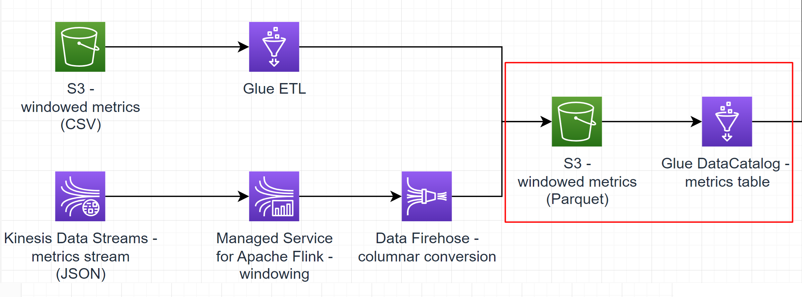

# Sub-task 2 - querying with Glue DataCatalog and Athena



# Goal
* create a DataCatalog table for the windowed metrics dataset
* query the table using Athena

# Instructions

## Step 1 - create a Glue DataCatalog table

* create a Data Catalog database - this one will be used not only for this sub-task, so name it properly
* recap the _Windowed metrics_ model
* [manually create a Data Catalog table](https://docs.aws.amazon.com/glue/latest/dg/console-tables.html)
    * make sure to include your name into the table name (for example, `ybaranouski` or `Yauhen_B`, or else)
    * choose the _Parquet_ format
    * associate the table with the previously created database
    * point the table to the S3 windowed metrics (Parquet) bucket created in sub-task 1
    * add columns according to the model
      * componentName - string, **this must be the partition key**
      * fromTimestamp - string
      * maxValue - double
      * metricName - string
      * minValue - double
      * toTimestamp - string
      * unit - string
* **PAY ATTENTION TO THE FOLLOWING PITFALLS**
  * make sure to add the columns in the order exactly as in the header of the CSVs generated in sub-task 1
  * before confirming the table creation, make sure the `componentName` column is at position 1 - manually adjust, if Glue Catalog tries pushing it at the end

## Step 2 - partition the Glue DataCatalog table
* set up Athena
  * create another S3 bucket 
  * open Athena query editor and configure the bucket as an output location in Settings
  * before running any read queries, add one partition per unique `componentName` in the data generated in sub-task 1, for example
```sql
ALTER TABLE `<your table name>`
    ADD PARTITION (componentname = 'order-service') LOCATION 's3://ybaranouski-dt4j-metrics-table/order-service/'
    ADD PARTITION (componentname = 'user-service') LOCATION 's3://ybaranouski-dt4j-metrics-table/user-service/';
```

## Step 3 - query the Glue DataCatalog table
* experiment and make some SQL queries to the Metrics table
* **querying pitfalls**
  * DDL queries like `ADD PARTITION` above require table names to be enclosed into back-ticks (see the query example above)
  * in the `SELECT` queries though, table names and other identifiers are double-quoted like this `"metrics-table"`

# Cost management recommendations
* in case you tested the ETL job in conjunction with Athena, make sure the job is shut down

# Intermediate exam

In the scope of this task, the final exam minimal demonstration includes a **scree cast** that shows the following
1. an S3 bucket - referred to as "input" below
    1. having the student name in its name (e.g. `ybaranouski` or `Yauhen_B` or else)
    2. having two files: `order-service.csv` and `user-service.csv`
    3. open one of the files to show that it looks like this and highlight one of the rows - referred to as **chosen row** below
```csv
componentName,fromTimestamp,maxValue,metricName,minValue,toTimestamp,unit
order-service,2020-09-01T12:35:05.001Z,33.733208554451814,cpu,6.38975523943582,2020-09-01T12:35:15.001Z,percent
order-service,2020-09-01T12:35:05.001Z,57.9457410846168,ram,47.31919418315785,2020-09-01T12:35:15.001Z,percent
order-service,2020-09-01T12:35:15.001Z,37.0532206594587,cpu,9.466127064934511,2020-09-01T12:35:25.001Z,percent
order-service,2020-09-01T12:35:15.001Z,58.97717238123697,ram,47.99950698319854,2020-09-01T12:35:25.001Z,percent
order-service,2020-09-01T12:35:25.001Z,32.4572403612426,cpu,13.39478873881615,2020-09-01T12:35:35.001Z,percent
order-service,2020-09-01T12:35:25.001Z,46.50702379693269,ram,36.03431439176199,2020-09-01T12:35:35.001Z,percent
```
2. an S3 bucket - referred to as "output" below
    1. having the student name in its name (e.g. `ybaranouski` or `Yauhen_B` or else)
    2. empty at the beginning of the demo
3. configuration of a Glue ETL job pointing to the "input" and "output" buckets
4. successful run of the Glue ETL job
5. show the "output" bucket - it should have some files in it
6. show a Glue DataCatalog table schema that has the following columns
   1. componentName - string, partition key
   2. fromTimestamp - string
   3. maxValue - double
   4. metricName - string
   5. minValue - double
   6. toTimestamp - string
   7. unit - string
7. The table name must include the student name in its name (e.g. `ybaranouski` or `Yauhen_B` or else)
8. make an Athena query to find the **chosen row** selected above.

# To know for the final exam Q&A

1. What are the key API abstractions in Glue DataCatalog?
2. How does Glue table schema influence the file layout in S3?
