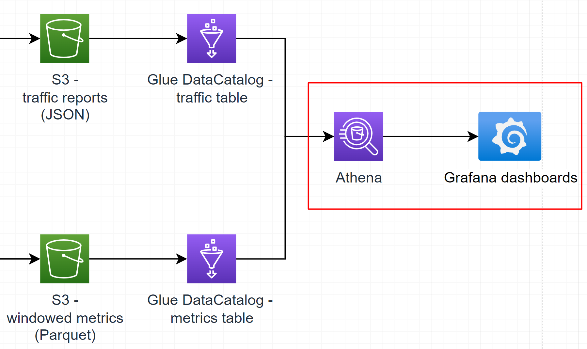

# Sub-task 3 - visualising with Grafana

# Learning prerequisites
* [Grafana overview](https://www.youtube.com/watch?v=w-c3KYKQQfs&ab_channel=edureka%21) (video)
* [Running Grafana in Docker](https://grafana.com/docs/grafana/latest/setup-grafana/installation/docker/) (official docs)
* [Athena Plugin for Grafana](https://grafana.com/grafana/plugins/grafana-athena-datasource/?tab=installation) (official docs)

# Goal
* familiarise with Grafana
* visualise an Athena datasource

# Instructions
* run Grafana instance locally [using Docker](https://grafana.com/docs/grafana/latest/setup-grafana/installation/docker/)
* to simplify things (especially if you use an EPAM AWS Sandbox), use the Grafana setup from `materials/aws-local-stack` (see the README there)
* configure the [Grafana Athena plugin](https://grafana.com/grafana/plugins/grafana-athena-datasource/) with credentials to access the Athena/Glue database created in sub-task 2
* create a Grafana dashboard which allows choosing a specific metric and component and showing a chart with average values for the metric over time

# Cost management recommendations
* in case you tested the ETL job in conjunction with Athena/Grafana, make sure the job is shut down

# Intermediate exam

In the scope of this task, the final exam minimal demonstration includes a **scree cast** that shows the following
1. open the UI of a locally running Grafana instance (the browser URL should be `http://localhost...`)
2. show a Grafana data source to prove that it's connected to Athena (the table name must include the student name in its name (e.g. `ybaranouski` or `Yauhen_B` or else))
3. show a Grafana dashboard
   1. show the dashboard config to prove that it points to the data source above
   2. fetch N first rows in Athena UI
   3. fetch the same N first rows in Grafana

# To know for the final exam Q&A

1. What data sources does Athena support?
2. On the high level, how does Athena query S3?
3. What are the available options for speeding up Athena queries on ever-growing S3 datasets?
4. What technology backs Athena?
