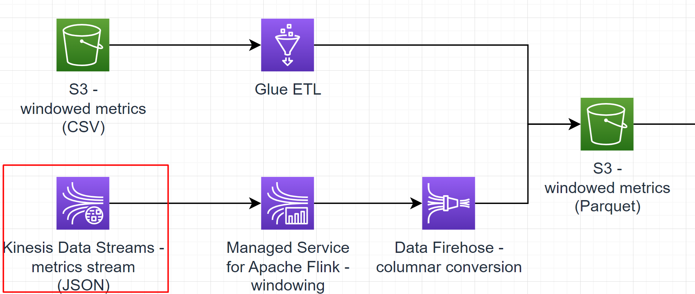

# Sub-task 4 - streaming with AWS Kinesis Data Streams



# Learning prerequisites
* [AWS for Developers: Data-Driven Serverless Applications with Kinesis](https://learn.epam.com/detailsPage?id=3d2f05f1-49a6-412a-83c4-def85e9e5ce2) (EPAM Learn course, it will be assigned to you by the organizers)

# Goal
* ingest data with Kinesis Data Streams

# Instructions

## Step 1 - create a Kinesis Data Stream
* create a CloudFormation template with a [Kinesis Data Streams resource](https://docs.aws.amazon.com/AWSCloudFormation/latest/UserGuide/aws-resource-kinesis-stream.html)
    * specify the _provisioned_ mode
    * specify 1 shard

## Step 2 - populate the stream with data
* **for personal AWS accounts**
  * make sure to use AWS CLI to generate valid access key id and secret key in `<user_home>/.aws/credentials`
* **for EPAM AWS Sandboxes and those who authenticate using any sort of SSO**
  * make sure to follow the Sandbox setup guide to configure a `sandx` profile in `<user_home>/.aws/credentials`
  * locate `aws/materials/aws-local-sandbox`
  * make sure to follow `One-time setup > Configure environment variables` README
  * open your PowerShell in `aws/materials/aws-local-sandbox/local-infra`
  * run `.\issue-aws-credentials.ps1` - this should output a JSON
  * in the Kinesis metrics stream generator config, add an `auth` object as follows:
```json5
{
  "@type": "kinesis-metrics-stream",
  "auth": {
    "accessKeyId": "<accessKeyId from the credentials JSON>",
    "secretKey": "<secretAccessKey from the credentials JSON>",
    "sessionToken": "<sessionToken from the credentials JSON>"
  },
  "stream": {
    // your stream config
  }
  // everything else
}
```
* run the template and make sure a stream is created
* generate metrics
    * make sure to authorise to your AWS account via AWS CLI
    * run the Kinesis metrics stream task provided by the test data generator - make sure to specify the correct AWS region and Kinesis stream name in the task config
* make sure the events are visible via the [AWS Console](https://docs.aws.amazon.com/streams/latest/dev/data-viewer.html)
    * **pitfall** - if you decide to consume data from the stream via Console **after the generator has stopped**, make sure to choose **Trim Horizon** option in the Console to see "old" data

# Cost management recommendations
* make sure to dispose the Kinesis Stream created with the CloudFormation template - **Kinesis Stream is the most expensive component in the overall solution**

# Intermediate exam
None. A demo expected for **task 6**.

# To know for the final exam Q&A

1. What are shards in Kinesis Data Streams? How do they implement scalability?
2. What is a partition key and sequence number in Kinesis Data Streams?
3. What is the difference between provisioned and on-demand capacity mode in Kinesis Data Streams?
4. What are the size and retention limitations in Kinesis Data Streams?
5. What AWS services can directly write to Kinesis Data Streams?
6. How can we monitor a Kinesis Data Stream? What metrics are available?

