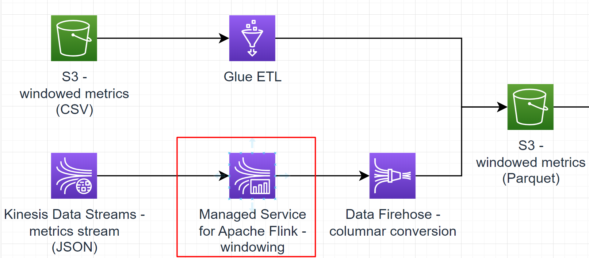

# Sub-task 5 - analysing with AWS Managed Service for Apache Flink

**NOTE**: AWS Managed Service for Apache Flink is mostly similar in functionality to its predecessor called AWS Kinesis Data Analytics. Both services are
based on Apache Flink.

# Learning prerequisites
* [Real-time streaming with Apache Flink, part 1](https://explore.skillbuilder.aws/learn/course/internal/view/elearning/16031/aws-partnercast-session-1-real-time-streaming-with-apache-flink-advanced-technical-advanced-level-300-technical) (AWS Skill Builder)
* [Real-time streaming with Apache Flink, part 2](https://explore.skillbuilder.aws/learn/course/internal/view/elearning/16036/aws-partnercast-session-2-real-time-streaming-with-apache-flink-technical-advanced-level-300-technical) (AWS Skill Builder)

# Goal
* write an Apache Flink application for computing windows on metrics events
* **Depending on your primary skill/learning goal**:
  * there are two implementation options: instructions option A and B
  * option A is for those whose primary skill is based on Java and/or the personal goal is to focus on Java Flink API
  * option B is for those whose primary skill is NOT based on Java and/or the personal goal is to focus on interactive analytics using Jupyter/Zeppelin-style notebooks
* deploy the Apache Flink application to Kinesis Data Analytics
* connect the Apache Flink application to a Kinesis stream

# Instructions option A - Java API

## Step 1 - learn about Apache Flink
* get to know or recap Apache Flink basics
    * [overview](https://nightlies.apache.org/flink/flink-docs-release-1.14/docs/dev/datastream/overview/)
    * [execution mode](https://nightlies.apache.org/flink/flink-docs-release-1.14/docs/dev/datastream/execution_mode/) - focus on streaming
    * [event time](https://nightlies.apache.org/flink/flink-docs-release-1.14/docs/concepts/time/)
    * [event time - custom watermarks](https://nightlies.apache.org/flink/flink-docs-release-1.14/docs/dev/datastream/event-time/generating_watermarks/)

## Step 2 - create a streaming application
* create an Apache Flink application that
    * reads events from a stream of events that correspond to the _Metrics stream_ model
    * applies [tumbling windows](https://nightlies.apache.org/flink/flink-docs-release-1.14/docs/dev/datastream/operators/windows/#tumbling-windows) to the stream - 5 minutes per window based on the event publication timestamp
    * reduces each window into an aggregate event that corresponds to the _Windowed metrics_ model
    * prints the resulting aggregate windows to `stdout`
* **implementation recommendations**
  * make sure to configure a **timestamp assigner**
  * make sure to configure a proper **watermark strategy with source idleness timeout**
  * follow the [Flink test template](../materials/flink-test-template/README.MD)
    * this template project will help you to set up a baseline for the dependencies required to package a Flink application for AWS deployment using an Uber (shaded) JAR
    * also it contains an example of how to handle serialisation and JSON mapping with Flink - **this is one of the main specifics of Flink API**
    * also, it contains a convenient template for running Flink integration tests locally against LocalStack's Kinesis implementation
    * in case you're more inclined towards Maven, you may still reuse the integration test template and look up a POM example [here](https://github.com/aws-samples/amazon-managed-service-for-apache-flink-examples/blob/main/java/KinesisConnectors/pom.xml)

## Step 3 - test the streaming application
* write some [unit tests](https://nightlies.apache.org/flink/flink-docs-release-1.14/docs/dev/datastream/testing/) for the application

## Step 4 - deploy the streaming application
* deploy the application to Kinesis Data Analytics
    * extend the CloudFormation template created in sub-task 4
    * update your code to work with [Kinesis Data Streams as a source](https://docs.aws.amazon.com/managed-flink/latest/java/how-sinks.html#input-streams)
    * [create a Data Analytics application](https://docs.aws.amazon.com/managed-flink/latest/java/how-creating-apps.html) based on your code
    * connect the application to the stream created in sub-task 4
    * **PITFALL**: Pay attention to the fact that your application must be [correctly deployed in a VPC private subnet](https://docs.aws.amazon.com/managed-flink/latest/java/vpc-internet.html) to get access to other AWS resources
* run your application and make sure the application logs contain aggregate metrics

# Instructions option B - interactive Zeppelin notebook

## Step 1 - learn about Apache Flink
* get to know or recap Apache Flink basics
    * [overview](https://nightlies.apache.org/flink/flink-docs-release-1.14/docs/dev/datastream/overview/)
    * [execution mode](https://nightlies.apache.org/flink/flink-docs-release-1.14/docs/dev/datastream/execution_mode/) - focus on streaming
    * [event time](https://nightlies.apache.org/flink/flink-docs-release-1.14/docs/concepts/time/)
    * [event time - custom watermarks](https://nightlies.apache.org/flink/flink-docs-release-1.14/docs/dev/datastream/event-time/generating_watermarks/)

## Step 2 - learn about AWS Managed Service for Apache Flink
* [overview](https://docs.aws.amazon.com/managed-flink/latest/java/what-is.html)
* [notebooks](https://docs.aws.amazon.com/managed-flink/latest/java/how-notebook.html)
* [creating a notebook](https://docs.aws.amazon.com/managed-flink/latest/java/how-zeppelin-creating.html)
* [interactive analysis with notebooks](https://docs.aws.amazon.com/managed-flink/latest/java/how-zeppelin-interactive.html)
* Flink SQL
  * [basics](https://nightlies.apache.org/flink/flink-docs-master/docs/dev/table/sql/gettingstarted/)
  * [creating tables](https://nightlies.apache.org/flink/flink-docs-master/docs/dev/table/sql/create/)
  * [grouping aggregations](https://nightlies.apache.org/flink/flink-docs-master/docs/dev/table/sql/queries/group-agg/)
  * [windowing aggregations](https://nightlies.apache.org/flink/flink-docs-master/docs/dev/table/sql/queries/window-tvf/)
  * [writing data](https://nightlies.apache.org/flink/flink-docs-master/docs/dev/table/sql/insert/)

## Step 3 - create an interactive notebook
* follow [this guide](https://docs.aws.amazon.com/managed-flink/latest/java/example-notebook-streams.html) to create an interactive Zeppelin notebook
* **configuration recommendations**
  * choose advanced configuration setup - avoid predefined templates
  * to control costs, make sure to set parallelism to 1
  * when creating your first notebook, you may opt for auto-generating the IAM role required to run your notebook, for this
    * create an AWS Glue database
    * leave the notebook config option to create an IAM role for you
    * make sure to choose a Kinesis source pointing to your input Kinesis Data Stream
* run the notebook - **may take 5-10 minutes**
* open the notebook and create a new note in it
* write SQL code that
  * reads events from a stream of events that correspond to the _Metrics stream_ model
  * applies [tumbling windows](https://nightlies.apache.org/flink/flink-docs-master/docs/dev/table/sql/queries/window-agg/) to the stream - 5 minutes per window based on the event publication timestamp
  * reduces each window into an aggregate event that corresponds to the _Windowed metrics_ model
  * prints the resulting aggregations to the notebook visual output - use a regular `SELECT` statement for this
* **PITFALLS and recommendations**
    * get acquainted with [Flink date and time data types](https://nightlies.apache.org/flink/flink-docs-master/docs/dev/table/types/#date-and-time) - you may need to apply some extra string manipulations to adapt generated test metrics timestamps
    * make sure to use the `TRIM_HORIZON` option for the Kinesis Stream input - otherwise, you will lose any data published before running the notebook code
    * examples on how to read from and write to Kinesis Data Streams using SQL may be found [here](https://docs.aws.amazon.com/managed-flink/latest/java/how-zeppelin-sql-examples.html#how-zeppelin-examples-creating-tables-with-kinesis)
    * if you decide to add `DROP TABLE` statements to your code, you need to add the `glue:DeleteTable` IAM permission on AWS Glue tables for your Flink application
    * if you decide to use partitioning on the data source/sink, you need to add the `glue:GetPartitions` IAM permission on AWS Glue tables for your Flink application

# Cost management recommendations
* make sure to dispose the resources create using CloudFormation - **Kinesis Stream is the most expensive component in the overall solution**
* if you use an interactive notebook, make sure to use parallelism 1 for it and also dispose it once you've done experimenting/testing

# Intermediate exam

None. A demo expected for **task 6**.

# To know for the final exam Q&A

1. What are the key components in a Flink cluster?
2. What is the difference between batch jobs and streaming jobs in Flink?
3. How does serialisation work in Flink?
4. What are checkpoints in Flink?
5. What are the key API abstractions in Flink?
6. What is the difference between Flink data streams vs data tables?
7. How can we test Flink code?
8. What are windowing operations in Flink? What aggregations functions are available for them?
9. What window types does Flink provide? How can we implement a custom windowing strategy?