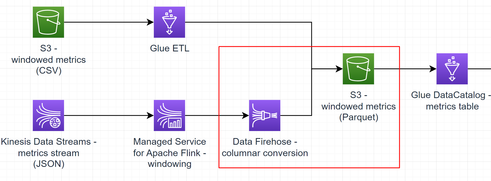

# Sub-task 6 - delivering with AWS Data Firehose



# Goal
* setup a JSON-to-Parquet transformation
* write a Kinesis stream into a Parquet S3 bucket

# Instructions

## Step 1 - extend the streaming application
* update the Flink application from sub-task 5
  * direct the output to another Kinesis Stream
  * update your tests

## Step 2 - create a Data Firehose delivery stream
* update the CloudFormation template created in sub-tasks 4-5
    * create another Kinesis Stream (I) that will serve as the output for the Flink application - use 1 provisioned shard
    * create another S3 bucket (O)
    * create a Data Firehose delivery stream
    * configure the delivery stream to
      * read from stream I
      * write to bucket O
      * enable [dynamic partitioning](https://docs.aws.amazon.com/firehose/latest/dev/dynamic-partitioning.html#dynamic-partitioning-s3bucketprefix)
        * use JQ queries to extract the `componentName` field from the JSON payloads produced by the Flink application
        * specify the `!{componentName}/` bucket prefix and any error bucket prefix
        * **pitfall**: both normal and error bucket prefixes must end with `/`
        * configure buffering hints - specify 60 seconds as the time hint
    * point the Flink application created in sub-task 5 to write to stream O

## Step 3 - test the streaming application
* ingest some events to the Kinesis Data Stream (use the test data generator)
* create a table in AWS Glue DataCatalog
  * use the same database as in task 1
  * use the same schema definition as in task 1
  * use bucket O as the location
  * specify JSON as the format
* in Athena
  * partition the new table just like in task 1
  * **pitfall**: do not forget to manually add one partition per unique `componentName` you publish to Kinesis Streams
  * try querying the new table

# Cost management recommendations
* make sure to dispose the resources create using CloudFormation - **Kinesis Streams are the most expensive component in the overall solution**

# Advanced sub-task (optional)
* normally in production, you would write such data as aggregate metrics not as JSON files, but either to some database or at least using the Parquet format
* one option would be to use a [JSON-to-Parquet conversion](https://docs.aws.amazon.com/firehose/latest/dev/record-format-conversion.html), but it requires [at least 64 Mb of data](https://docs.aws.amazon.com/firehose/latest/APIReference/API_ParquetSerDe.html)
to form a Parquet block - putting enough data quickly in Kinesis Streams might be thus too expensive for education purposes
* a more appropriate option would be to modify the Flink application to directly write to S3 in the [Parquet bulk format using a rolling strategy](https://nightlies.apache.org/flink/flink-docs-release-1.18/docs/connectors/datastream/filesystem/#bulk-encoded-formats)

# Intermediate exam

## Part 1 - code review - task 5 option A (Java API)
In the scope of this task, the student should share a **Java project**.
**It's highly recommended** to conduct a code review before the final exam to save more time for a live discussion). The project should have the following
1. a dedicated module containing a data model - the input metrics model and the output aggregate model
2. a dedicated module containing the streaming application
    1. there must be a dedicated class responsible for constructing the operation graph for the stream - it should have minimal business logic in it
    2. there must be dedicated classes modelling the stream application config - sink, source, timeouts, windowing params, etc
    3. any custom stream functions/operators should be factored out into their own classes
    4. any custom stream functions/operators should be covered with at least one positive unit test case
    5. all the key steps in the stream processing logic must have `debug` logs
3. there must be an integration test that
    1. follows the setup from `materials/flink-test-template` - Flink local cluster + LocalStack Kinesis Stream
    2. publishes at least 3 metric events from two services for CPU and RAM usage **out-of-order** - for example:
```
user-service cpu: 50, timestamp: 12:00
user-service cpu: 43, timestamp: 11:30
order-service ram: 13, timestamp: 11:00
user-service cpu: 57, timestamp: 12:30
...
```
3. reads from the output Kinesis stream and verifies that proper aggregations for each service/component are present with correct min/max/avg values and min/max timestamps

## Part 2 - live demo
In the scope of this task, the final exam minimal demonstration includes a **screencast** that shows the following
1. two Kinesis Data Streams (input and output) having the student name in its name (e.g. `ybaranouski` or `Yauhen_B` or else)
2. prove that both streams are empty by monitoring via Console with the **Trim Horizon** option
3. show an empty S3 bucket having the student name in its name (e.g. `ybaranouski` or `Yauhen_B` or else)
4. show a managed Flink application and prove that its config is pointed to the input/output streams
5. show a Data Firehose delivery stream and prove that its config is pointed to the output stream as its input and the S3 bucket as its output
6. publish some test metrics using the test data generator
7. open a DataCatalog table and prove that it's pointed to the S3 bucket
8. open the table in Athena and query some data
9. the data must have the following columns
   1. componentName - "user-service" or "order-service"
   2. metricName- e.g., "cpu-usage"
   3. unit - e.g., "percent"
   4. minValue - e.g., 20.24
   5. maxValue - e.g., 55.333
   6. fromTimestamp - e.g. "2021-09-09T12:15:02.001Z"
   7. toTimestamp - e.g., "2021-09-09T12:15:07.001Z"
10. **only for task 5 option B (interactive notebook)** - open the notebook created in Apache Flink Studio and walk through the SQL code there

# To know for the final exam Q&A

1. What are the typical use cases for Data Firehose?
2. What is a delivery stream?
3. What are the available sinks and sources for Data Firehose?
4. What is data transformation in Data Firehose?
5. What fields are available in data transformations?
6. What are the pros/cons of Lambda transformations in Data Firehose?
7. How can we deal with errors in Data Firehose transformations?
8. What is dynamic partitioning in Data Firehose?
