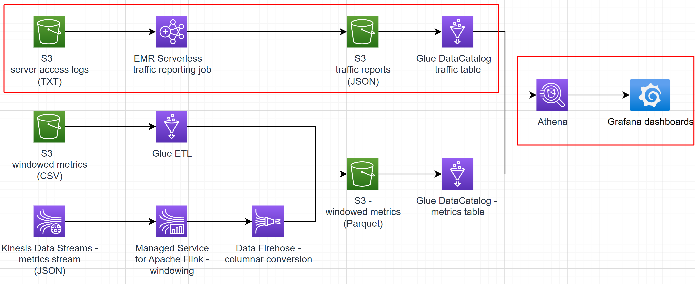
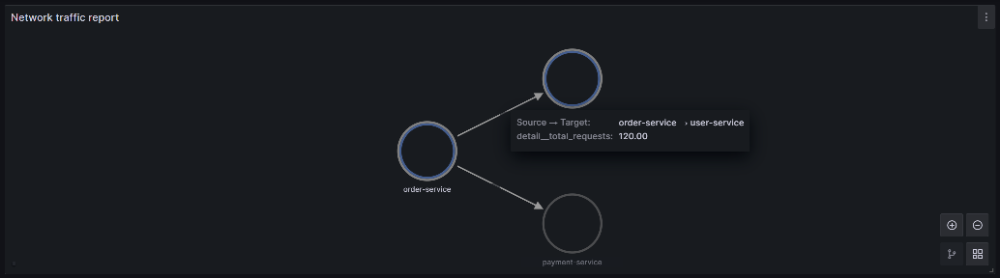

# Sub-task 7 - reporting with EMR



# Learning prerequisites
* [Getting started with Amazon EMR](https://explore.skillbuilder.aws/learn/course/internal/view/elearning/8827/getting-started-with-amazon-emr) (AWS Skill Builder)

# Goal
* write a Spark batch job to parse server access logs and build a call graph based on them
* visualise the reports using Grafana graphs
* optional - enrich the call graph reports with the metrics data derived from the previously ingested stream

# Instructions

## Step 1 - set up outputs
* create an S3 traffic report bucket
* create a Glue DataCatalog Table for the bucket
    * follow the _Server traffic report_ model

## Step 2 - create a Spark application
* write a Spark batch job that
    * reads a dataset from the S3 server access logs bucket
    * filters data for only the specified time range (latest 24 hours by default)
    * parses them (see the _Server access logs_ model)
    * calculates the number of calls per service pair (see the _Server traffic report_ model)
    * writes the reports in the JSON format into the S3 traffic report bucket

## Step 3 - create an EMR Serverless application
* deploy the job using EMR
  * create an IAM role which grants access to the input and output buckets
  * create an EMR Studio (it's free to keep)
  * create an EMR Serverless application
  * **PITFALLS**
    * disable pre-initialized capacity
    * set capacity limits to 3 vCPUs, 4096 Mb of RAM, 60 Gb of disk
    * make sure interactive endpoint is disabled
  * upload your Spark code archive to the **Source Code bucket**

## Step 4 - run a job
* use the server access log task provided by the [test data generator](../materials/test-data-generator-prebuilt) and copy the resulting files to the S3 server access logs bucket
* run the job
  * in the serverless app just created above, submit a job
  * use the following parameters
    * choose the IAM role created above
    * browse to your Spark code archive in S3
    * set the following Spark properties (edit as text):
```
--conf spark.executor.cores=1 --conf spark.executor.memory=1g --conf spark.driver.cores=1 --conf spark.driver.memory=1g --conf spark.executor.instances=1
```
  * wait for the job to start (may take 2-3 minutes for the first time if there is no capacity running at the moment for your app)
  * make sure correct reports appear in the S3 traffic report bucket
  * in case of issues, check "View logs" in the job run
    * stderr for Spark driver logs
    * stdout for logs from your code
    * click "Clone" button to rerun the failed job

## Step 5 - visualise
* use the local Grafana container created in sub-task 3
* follow the conventions from the [node graph panel documentation](https://grafana.com/docs/grafana/latest/panels-visualizations/visualizations/node-graph/)
* check how to [use SQL-like data sources for graph visualisations](https://community.grafana.com/t/nodegraph-with-mysql/66338/3)
* use an Athena datasource pointed at the S3 traffic report bucket as the _edges_ Grafana data frame

# Cost management recommendations
* make sure the EMR job is shut down
* delete the EMR Serverless application
* EMR Studio may be left intact - it's free

# Intermediate exam

## Part 1 - code review
In the scope of this task, the student should share a **Java, or Python, or Scala project**.
**It's highly recommended** to conduct a code review before the final exam to save more time for a live discussion). The project should have the following
* a Spark application
* the application code should include
  * read all files by glob patterns or just a bucket name
  * parse the access log
  * use input_file_name() to get log file (service) names as columns
  * group by service pairs
  * write to S3

## Part 2 - live demo
In the scope of this task, the final exam minimal demonstration includes a **scree cast** that shows the following
1. an S3 bucket for storing the traffic reports
   1. it must include the student name in its name (e.g. `ybaranouski` or `Yauhen_B` or else)
   2. it must be empty initially
2. an S3 bucket with server access logs
   1. it must include the student name in its name (e.g. `ybaranouski` or `Yauhen_B` or else)
   2. it must have files like this
```
audit-service-2022-09-15.txt
audit-service-2022-09-16.txt
audit-service-2022-09-17.txt
geolocation-service-2022-09-15.txt
geolocation-service-2022-09-16.txt
geolocation-service-2022-09-17.txt
inventory-service-2022-09-15.txt
inventory-service-2022-09-16.txt
inventory-service-2022-09-17.txt
order-service-2022-09-15.txt
order-service-2022-09-16.txt
order-service-2022-09-17.txt
payment-service-2022-09-15.txt
payment-service-2022-09-16.txt
payment-service-2022-09-17.txt
shipment-service-2022-09-15.txt
shipment-service-2022-09-16.txt
shipment-service-2022-09-17.txt
user-service-2022-09-15.txt
user-service-2022-09-16.txt
user-service-2022-09-17.txt
```
   3. each file must have contents like this
```
<masked>  - order-service "POST /api/v1/audit" 200 [2022-09-15T13:43:01.721Z] "Apache HTTP Client"
<masked>  - inventory-service "POST /api/v1/audit" 200 [2022-09-15T13:43:02.561Z] "Apache HTTP Client"
<masked>  - shipment-service "POST /api/v1/audit" 200 [2022-09-15T13:43:02.888Z] "Apache HTTP Client"
<masked>  - geolocation-service "POST /api/v1/audit" 200 [2022-09-15T13:43:03.221Z] "Apache HTTP Client"
<masked>  - payment-service "POST /api/v1/audit" 200 [2022-09-15T13:43:01.734Z] "Apache HTTP Client"
<masked>  - order-service "POST /api/v1/audit" 200 [2022-09-15T13:43:16.976Z] "Apache HTTP Client"
<masked>  - inventory-service "POST /api/v1/audit" 200 [2022-09-15T13:43:17.130Z] "Apache HTTP Client"
<masked>  - shipment-service "POST /api/v1/audit" 200 [2022-09-15T13:43:17.363Z] "Apache HTTP Client"
<masked>  - geolocation-service "POST /api/v1/audit" 200 [2022-09-15T13:43:17.801Z] "Apache HTTP Client"
<masked>  - payment-service "POST /api/v1/audit" 200 [2022-09-15T13:43:17.460Z] "Apache HTTP Client"
<masked>  - order-service "POST /api/v1/audit" 200 [2022-09-15T13:43:31.255Z] "Apache HTTP Client"
<masked>  - inventory-service "POST /api/v1/audit" 200 [2022-09-15T13:43:31.707Z] "Apache HTTP Client"
<masked>  - shipment-service "POST /api/v1/audit" 200 [2022-09-15T13:43:31.524Z] "Apache HTTP Client"
```
3. run the EMR job successfully
4. show that the report S3 bucket now has some files in it having contents like
```json5
{
 // an alphanumeric string, should be unique per service pair
 "id": "asbkhgl2598y3944t",
 // the name of the source (requesting) service
 "source": "user-service",
 // the name of the target (responding) service
 "target": "auth-service",
 // the total number of requests done in 24 hours
 "totalRequests": 1025
}
```
5. show a DataCatalog Table
   1. pointing to the S3 reports bucket
   2. having the student name in its name (e.g. `ybaranouski` or `Yauhen_B` or else)
6. open a local Grafana instance (the browser URL should be `http://localhost:...`)
7. show an Athena data source pointing to the DataCatalog Table
8. show a dashboard
   1. prove that it points to the Athena data source
   2. prove that the dashboard has a graph nodes panel like this



# To know for the final exam Q&A

1. What logical components are involved in creating and running EMR Serverless jobs?
2. How does capacity provisioning work for EMR Serverless?
3. What parameters may be configured for EMR Serverless jobs?
4. How can we supply custom libraries for EMR Serverless jobs?
5. How can we monitor the execution of an EMR Serverless job?
6. What are the use cases for EMR Serverless vs regular EMR clusters?
