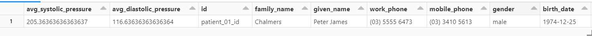

To validate the entire flow we need to have `readFromEventHub.py` notebook being run. It keeps listening to new event in Event Hub and needs to be **manually stopped** after validation, otherwise it will prevent cluster from autoscaling and might incur additional charges.

- [ ] Make sure that Data Factory pipeline is published without errors.
- [ ] Upload one of the patient sample files to  `_sourcebigdata/patient-data-source/_`  folder.
+
[WARNING]
====
For the sake of simplicity the solution is not optimized for processing of multiple files
being placed simultaneously to the source folder.
Although, it will work,
most likely you'll come across with *ConcurrentAppendException* within Notebook during merge operation.
The reason we are not partitioning data in Bronze layer.
Here is more https://learn.microsoft.com/en-us/azure/databricks/optimizations/isolation-level[information] how to resolve such kind of issues.
====
- [ ] Go to  `Data Factory/Monitor/Pipeline Runs`  and make sure that pipeline is completed successfully.
- [ ] Execute ```select * from gold_patient_observation``` statement from within Databricks notebook. Make sure new aggregate columns are present in a result.
+
