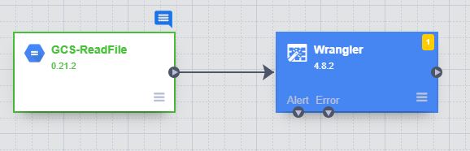
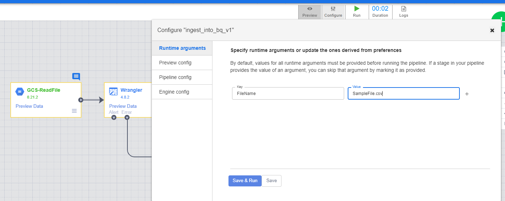
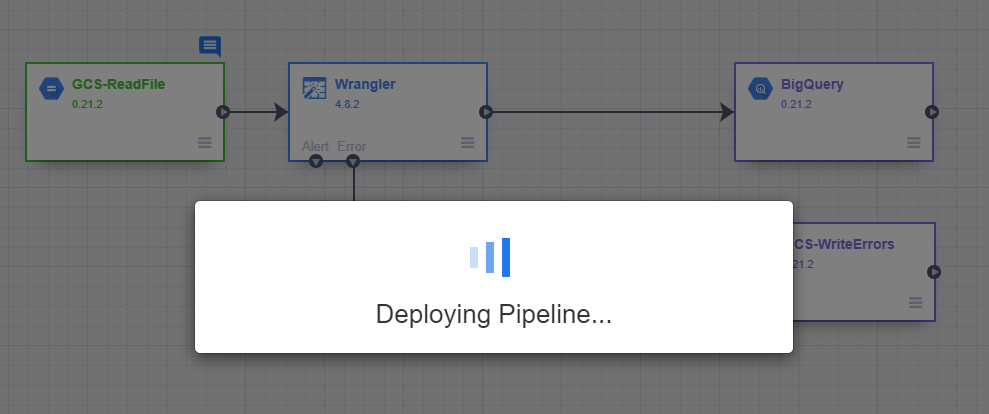
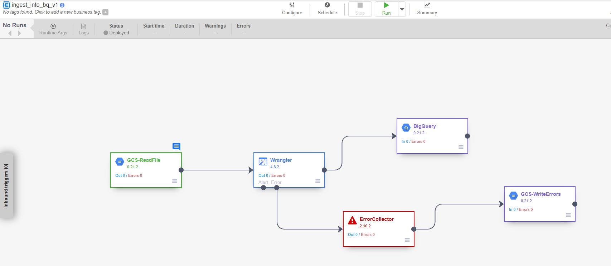

### **Task 4: Create the data pipeline in Data Fusion**

#### **Theory: Data pipeline**

> ***Duration \[2h\]***

[[Work with Data Pipelines \| Cloud
Dataflow]](https://cloud.google.com/dataflow/docs/guides/data-pipelines?hl=en)

#### **Practice: Create the Data pipeline**

> ***Duration \[2h\]***
>
> In the Data Fusion section you'll see the Data Fusion instance, click
> on the **View instance** link to access the **Data Fusion UI**:
>
> 
>
> The Data Fusion UI will be opened in another tab on your browser.
>
> We will begin designing the pipeline from scratch for clarity, so
> click in the Studio link under the **Integrate** card
>
> 
>
> You will be redirected to the studio page, first, give the pipeline a
> meaningful name in the top center of the screen **(you will need to
> reference the pipeline name (PIPELINE_NAME variable) later on in the
> Cloud Function python script, when the Cloud Function references it to
> get the execution started):**
>
> 
>
> Next, we will read the sample CSV file, we will just pass through the
> whole file to the next stage, and will parse the CSV in the following
> step.
>
> 
>
> Hover your mouse over the green GCS box that was added to the canvas
> when you clicked the GCS icon on the left menu. A "properties" button
> will appear.
>
> Click on this button:
>
> In the properties page of the GCS source component, set the "Path"
> property to: gs://\[YOUR_DATA_SOURCE_BUCKET\]/**\${FileName}**
>
> ,where is YOUR_DATA_SOURCE_BUCKET=csv-load-raw-source
>
> Where \${FileName} acts as a Runtime Argument variable that will be
> passed to the pipeline at execution time (we will define the variable
> later on as part of the pipeline's metadata).
>
> In the **output schema** section to the right, delete the **offset**
> field so that it does not get passed through to the next step in the
> pipeline, and only the **body** of the text gets passed on to the data
> wrangler component we will set up in the next step of the pipeline.
>
> 
>
> 
>
> You can click on Validate and make sure there are no errors. Then
> click on the cross symbol:
>
> 
>
> Next, we'll add a wrangler operation to the canvas in which we will
> perform the transformations and parsing mentioned in step 1. To do
> this, expand the Transform menu to the left, and click on the Wrangler
> tool. It will get added to the canvas as seen in the blue box below:
>
> 
>
> Now, we need to connect the output of the CSV file read to the
> wrangler, as depicted below. Then, hover over to the wrangler and
> click on the properties button that appears to access the wrangler
> properties:
>
> 
>
> 
>
> Here, you can put any name you like to the label, for now, we'll leave
> everything by default, but we'll change the Error Handling behavior
> from the default "Skip error", to "Send to error port" so that we can
> redirect errors during pipeline execution to a file in GCS for further
> processing later. We could write the recipe for the transformation
> directly with Directives using JEXL syntax
> ([[https://commons.apache.org/proper/commons-jexl/reference/syntax.html]](https://commons.apache.org/proper/commons-jexl/reference/syntax.html)),
> but for simplicity, and to take advantage of the Data Fusion UI, we'll
> do it using the wrangler tool, whatever we do in the wrangler will
> later be translated into JEXL directives and displayed under the
> recipe here. Click in the **WRANGLE** button, below the directives
> section.
>
> Now is when uploading the SampleFile.csv file to the source data
> bucket created in Step 1 will come in handy, in the GCS browser that
> opens, navigate to \[YOUR_DATA_SOURCE_BUCKET\] and select the file you
> uploaded in Step 1. By providing a sample of the data file to the
> wrangler, we allow the wrangler to infer the data structure and
> perform the data wrangling tasks intuitively.
>
> 
>
> 
>
> 
>
> 
>
> The file contents will be displayed to the left, and the columns that
> will go out of the wrangler are displayed in the section to the right.
> As of now, the wrangler reads each line in the file as a single field
> called "body" and outputs it as it is. We'll begin the transformations
> now:
>
> 
>
> Output by default from the wrangler
>
> First we will have the wrangler parse the file as a
> semicolon-delimited CSV file. Click in the little arrow pointing
> downwards to the left of the column name **(body)**, and select the
> parse→ CSV option.
>
> 
>
> As the columns in the CSV file are separated with semicolon (;), we
> select custom delimiter in the pop-up that shows up and insert a
> semicolon in there, we also **check the flag to treat the first row as
> headers**, and then click **Apply:**
>
> 
>
> Now, the wrangler has separated all the input fields in the file and
> created a column for each as reflected in the output columns list to
> the right, it keeps the body input as a separate column, but we don't
> need it so we'll delete it by selecting it as we did before and
> choosing the "Delete column" option:
>
> 
>
> We can now begin with the parsing and transformations required to
> ingest the data into the BigQuery table.
>
> By default, and as this is a CSV file, Data Fusion treats all the
> inputs as Strings, we need to change that to insert the data properly.
> We will use the Change Data Type option in the arrow menu on the
> columns to set the data types to something compatible with how we
> defined the columns in the BigQuery table on Step 2.
>
> First, by following this same procedure, we will change the data types
> of the fields **id, status_code** and **invoice_number** to **Long**,
> so they can be inserted in the BigQuery table:
>
> 
>
> Next, we will replace the commas with points in the **amount** field
> prior to changing the data type to float so that it can easily be
> inserted in BigQuery as a float value and so that the commas don't get
> misinterpreted as being thousand separators (this is caused by points
> being used as the thousands separator rather than commas in
> non-english countries and the commas being used as a decimal
> separator). We will use the **Find and replace** function for this,
> fill in the comma in the Old value field and a dot in the New value
> field, and then click on the **Replace All** button:
>
> 
>
> We can now change the data type of the field to float.
>
> 
>
> Now, we will parse the **order_date** field so it can be inserted
> correctly as of type Datetime into BigQuery.
>
> 
>
> As explained earlier, we will have to use a custom format as the input
> dates are in the format **dd-MM-yyyy H:mm** , so select the "custom
> format" option, provide the format in the text field and click
> **Apply**.
>
> 
>
> Next, we'll use the "Send to error" function to filter out the rows
> where the **amount** is 0, these will get sent out to the error file
> where they can be reviewed further and reprocessed if required later
> on (because we had previously changed the data type of this field to
> float, the wrangler automatically has replaced the input values from 0
> to 0.0, so we need to set the filter to 0.0 accordingly).
>
> Select the **Send to error** Transformation in the **amount** column,
> set the condition to "**value is"** , and the value to 0.0, then click
> on **Apply:**
>
> 
>
> The source data has some nulls in the field **delivery_date**, we will
> also send those records to the error port so that those can be
> reviewed later.
>
> Select the **Send to error** Transformation in the **delivery_date**
> column, set the condition to "**value is empty"** and click on
> **Apply:**
>
> 
>
> Finally, we'll parse the field **delivery_date**, as datetime with the
> same procedure as we did for the **order_date** field:
>
> 
>
> 
>
> Now that we have made the recipe for all the transformations, to the
> right side of the wrangler screen, we can see a summary of the
> transformation steps, you can also delete steps if you wish to do so:
>
> 
>
> Lastly, click the Apply button on the upper right side and you will
> get back to the wrangler properties page, where you will now see the
> recipe in JEXL syntax, you will also see to the right, the output
> fields that will come out of the wrangler step in the pipeline:
>
> 
>
> Now you can click the Validate button to validate everything looks
> alright, and then when ready, click on the X next to the button to go
> back to the pipeline design canvas.
>
> Now we'll handle the errors, in the canvas, we'll expand the "Errors
> handlers and Alerts" section in the left menu, and click on "Error
> Collector":
>
> 
>
> Then, we will drag and drop an arrow from the Error port in the
> Wrangler to the Error Collector to direct and collect the output
> errors from the Wrangler, we won't perform any further configuration
> in the ErrorCollector properties. Instead, we will expand the Sink
> section in the left menu and click on "GCS" to add a GCS Writer to the
> canvas, to which we will write the output of the errors collected from
> the ErrorCollector:
>
> 
>
> Drag an arrow from the ErrorCollector to the GCS Writer and then hover
> the mouse over the newly added GCS Writer to access its properties.
> Here we will set the **label** to "GCS-WriteErrors", the **Path**
> field to **gs://\[YOUR_CDAP_ERRORS_BUCKET\]** created in Step 1
> (gs://test-cdap-errors), the **format** to CSV and the **write
> headers** flag to True, finally we'll set the **Output File prefix**
> to "errors". This will write a CSV file to the path you defined, and
> add a new line to it by each error that comes out of the wrangler
> during the pipeline execution:
>
> 
>
> Now that we've handled the errors properly, we will add the final step
> in the pipeline, ingesting the output of the wrangler to the BigQuery
> table. In the same sink section in the left menu, click in the
> BigQuery icon and drag an arrow from the output of the wrangler to
> this new icon:
>
> 
>
> Now the pipeline should look like this, hover the mouse to the
> BigQuery icon in the canvas and access its properties to setup the
> final part of the pipeline:
>
> 
>
> In the BigQuery sink properties we will set a few values:
>
> We will set the **dataset** and **table** to the dataset and tables we
> created in BigQuery during Step 2. We'll set the Temporary Bucket Name
> to **gs://\[YOUR_CDAP_TEMP_BUCKET\] (**gs://test-cdap-staging**)**
>
> 
>
> We will also enable the **Truncate Table** flag so that the table gets
> truncated every single time the pipeline
> runs:
>
> Now that the pipeline is complete, you may try a dry run of the
> pipeline by clicking on the **Preview** button on the top of the
> canvas, and manually setting the FileName we setup as a Runtime
> Argument defined for the pipeline (after the pipeline is deployed and
> executed from the Cloud Function, this Runtime Argument will be filled
> with the actual File name that is uploaded to
> **gs://\[YOUR_DATA_SOURCE_BUCKET\]** (gs://csv-load-raw-source) the
> and it will be passed to the pipeline at runtime, for now we will
> provide the same File Name that we uploaded to the bucket in Step 1
> for the purposes of this dry run, and click on **Run**:
>
> 
>
> The preview of the pipeline will run for about a minute but no actual
> execution will be performed, no Dataproc cluster will spawn and no
> records will be written to the BigQuery table:
>
> 
>
> Once the preview run finishes, you can Preview what data reached the
> input at each step and what came out after the processing of each
> step. You do so by clicking on the **"Preview Data"** links on each of
> the pipeline steps.
>
> Once you have reviewed the preview and are satisfied with how the
> pipeline behaves, it's time to deploy it. For this, go back to the
> canvas and disable the preview mode by clicking on the Preview button
> again, and then click on the Deploy button.
>
> 
>
> 
>
> After a few seconds, the pipeline will be deployed and ready to be
> executed:
>
> 

