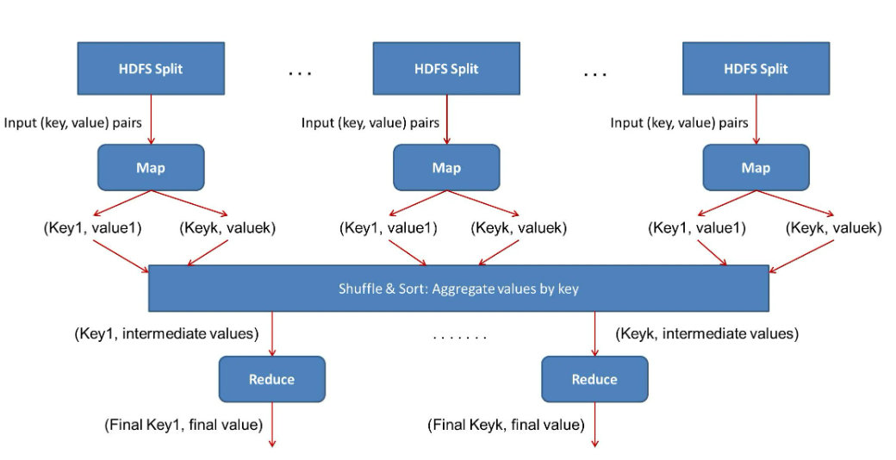
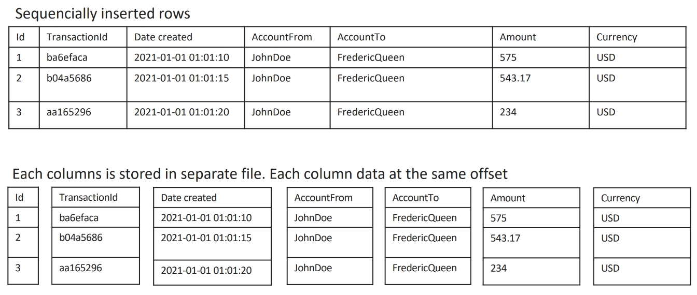
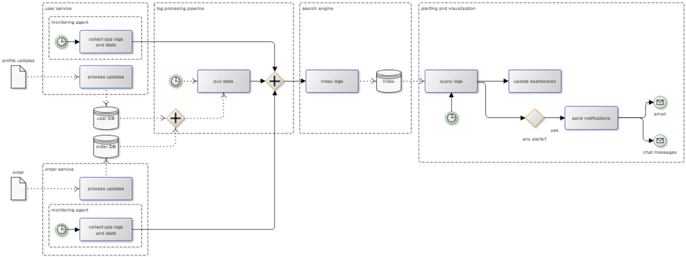

# Topics to cover
- Big data vs Data intensive
- The V's of data engineering
- Hadoop - the pioneer that made data affordable
- Spark - Hadoop successor
- Data formats and efficiency
- ETL vs ELT
- Data warehouse, data lake, and data marts
- Data products and factories
- Typical data architecture patterns

# Intro

## Before you read further
The external links provided in this module are optional for study.
All the necessary theory materials will be provided in subsequent modules
focusing on specific concepts and technologies.

## Topics to cover:

1. Introduction to BigData
2. Data Characteristics (VVVs)
3. Introduction to Hadoop
4. Data Product and Data Factory
5. File Formats

## Materials:

### Big data and data intensive

In 2000's, **big data** was considered as data assets characterised by 3
V's

-   **volume** - data scale/size
-   **velocity** - continuous realtime stream vs batches
-   **variety** - structured vs semi-structured vs unstructured data

However, the challenges related to data handling continue to expand:
-   **veracity** - accuracy and quality
-   **variability** - unpredictable anomalies and inconsistencies
-   **viscosity** - complexity to explore
-   **volatility** - likelihood of disappearing
-   **value** - relevance to the business
-   etc

In 2014, we had 10 V's. Today it's 40 V's already
([[link]](https://www.elderresearch.com/blog/42-v-of-big-data)).

So, the data challenges are not always related to volume/speed and today
we say that we perform **data engineering** in order to build **data
intensive** systems.

### Hadoop - the pioneer in budget data processing

Links (optional, if interested in more details)
- [overview](https://intellipaat.com/blog/tutorial/hadoop-tutorial/introduction-hadoop/?US)
- [vs Spark](https://geekflare.com/hadoop-vs-spark/)

Hadoop was the first open-source solution that was able to process large
amounts of data daily generated by major websites while running on
commodity hardware. Running on the familiar Java platform, it leveraged
the **map-reduce** concept. It was a lot easier and cheaper to use and
scale than most of the commercial software available in the 2000s. So,
it quickly became popular and grew the whole ecosystem around it:

Hadoop employs the **leader-follower design** at its core. Its data
storage, **Hadoop Distributed File System (HDFS)**, looks like this:

Here
-   data is organised into files
-   each file is split into **blocks**
-   each **DataNode** daemon is responsible for managing a subset of
    blocks
-   the **NameNode** daemon running on the leader node is responsible
    for the mapping between the blocks and data nodes

For fault tolerance, HDFS **replicates** each block into multiple copies
across **different hardware racks** if possible

**Map-reduce** is the data processing layer of Hadoop that allows
running parallel load (per block) across a cluster

Here
-   one or more **map** tasks load, parse, transform, and filter data
-   one or more **reduce** tasks aggregates intermediate or final
    results on a subset of the outputs from the map step
-   because the map tasks are executed on the follower nodes that hold
    the input blocks, optimal performance and intra-cluster traffic is
    achieved - **data locality**

**Yet Another Resource Negotiator (YARN)** is the resource management
layer of Hadoop. The main idea is to have a separate component
responsible for resource management, job scheduling, and monitoring into
separate daemons. Each application is represented as a directed acyclic
graph (DAG) of tasks. Each DAG is managed by an application master which
are supervised by a global resource manager.

All that is good, but Hadoop has its downsides
-   while Hadoop scales well and may be deployed anywhere, managing it
    is not trivial (e.g. dealing with ZooKeeper is a specific endeavour)
-   also, it doesn't solve all the challenges that modern data
    engineering is facing - e.g. it's not sufficient in terms of
    performance for realtime streaming

As cloud providers grew and delivered more and more facilities for
deploying more complicated and more expensive technologies at a fraction
of their cost, **serverless components** and **managed services** like
AWS EMR and DataBricks took over the modern trends.

**Conclusion**:
- The success of Hadoop showed that special design decisions, tools, and
services are required to make the business able to understand its own
data and products on the modern scale.
- However, **Hadoop is now considered rather a legacy tech** compared to Spark-based solutions.
- The topic of **Spark will be expanded in a lot more detail later in this course**.

### Data products and pipelines

**Data product** is the result of transforming the data that a company
owns into a value-generating asset. Each data product has a structure
that includes:

-   business purpose
-   data sources
-   artefacts
    -   documentation
    -   code
    -   models
-   metrics
    -   data quality
    -   usage
    -   cost
    -   audit
    -   lineage

**Data sources** may be external (downloaded files, data pulled from
partner APIs, public datasets, etc) or internal (application logs,
network logs, user profiles, etc.).

Data ends up in one of the following places
-   **data lake** - a potentially huge storage of raw data
-   **data warehouse** - a scalable storage of structured data ready to
    serve analytics
-   **data mart** - a set of dashboards created based on a subset of
    data from a warehouse/lake and serving specific business use cases

Data warehouses and lakes may be compared to general-purpose DBs as
follows

Data sources, lakes, and warehouses are connected via some sort of
ETL/ELT pipelines:

**ETL** stands for **extract-transform-load**. It's usually performed by
**batching** a subset of available data on schedule, transformed to fit
the destination use case using one or more steps, and loaded to the
destination storage.

**ELT** is an alternative to ETL where the load and transform steps are
swapped. Usually, this means that data is continuously **streaming**
(batching is applicable as well) to a data lake and applying the
necessary transformations afterwards on-demand. This allows to capture a
lot more, avoid mistakenly filtering out valuable data, and deciding on
how to use it later.

More info (optional, if interested in more details)
- [data products](https://lakefs.io/blog/data-products/)
- [data warehouse vs lake vs mart](https://medium.com/codex/data-warehouse-vs-data-mart-vs-data-lake-a335f328e6a8)
- [ETL vs ELT](https://www.mssqltips.com/sqlservertip/5937/etl-vs-elt-features-and-use-cases/)

### File formats

[Recording/slides: Big Data in Java World: Apache Spark and Scala. Architecture and live coding](https://wearecommunity.io/events/java-on-2022/talks/48154)

#### Overview

Different file formats are used today for different tasks. Some of the
most known include
-   plain text
-   CSV
-   JSON
-   Parquet
-   Avro
-   ORC

Rows vs columns

#### Avro

Pros
-   high write speed
-   JSON-like schema
-   good for data streaming like Kafka
-   good for ETL pipelines and data marts
-   supports schema evolution to some extent

Cons
-   inefficient where only a subset of columns is required
-   compression ratio is so-so

#### Parquet

Pros
-   efficient compression
-   efficient for querying by specific columns
-   good for backup/restore and replication
-   strongly typed
-   good for file-based storages like Hive

Cons
-   restricted schema evolution
-   hard to have transactions on top
-   not human friendly
-   not good for streaming

#### ORC

Pros
-   allows skipping columns when reading
-   good for file-based storages like Hive
-   can have ACID transactions implemented on top

#### Summary

### Local and single-node data processing
The history itself is always spiral - many approaches widely used in the past are periodically re-discovered to shine in a new light.
The same is with data engineering: all the theory covered above mostly focuses on datasets that have one or more qualities that require distributed setups for
efficient processing. However, hardware is continuously improving and cloud pricing schemes are evolving - both faster than some business use cases.

In 2024, several technologies appeared with the focus on single-node non-distributed data processing. These include **DuckDB** and **Polars**.
Both of them are Python libraries which bring the ability to run analytics nearly on any modern hardware. They are able to connect to data lake storages like
AWS S3 or Azure Blob Storage, run local processing on one machine, and do that with pretty impressive efficiency given the data size is below 1 Tb.

[This article](https://alirezasadeghi1.medium.com/the-rise-of-single-node-processing-challenging-the-distributed-first-mindset-111333162b83) gives some bright examples from the real world of data-intensive companies:

The advantages here are clear:
- it's possible to have a toolkit which runs the same as in the cloud, so on pre, and even on dev machines
- no need to account for the complexities of distributed architectures
- no need to bother with complex infrastructure management and processes
- no need to pay for massive dedicated clusters

This is a perfect setup for POCs when the time, money, and other resources are very scarce.

So, a smart data engineer/architect must always seek to optimise costs and confirm whether it's really
worth it to allocate a heavyweight Spark cluster on an enterprise Databricks subscription, if it's affordable to handle the data at hand
on one mid-sized AWS EC2 instance or a local machine. 

### Optional - extra cases and architectures

#### Case - gathering data for BI

Case requirements
-   some business has one or more DBs that serve OLTP load (e.g. web
    shop or bank)
-   the business intelligence department wants to build daily reports
    based on the user activity
-   the aggregations in the BI reports are heavy and it's necessary to
    prevent impact on the customer experience

Solution - ETL
-   deploy an ETL pipeline which captures updates from the OLTP DBs,
    makes the necessary computations, and store the results in a
    dedicated data warehouse DB
-   depending on the volume of the data, complexity of the aggregations,
    and freshness requirements
    -   the ETL pipeline may run as lightweight as a serverless function
        (AWS Lambda, Azure Function, etc) or as powerful as a multi-node
        Spark cluster orchestrated by AWS Glue

#### Case - monitoring microservices

Case requirements
-   a business has an ecosystem of multiple microservices
-   it's necessary to monitor the status of the microservices in
    realtime
    -   application logs - for business intelligence and anomaly
        detection
    -   server/network logs - for operations troubleshooting and
        security breach detection
    -   the hardware usage stats from the DB and application nodes - for
        operations troubleshooting and capacity planning
-   next, it's necessary to set up alerts based on the above rules and
    make the alerts trigger such channels as emails and DevOps chats
-   finally, it's necessary to enable realtime visualisation and
    querying of all the time series data collected from the logs

Solution
-   log collection is typically done by some sort of an agent running
    nearby the application/DB nodes
    -   AWS CloudWatch agent
    -   Beats from the ELK stack (e.g. FileBeat or MetricBeat)
-   logs then should be indexed/stored
    -   LogStash from the ELK stack is able to index the data collected
        from the log collectors to ElasticSearch
    -   if the log collectors deliver data to some distributed store
        like AWS S3 or Azure Blob Storage, it's possible to use
        serverless functions to apply necessary transformations and push
        the data to ElasticSearch again or time series database or
        elsewhere
-   there are various platforms that combine powerful querying,
    visualization, and alerting capabilities in one box
    -   Kibana from the ELK stack
    -   Grafana
    -   AWS QuickSight

#### Case - managing an IoT fleet

Case requirements
-   a business manages a fleet of IoT devices that produce a continuous
    stream of signals that must be collected and analyzed
-   all the data must be stored in a durable manner
-   some critical anomalies must be detected in realtime and immediately
    trigger alerts
-   the rest of the analytical tasks may be quite heavy, but since they are not critical, they can be run on schedule.

Solution

-   a distributed log is typically used for ingestion - its main goal is
    to persist and replicate incoming data as-is as fast as possible
    -   Kafka
    -   Kinesis Streams
-   then, a [Lambda or Kappa architecture](https://nexocode.com/blog/posts/lambda-vs-kappa-architecture/)
    may be deployed - it leverages a lightweight streaming technology
    for realtime processing and a deployment of a heavier weight for the
    on-schedule part of the job (batching)
    -   streaming
        -   Kafka Streams
        -   Apache Flink
        -   Kinesis Data Analytics
        -   Spark
    -   batching
        -   Spark
        -   Hadoop

#### Data meshes and EPAM Data Factory

Links (optional, if interested in more details)
- [data products](https://lakefs.io/blog/data-products/)
- [data mesh architecture](https://www.datamesh-architecture.com/)

When we deal with a medium-big business with more than one department,
it's hard to fit everyone in one ETL. We need to define one or more
**data products** per department and organise them.

Data products on a large scale are typically organised using the **data mesh** architecture
which goes away from siloed/centralized approaches and builds on top of
a self-service environment. Data meshes enable fast experimentation and
growth while providing clear guidelines for following good practices:

EPAM has its own template for such platforms that called **Data Factory**:

This brings a lot more challenges including
-   access control and audit
-   highly variable integration points - handled by fine-tuned data
    flows (e.g. Apache NiFi)
-   the need to orchestrate multi-step processes inside and outside each
    product - handled by such tools as Apache Airflow

# Final exam theory questions

## Hadoop
1. What is `map-reduce`? Give an example.
2. Why was `Hadoop` so popular at its time?
3. What is the structure of `HDFS`?
4. What is the structure of a `Hadoop` cluster?
5. In what respects `Spark` is similar to `Hadoop`?
6. Why did `Spark` overtake the role of `Hadoop` (mostly)?

## Data products and pipelines
1. What is a `Data product`?
2. What is the difference between `data lake`, `data warehouse`, and `data mart`?
3. What is `ETL`?
4. What is `ELT`?
5. When should we use `ETL` vs `ELT`?

## File formats
1. What file formats may be found in modern data pipelines?
2. What is the difference between row-oriented and column-oriented file formats? Can you give examples in each category?
3. What is the `Avro` file layout?
4. Where can we keep an `Avro` schema?
5. What are the pros and cons of `Avro`?
6. What are the use cases for `Avro` vs `Parquet` vs `JSON`?
7. What is the `Parquet` file layout?
8. What are the pros and cons of `Parquet`?
9. What is the `ORC` file layout?
10. What are the pros and cons of `ORC`?
