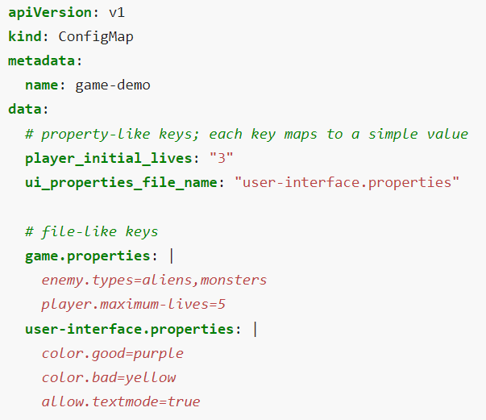
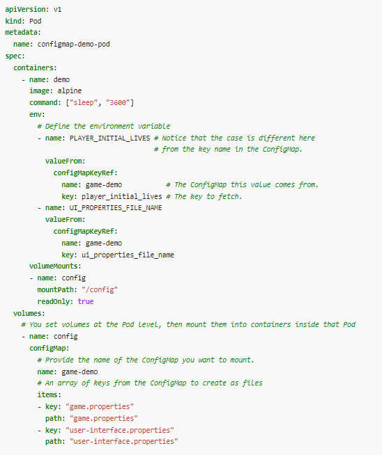

# Table of Content

- [Secrets and config-maps](#secrets-and-config-maps)
- [Health checks for microservices application](#health-checks-for-microservices-application)
- [Liveness & Readiness probes in Kubernetes](#liveness--readiness-probes-in-kubernetes)
- [Deployment strategies](#deployment-strategies)
- [Related reading](#related-reading)
- [Questions](#questions)

# Secrets and Config-maps
A ConfigMap is an API object used to store non-confidential data in key-value pairs. Pods can consume ConfigMaps as environment variables, command-line arguments, or as configuration files in a volume.

A ConfigMap allows you to decouple environment-specific configuration from your container images, so that your applications are easily portable.

Use a ConfigMap for setting configuration data separately from application code.

For example, imagine that you are developing an application that you can run on your own computer (for development) and in the cloud (to handle real traffic). You write the code to look in an environment variable named DATABASE_HOST. Locally, you set that variable to localhost. In the cloud, you set it to refer to a Kubernetes Service that exposes the database component to your cluster. This lets you fetch a container image running in the cloud and debug the exact same code locally if needed.

A ConfigMap is not designed to hold large chunks of data. The data stored in a ConfigMap cannot exceed 1 MiB. If you need to store settings that are larger than this limit, you may want to consider mounting a volume or use a separate database or file service.

Here's an example ConfigMap that has some keys with single values, and other keys where the value looks like a fragment of a configuration format.

A Secret is an object that contains a small amount of sensitive data such as a password, a token, or a key. Such information might otherwise be put in a Pod specification or in a container image. Using a Secret means that you don't need to include confidential data in your application code.

Because Secrets can be created independently of the Pods that use them, there is less risk of the Secret (and its data) being exposed during the workflow of creating, viewing, and editing Pods. Kubernetes, and applications that run in your cluster, can also take additional precautions with Secrets, such as avoiding writing secret data to nonvolatile storage.

Secrets are similar to ConfigMaps but are specifically intended to hold confidential data.

# Health checks for microservices application

A health check is a special REST API implementation that you can use to validate the status of a microservice and its dependencies. With MicroProfile Health, microservices can self-check their health and publish their overall status to a defined endpoint.

A health check can assess anything that a microservice needs, including dependencies, system properties, database connections, endpoint connections, and resource availability. The overall status of the microservice depends on whether all the configured health checks pass. A microservice is considered available and reports UP status if all the configured health checks are successful. If one or more health checks fail, the microservice is considered unavailable and reports a DOWN status. Services can report their availability to a defined endpoint by implementing the API that is provided by MicroProfile Health. A service orchestrator can use these status reports to decide how to manage and scale the microservices within an application. Health checks can also interact with Kubernetes liveness and readiness probes.

Forces:
- An alert should be generated when a service instance fails
- Requests should be routed to working service instances

Solution:
A service has health check API endpoint (e.g. HTTP /health) that returns the health of the service. The API endpoint handler performs various checks, such as
- the status of the connections to the infrastructure services used by the service instance
- the status of the host, e.g. disk space
- application specific logic 

A health check client - a monitoring service, service registry or load balancer - periodically invokes the endpoint to check the health of the service instance.

This pattern has the following benefits:
- The health check endpoint enables the health of a service instance to be periodically tested

This pattern has the following drawbacks:
- The health check might not sufficiently comprehensive or the service instance might fail between health checks and so requests might still be routed to a failed service instance

# Liveness & Readiness probes in Kubernetes
## Liveness probe
The kubelet uses liveness probes to know when to restart a container. For example, liveness probes could catch a deadlock, where an application is running, but unable to make progress. Restarting a container in such a state can help to make the application more available despite bugs.

The kubelet uses readiness probes to know when a container is ready to start accepting traffic. A Pod is considered ready when all of its containers are ready. One use of this signal is to control which Pods are used as backends for Services. When a Pod is not ready, it is removed from Service load balancers.

The kubelet uses startup probes to know when a container application has started. If such a probe is configured, it disables liveness and readiness checks until it succeeds, making sure those probes don't interfere with the application startup. This can be used to adopt liveness checks on slow starting containers, avoiding them getting killed by the kubelet before they are up and running.

A kind of liveness probe uses an HTTP GET request. Here is the configuration file for a Pod that runs a container based on the registry.k8s.io/liveness image.

In the configuration file, you can see that the Pod has a single container. The periodSeconds field specifies that the kubelet should perform a liveness probe every 3 seconds. The initialDelaySeconds field tells the kubelet that it should wait 3 seconds before performing the first probe. To perform a probe, the kubelet sends an HTTP GET request to the server that is running in the container and listening on port 8080. If the handler for the server's /healthz path returns a success code, the kubelet considers the container to be alive and healthy. If the handler returns a failure code, the kubelet kills the container and restarts it.

Any code greater than or equal to 200 and less than 400 indicates success. Any other code indicates failure.

## Readiness probe
Sometimes, applications are temporarily unable to serve traffic. For example, an application might need to load large data or configuration files during startup, or depend on external services after startup. In such cases, you don't want to kill the application, but you don't want to send it requests either. Kubernetes provides readiness probes to detect and mitigate these situations. A pod with containers reporting that they are not ready does not receive traffic through Kubernetes Services.

## Startup probe
Sometimes, applications need additional startup time on their first initialization. Liveness and readiness probes start working after startup probe has succeeded.

## Configure probes
Probes have a number of fields that you can use to more precisely control the behavior of startup, liveness and readiness checks:
- initialDelaySeconds: Number of seconds after the container has started before startup, liveness or readiness probes are initiated. Defaults to 0 seconds. Minimum value is 0.
- periodSeconds: How often (in seconds) to perform the probe. Default to 10 seconds. Minimum value is 1.
- timeoutSeconds: Number of seconds after which the probe times out. Defaults to 1 second. Minimum value is 1.
- successThreshold: Minimum consecutive successes for the probe to be considered successful after having failed. Defaults to 1. Must be 1 for liveness and startup Probes. Minimum value is 1.
- [failureThreshold: When a probe fails, Kubernetes will try failureThreshold times before giving up. Giving up in case of liveness probe means restarting the container. In case of readiness probe the Pod will be marked Unready. Defaults to 3. Minimum value is 1.

# Deployment strategies
There are a variety of techniques to deploy new applications to production, so choosing the right strategy is an important decision, weighing the options in terms of the impact of change on the system, and on the end-users.

The amount deployment strategies is various. Here are most popular of them:
- Recreate: Version A is terminated then version B is rolled out.
- Ramped (also known as rolling-update or incremental): Version B is slowly rolled out and replacing version A.
- Blue/Green: Version B is released alongside version A, then the traffic is switched to version B.
- Canary: Version B is released to a subset of users, then proceed to a full rollout.
- A/B testing: Version B is released to a subset of users under specific condition.
- Shadow: Version B receives real-world traffic alongside version A doesn’t impact the response.

Here is the description for each one of them: [deployment strategies](https://thenewstack.io/deployment-strategies/).

# Related reading

- [Kubernetes config maps and secrets](https://www.cloudtruth.com/blog/whats-the-difference-between-configmaps-and-secrets)
- [Health check pattern](https://microservices.io/patterns/observability/health-check-api.html)
- [Kubernetes probes](https://kubernetes.io/docs/tasks/configure-pod-container/configure-liveness-readiness-startup-probes)
- [Deployment strategies](https://thenewstack.io/deployment-strategies)
- [Kubernetes labels](https://kubebyexample.com/concept/labels)
- [Deployment history](https://kubernetes.io/docs/concepts/workloads/controllers/deployment/#rolling-back-a-deployment)

# Questions

- Why do we need health checks for applications?
- What is the difference between Kubernetes probes?
- What is the best storage for environment variables for your Kubernetes pod? What if these variables are sensitive?
- Why should we use deployment strategies? What types of deployments strategies do you know?
- How can you roll back to the previous version of deployment in Kubernetes?
