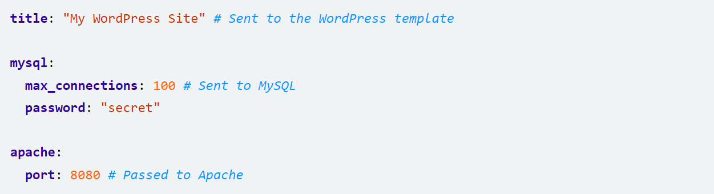

# Table of Content

- [Helm chart](#helm-chart)
- [Related reading](#related-reading)
- [Questions](#questions)

# Helm chart
Helm is widely known as "the package manager for Kubernetes". Although it presents itself like this, its scope goes way beyond that of a simple package manager. However, let's start at the beginning. 
Helm is an open-source project which was originally created by DeisLabs and donated to CNCF, which now maintains it. The original goal of Helm was to provide users with a better way to manage all the Kubernetes YAML files we create on Kubernetes projects. 
The path Helm took to solve this issue was to create Helm Charts. Each chart is a bundle with one or more Kubernetes manifests – a chart can have child charts and dependent charts as well.
This means that Helm installs the whole dependency tree of a project if you run the `install` command for the top-level chart. You just execute a single command to install your entire application, instead of listing the files to install via `kubectl`.

Helm uses a packaging format called charts. A chart is a collection of files that describe a related set of Kubernetes resources. A single chart might be used to deploy something simple, like a memcached pod, or something complex, like a full web app stack with HTTP servers, databases, caches, and so on. 
Charts are created as files laid out in a particular directory tree. They can be packaged into versioned archives to be deployed.

## Scope, Dependencies and Values
Values file can declare values for the top-level chart, as well as for any of the charts that are included in that chart's charts/ directory. Or, to phrase it differently, a values file can supply values to the chart as well as to any of its dependencies. For example, the demonstration WordPress chart above has both mysql and apache as dependencies. The values file could supply values to all of these components:



Charts at a higher level have access to all the variables defined beneath. So the WordPress chart can access the MySQL password as .Values.mysql.password. But lower level charts cannot access things in parent charts, so MySQL will not be able to access the title property. Nor, for that matter, can it access apache.port.

Values are namespaced, but namespaces are pruned. So for the WordPress chart, it can access the MySQL password field as .Values.mysql.password. But for the MySQL chart, the scope of the values has been reduced and the namespace prefix removed, so it will see the password field simply as .Values.password.

## Named templates
A named template (sometimes called a partial or a subtemplate) is simply a template defined inside a file, and given a name. One popular naming convention is to prefix each defined template with the name of the chart: `{{ define "mychart.labels" }}`. By using the specific chart name as a prefix we can avoid any conflicts that may arise due to two different charts that implement templates of the same name.

The `define` action allows us to create a named template inside a template file. Its syntax goes like this:
````
{{- define "MY.NAME" }}
# body of template here
{{- end }}
````
Now we can embed this template inside our existing ConfigMap, and then include it with the template action:
````
{{- define "mychart.labels" }}
labels:
generator: helm
date: {{ now | htmlDate }}
{{- end }}
apiVersion: v1
kind: ConfigMap
metadata:
name: {{ .Release.Name }}-configmap
{{- template "mychart.labels" }}
data:
myvalue: "Hello World"
{{- range $key, $val := .Values.favorite }}
{{ $key }}: {{ $val | quote }}
{{- end }}
````
When the template engine reads this file, it will store away the reference to `mychart.labels` until template `mychart.labels` is called. Then it will render that template inline. So the result will look like this:
````
# Source: mychart/templates/configmap.yaml
apiVersion: v1
kind: ConfigMap
metadata:
  name: running-panda-configmap
  labels:
    generator: helm
    date: 2016-11-02
data:
  myvalue: "Hello World"
  drink: "coffee"
  food: "pizza"
````

# Related reading

- [Helm tutorial for beginners](https://blog.packagecloud.io/what-is-a-helm-chart-a-tutorial-for-kubernetes-beginners)
- [Helm chart documentation](https://helm.sh/docs/topics/charts)

# Questions

- Why should we use helm charts?
