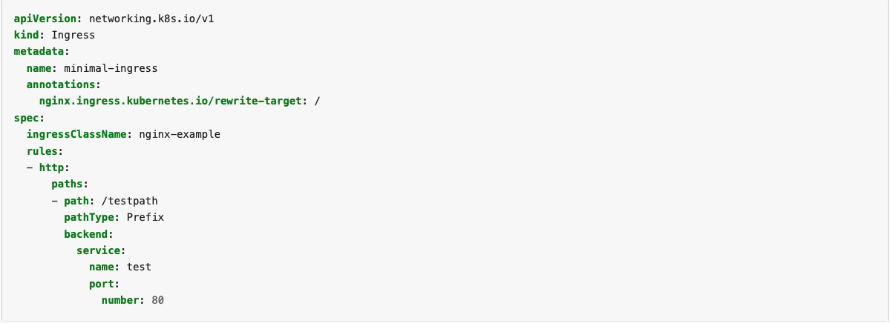

# Table of Content

- [Networking](#networking)
- [Ingress](#ingress)
- [Questions](#questions)

# Networking
Networking is a central part of Kubernetes, but it can be challenging to understand exactly how it is expected to work. There are 4 distinct networking problems to address:

- Highly-coupled container-to-container communications: this is solved by Pods and localhost communications.
- Pod-to-Pod communications: this is the primary focus of this document.
- Pod-to-Service communications: this is covered by Services.
- External-to-Service communications: this is also covered by Services.

Kubernetes is all about sharing machines between applications. Typically, sharing machines requires ensuring that two applications do not try to use the same ports. Coordinating ports across multiple developers is very difficult to do at scale and exposes users to cluster-level issues outside of their control.

Dynamic port allocation brings a lot of complications to the system - every application has to take ports as flags, the API servers have to know how to insert dynamic port numbers into configuration blocks, services have to know how to find each other, etc. Rather than deal with this, Kubernetes takes a different approach.

## How to implement the Kubernetes network model

The network model is implemented by the container runtime on each node. The most common container runtimes use Container Network Interface (CNI) plugins to manage their network and security capabilities. Many different CNI plugins exist from many different vendors. Some of these provide only basic features of adding and removing network interfaces, while others provide more sophisticated solutions, such as integration with other container orchestration systems, running multiple CNI plugins, advanced IPAM features etc.

# Ingress
An API object that manages external access to the services in a cluster, typically HTTP.
Ingress may provide load balancing, SSL termination and name-based virtual hosting.

Ingress exposes HTTP and HTTPS routes from outside the cluster to services within the cluster. Traffic routing is controlled by rules defined on the Ingress resource.

Here is a simple example where an Ingress sends all its traffic to one Service:

An Ingress may be configured to give Services externally-reachable URLs, load balance traffic, terminate SSL / TLS, and offer name-based virtual hosting. An Ingress controller is responsible for fulfilling the Ingress, usually with a load balancer, though it may also configure your edge router or additional frontends to help handle the traffic.

An Ingress does not expose arbitrary ports or protocols. Exposing services other than HTTP and HTTPS to the internet typically uses a service of type Service.Type=NodePort or Service.Type=LoadBalancer.

## Prerequisites

You must have an Ingress controller to satisfy an Ingress. Only creating an Ingress resource has no effect.

You may need to deploy an Ingress controller such as ingress-nginx. You can choose from a number of Ingress controllers.

Ideally, all Ingress controllers should fit the reference specification. In reality, the various Ingress controllers operate slightly differently.

An Ingress needs apiVersion, kind, metadata and spec fields. The name of an Ingress object must be a valid DNS subdomain name. For general information about working with config files, see deploying applications, configuring containers, managing resources. Ingress frequently uses annotations to configure some options depending on the Ingress controller, an example of which is the rewrite-target annotation. Different Ingress controllers support different annotations. Review the documentation for your choice of Ingress controller to learn which annotations are supported.

The Ingress spec has all the information needed to configure a load balancer or proxy server. Most importantly, it contains a list of rules matched against all incoming requests. Ingress resource only supports rules for directing HTTP(S) traffic.

If the ingressClassName is omitted, a default Ingress class should be defined.

There are some ingress controllers, that work without the definition of a default IngressClass. For example, the Ingress-NGINX controller can be configured with a flag --watch-ingress-without-class. It is recommended though, to specify the default IngressClass as shown below.

Ingress rules

Each HTTP rule contains the following information:

- An optional host. In this example, no host is specified, so the rule applies to all inbound HTTP traffic through the IP address specified. If a host is provided (for example, foo.bar.com), the rules apply to that host.
- A list of paths (for example, /testpath), each of which has an associated backend defined with a service.name and a service.port.name or service.port.number. Both the host and path must match the content of an incoming request before the load balancer directs traffic to the referenced Service.
- A backend is a combination of Service and port names as described in the Service doc or a custom resource backend by way of a CRD. HTTP (and HTTPS) requests to the Ingress that matches the host and path of the rule are sent to the listed backend.

# Related reading
- [Services, Load Balancing, and Networking](https://kubernetes.io/docs/concepts/services-networking/)
- [Ingress with Minikube](https://matthewpalmer.net/kubernetes-app-developer/articles/kubernetes-ingress-guide-nginx-example.html)
- [Ingress. Kubernetes documentation](https://kubernetes.io/docs/concepts/services-networking/ingress)
- [The imperative way to create an ingress](https://kubernetes.io/docs/reference/generated/kubectl/kubectl-commands#-em-ingress-em-)
- [NGINX Ingress Controller](https://kubernetes.github.io/ingress-nginx/deploy/)
- [Example from NGINX documentation](https://kubernetes.github.io/ingress-nginx/examples/rewrite/)

# Related video

- [Kubernetes networking](https://www.youtube.com/watch?v=NFApeJRXos4&list=PLoWxE_5hnZUZMWrEON3wxMBoIZvweGeiq&index=4)

# Questions
- What are the different types of services in Kubernetes?
- What is Kubernetes Load Balancing?
- What are the different ways to provide external network connectivity to Kubernetes?
- What is Ingress network, and how does it work?
