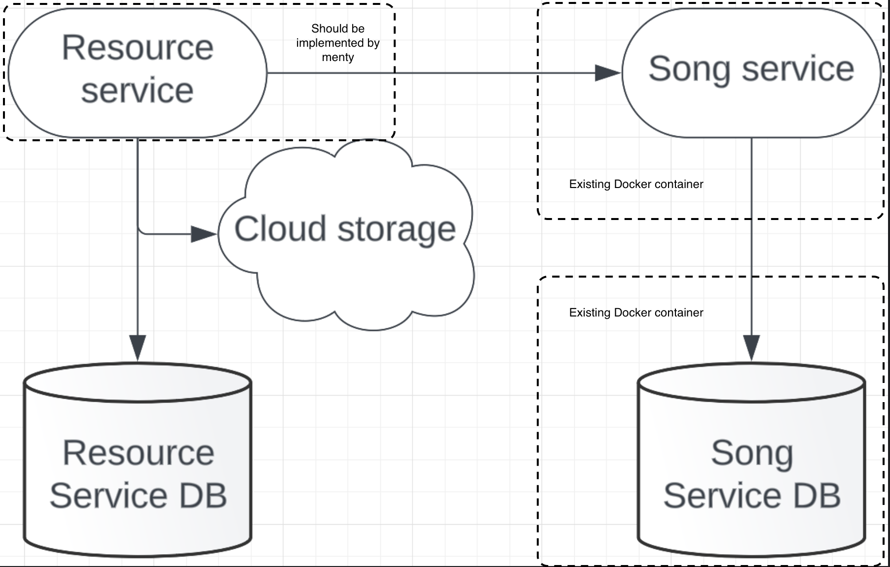

# Table of Content

- [What to do](#what-to-do)
- [Sub-task 1: Songs Service](#sub-task-1-songs-service)
- [Sub-task 2: Resources Service](#sub-task-2-resources-service)

## What to do

In this module you will need to create base structure of microservices system. 
One microservice should be implemented and configured according to provided architecture:

<div align="center">
    
</div>

## Sub-task 1: Songs Service

The **Songs-Service** provide the ability to manage some metadata about the songs (artist, album, etc.). 
The service should be run from existing docker [image](https://hub.docker.com/r/stky20/songs-ms-image/tags).

To run **Songs-Service** as a docker container follow next steps:
- Install [docker engine](https://www.docker.com/products/docker-desktop/) on local machine (Will be used all along a course).
- Create docker-compose.yml file with the following content:

```
services:
  songs-ms:
    image: stky20/songs-ms-image
    ports:
      - {SONGS_MS_PORT}:{INTERNAL_SONG_MS_PORT}
    environment:
      - SONGS_DB_URL=songs-ms-db
      - SONGS_DB_PORT=5432
      - POSTGRES_DB=postgres
      - POSTGRES_PASSWORD=postgres
      - SONGS_MS_SERVER_PORT={INTERNAL_SONGS_MS_PORT}
    restart: always
    depends_on:
      - songs-ms-db

  songs-ms-db:
    image: postgres
    volumes:
      - song-ms-db-data:/var/lib/postgresql/data
    environment:
      - POSTGRES_DB=postgres
      - POSTGRES_PASSWORD=postgres
    ports:
      - {SONG_MS_DB_PORT}:5432
    restart: always

volumes:
  song-ms-db-data:
```

- Replace the following placeholders to appropriate values:\
    **SONGS_MS_PORT** - local machine port on which **Songs-Service** will be run.\
    **INTERNAL_SONGS_MS_PORT** - internal docker container port on which **Songs-Service** will be run.\
    **SONGS_MS_DB_PORT** - local machine port on which **Songs Service Postgres DB** will be run.
- Open command line in folder where **docker-compose.yml** file was created. 
- Execute **docker-compose up** command.
- Verify that **Songs-Service** is available over HTTP: Method: GET, Url: http://localhost:{SONGS_MS_PORT}/songs/{SONG_ID} \
  **SONG_ID** - could be 1

**Songs Service API definition**

<table>
    <tr>
        <td><b>POST /songs</b></td>
        <td colspan="6"><b>Create a new song metadata record in database</b></td>
    </tr>
    <tr>
        <td rowspan="2"><b>Request</b></td>
        <td><i>Parameter</i></td>
        <td><i>Description</i></td>
        <td colspan="2"><i>Body example</i></td>
        <td><i>Description</i></td>
        <td><i>Restriction</i></td>
    </tr>
    <tr>
        <td></td>
        <td></td>
        <td colspan="2"><p>{</p>
            <p>&nbsp;&nbsp;&nbsp;&nbsp;"resourceId": "123",</p>
            <p>&nbsp;&nbsp;&nbsp;&nbsp;"name": "We are the champions",</p>
            <p>&nbsp;&nbsp;&nbsp;&nbsp;"artist": "Queen",</p>
            <p>&nbsp;&nbsp;&nbsp;&nbsp;"album": "News of the world",</p>
            <p>&nbsp;&nbsp;&nbsp;&nbsp;"length": "2:59",</p>
            <p>&nbsp;&nbsp;&nbsp;&nbsp;"year": ""1977</p>
            <p>}</p>
        </td>
        <td>Song metadata record, references resource id ("resourceId" of mp3 file itself)</td>
        <td>MP3 audio data</td>
    </tr>
    <tr>
        <td rowspan="2"><b>Response</b></td>
        <td><i>Body</i></td>
        <td><i>Description</i></td>
        <td colspan="4"><i>Code</i></td>
    </tr>
    <tr>
        <td><p>{</p>
            <p>&nbsp;&nbsp;&nbsp;&nbsp;"id":1123</p>
            <p>}</p></td>
        <td>Integer id – ID of the created song metadata</td>
        <td colspan="4"><p>200 – OK</p>
                        <p>400 – Song metadata missing validation error</p>
                        <p>500 – An internal server error has occurred</p>
        </td>
    </tr>
    <tr>
        <td><b>GET /songs/{id}</b></td>
        <td colspan="6"><b>Get song metadata by id</b></td>
    </tr>
    <tr>
        <td rowspan="2"><b>Request</b></td>
        <td><i>Parameter</i></td>
        <td><i>Description</i></td>
        <td><i>Restriction</i></td>
        <td><i>Body example</i></td>
        <td><i>Description</i></td>
        <td><i>Restriction</i></td>
    </tr>
    <tr>
        <td>Integer id</td>
        <td>Song metadata ID to get</td>
        <td>ID of an existing song metadata</td>
        <td></td>
        <td></td>
        <td></td>
    </tr>
    <tr>
        <td rowspan="2"><b>Response</b></td>
        <td colspan="2"><i>Body</i></td>
        <td colspan="2"><i>Description</i></td>
        <td colspan="2"><i>Code</i></td>
    </tr>
    <tr>
        <td colspan="2"><p>{</p>
                        <p>&nbsp;&nbsp;&nbsp;&nbsp;"resourceId": "123",</p>
                        <p>&nbsp;&nbsp;&nbsp;&nbsp;"name": "We are the champions",</p>
                        <p>&nbsp;&nbsp;&nbsp;&nbsp;"artist": "Queen",</p>
                        <p>&nbsp;&nbsp;&nbsp;&nbsp;"album": "News of the world",</p>
                        <p>&nbsp;&nbsp;&nbsp;&nbsp;"length": "2:59",</p>
                        <p>&nbsp;&nbsp;&nbsp;&nbsp;"year": ""1977</p>
                        <p>}</p>
        </td>
        <td colspan="2"></td>
        <td colspan="2"><p>200 – OK</p>
                        <p>404 – The song metadata with the specified id does not exist</p>
                        <p>500 – An internal server error has occurred</p>
        </td>
    </tr>
    <tr>
        <td><b>DELETE /songs?id=1,2</b></td>
        <td colspan="6"><b>Delete a song(s) metadata.</b></td>
    </tr>
    <tr>
        <td rowspan="2"><b>Request</b></td>
        <td><i>Parameter</i></td>
        <td><i>Description</i></td>
        <td><i>Restriction</i></td>
        <td><i>Body example</i></td>
        <td><i>Description</i></td>
        <td><i>Restriction</i></td>
    </tr>
    <tr>
        <td>String id</td>
        <td>CSV (Comma Separated Values) of song metadata IDs to remove</td>
        <td>Valid CSV length < 200 characters</td>
        <td></td>
        <td></td>
        <td></td>
    </tr>
    <tr>
        <td rowspan="2"><b>Response</b></td>
        <td colspan="2"><i>Body</i></td>
        <td colspan="2"><i>Description</i></td>
        <td colspan="2"><i>Code</i></td>
    </tr>
    <tr>
        <td colspan="2"><p>{</p>
                        <p>&nbsp;&nbsp;&nbsp;&nbsp;"ids": [1,2]</p>
                        <p>}</p></td>
        <td colspan="2">Integer [] ids - IDs of deleted resources</td>
        <td colspan="2"><p>200 – OK</p>
                        <p>500 – An internal server error has occurred</p>
        </td>
    </tr>
</table>

## Sub-task 2: Resources Service

During this task, you need to implement the following service in a programming language that suits you.

For a **Resources-Service**, it is recommended to implement a service with CRUD operations for processing mp3 files.

**Service definition could be next:**

<table>
    <tr>
        <td><b>POST /resources</b></td>
        <td colspan="6"><b>Upload new resource</b></td>
    </tr>
    <tr>
        <td rowspan="2"><b>Request</b></td>
        <td><i>Parameter</i></td>
        <td><i>Description</i></td>
        <td><i>Restriction</i></td>
        <td><i>Body example</i></td>
        <td><i>Description</i></td>
        <td><i>Restriction</i></td>
    </tr>
    <tr>
        <td></td>
        <td></td>
        <td></td>
        <td>Multipart/form-data</td>
        <td>Content type – audio/mpeg</td>
        <td>MP3 form data</td>
    </tr>
    <tr>
        <td rowspan="2"><b>Response</b></td>
        <td><i>Body</i></td>
        <td><i>Description</i></td>
        <td colspan="4"><i>Code</i></td>
    </tr>
    <tr>
        <td><p>{</p>
            <p>&nbsp;&nbsp;&nbsp;&nbsp;"id":1123</p>
            <p>}</p>
        </td>
        <td>Integer id — ID of the created resource</td>
        <td colspan="4"><p>200 – OK</p>
                        <p>400 – Validation failed or request body is invalid MP3</p>
                        <p>500 – An internal server error has occurred</p>
        </td>
    </tr>
    <tr>
        <td><b>GET /resources/{id}</b></td>
        <td colspan="6"><b>Get the binary audio data of a resource</b></td>
    </tr>
    <tr>
        <td rowspan="3"><b>Request</b></td>
        <td><i>Parameter</i></td>
        <td><i>Description</i></td>
        <td><i>Restriction</i></td>
        <td><i>Body example</i></td>
        <td><i>Description</i></td>
        <td><i>Restriction</i></td>
    </tr>
    <tr>
        <td>Integer id</td>
        <td>The ID of the resource to get</td>
        <td>ID of an existing resource</td>
        <td></td>
        <td></td>
        <td></td>
    </tr>
    <tr>
    </tr>
    <tr>
        <td rowspan="2"><b>Response</b></td>
        <td><i>Body</i></td>
        <td><i>Description</i></td>
        <td colspan="4"><i>Code</i></td>
    </tr>
    <tr>
        <td>Audio file data</td>
        <td></td>
        <td colspan="4"><p>200 – OK</p>
                        <p>404 – The resource with the specified id does not exist</p>
                        <p>500 – An internal server error has occurred</p>
        </td>
    </tr>
    <tr>
        <td><b>DELETE /resources?id=1,2</b></td>
        <td colspan="6"><b>Delete a resource(s). If there is no resource for id, do nothing</b></td>
    </tr>
    <tr>
        <td rowspan="2"><b>Request</b></td>
        <td><i>Parameter</i></td>
        <td><i>Description</i></td>
        <td><i>Restriction</i></td>
        <td><i>Body example</i></td>
        <td><i>Description</i></td>
        <td><i>Restriction</i></td>
    </tr>
    <tr>
        <td>String id</td>
        <td>CSV (Comma Separated Values) of resource IDs to remove</td>
        <td>Valid CSV length < 200 characters</td>
        <td></td>
        <td></td>
        <td></td>
    </tr>
    <tr>
        <td rowspan="2"><b>Response</b></td>
        <td><i>Body</i></td>
        <td><i>Description</i></td>
        <td colspan="4"><i>Code</i></td>
    </tr>
    <tr>
        <td><p>{</p>
            <p>&nbsp;&nbsp;&nbsp;&nbsp;"ids": [1,2]</p>
            <p>}</p>
        </td>
        <td>Integer [] ids – ids of deleted resources</td>
        <td colspan="4"><p>200 – OK</p>
                        <p>500 – An internal server error has occurred</p>
        </td>
    </tr>
</table>

When uploading a mp3 file, the **Resources-Service** should process the file in this way:

- **Resources-Service** should use any cloud storage or its emulation (e.g. [S3 emulator](https://github.com/localstack/localstack)) to store the source file.
- Resource tracking (resource location in the cloud storage) should be stored in the underlying database.

Database example table.

<table>
    <tr>
        <td>Resource data</td>
        <td>Description</td>
    </tr>
    <tr>
        <td>id</td>
        <td>Generated resource id</td>
    </tr>
    <tr>
        <td>source_path</td>
        <td>Path to stored file</td>
    </tr>
</table>

- Invoke **Songs-Service** from **Resources-Service** using **Songs-Service** API to save only resource id as metadata in this step.

After uploading file to **Resources-Service** check that **Songs-Service** has saved resource id. (Verify using **Songs-Service-API** or **Songs-Service-DB**)

**Note**

As a database, it is best to use Docker database/storage containers (e.g. [postgres image](https://hub.docker.com/_/postgres)) in the implementation.
