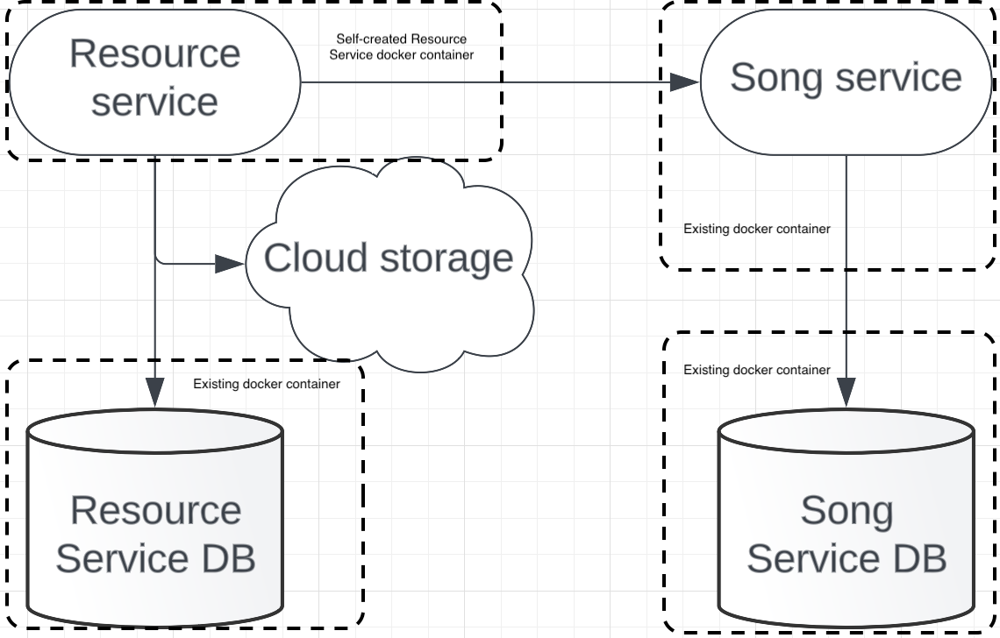

# Table of Content

 - [What to do](#what-to-do)
 - [Sub-task 1: Docker images](#sub-task-1-docker-images)
 - [Sub-task 2: Docker Compose file](#sub-task-2-docker-compose-file)

## What to do

In this module you will need to adjust your service with containerization approach according to following architecture.
Implemented **Resources-Service** should be run in docker container.

    

## Sub-task 1: Docker image

1) Package your applications as Docker image:
 - create a _Docker_ file that would contain instruction on how to package **Resources-Service**;
 - build a docker image and run it;
 - verify that **Resources-Service** available via http.

## Sub-task 2: Docker Compose file

1) When **Resources-Service** is successfully packaged, update an existing _docker-compose.yml_ file that it would also contain
**Resources-Service** docker container, **Resources-Services-Database** docker container and 3rd party dependencies to successfully start whole system.
Once you have a compose file, you can create and start your application containers with a single command: `docker-compose up`.

Optional:
 - Use an _.env_ file to replace all environment variables depending on the set-up.

Possible container options for existing resources:

 - [postgres DB](https://hub.docker.com/_/postgres)
 - [mysql db](https://hub.docker.com/_/mysql)
 - [Local stack (aws emulator)](https://hub.docker.com/r/localstack/localstack)
