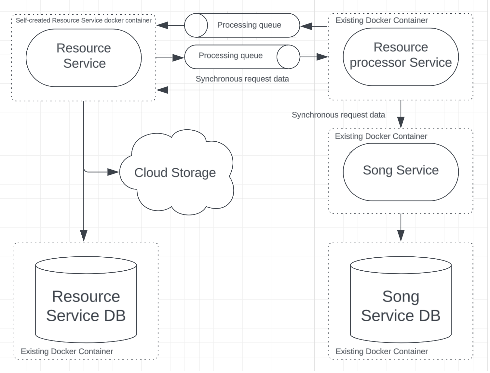

# Table of Content

- [What to do](#what-to-do)
- [Sub-task 1: Resource processor](#sub-task-1-resource-processor)
- [Sub-task 2: Asynchronous communication](#sub-task-2-asynchronous-communication)

## What to do

In this module it is needed to adjust **Resources-Service** created in the previous modules with adding cross-servers
calls.

<div align="center">
    
</div>

## Sub-task 1: Resource Processor

The **Resource-Processor-Service** provides the ability to retrieve metadata from mp3 file and post it into **Songs-Service**.
The service could be run from existing docker [image](https://hub.docker.com/r/stky20/resource-processor-ms-image/tags)
that configured to listen [RabbitMQ](https://www.rabbitmq.com/) queue.
Provided **Resource-Processor-Service** downloads resource by resourceId from **Resources-Service** implemented by mentee.
Be sure that **Resources-Service** API is running and available via http.

If you prefer to use a different messaging broker, you can configure the **Resource-Processor-Service** on your own with
provided:

1. Java [source code](https://git.epam.com/Stanislau_Kudzei/cloud_native_microservices/-/tree/main/resource-processor-service).

To run **Resource-Processor-Service** as a docker container follow next steps:

- Update the docker-compose.yml file with the following content:

```
services:
  resource-processor-ms:
    image: stky20/resource-processor-ms-image
    ports:
      - {RESOURCE_PROCESSOR_MS_SERVER_PORT}:{INTERNAL_RESOURCE_PROCESSOR_MS_SERVER_PORT}
    environment:
      - RMQ_URL=rabbitmq
      - RABBITMQ_USER={RABBITMQ_USER}
      - RABBITMQ_PASSWORD={RABBITMQ_PASSWORD}
      - RMQ_UPLOADED_QUEUE={RMQ_UPLOADED_QUEUE}
      - RMQ_PROCESSED_QUEUE={RMQ_PROCESSED_QUEUE}
      - RESOURCES_MS_URL={RESOURCES_MS_URL}
      - RESOURCES_MS_SERVER_PORT={RESOURCES_MS_SERVER_PORT}
      - SONGS_MS_URL={SONGS_MS_URL}
      - SONGS_MS_SERVER_PORT={SONGS_MS_SERVER_PORT}
      - RESOURCE_PROCESSOR_MS_SERVER_PORT={INTERNAL_RESOURCE_PROCESSOR_MS_SERVER_PORT}
    restart: always
    depends_on:
      - rabbitmq
      - song-ms
      - {RESOURCE_SERVICE_MS}
    
  rabbitmq:
    image: rabbitmq:3.10.7-management
    volumes:
      - rabbit-mq:/var/lib/rabbitmq
    environment:
      - RABBITMQ_DEFAULT_USER={RABBITMQ_USER}
      - RABBITMQ_DEFAULT_PASS={RABBITMQ_PASSWORD}
    restart: always
    ports:
      - 15672:15672
      - 5672:5672

volumes:
  rabbit-mq:
```

- Replace the following placeholders to appropriate values:\
  **RESOURCE_PROCESSOR_MS_SERVER_PORT** - local machine port on which **Resource-Processor-Service** will be run\
  **INTERNAL_RESOURCE_PROCESSOR_MS_SERVER_PORT** - internal docker container port on which **Resource-Processor-Service** will be run.\
  **RMQ_UPLOADED_QUEUE** - queue name to get messages from **Resources-Service**\
  **RMQ_PROCESSED_QUEUE** - queue name to send messages to **Resources-Service**\
  **RESOURCES_MS_URL** - local machine url and port on which **Resources-Service** will be run\
  **RESOURCES_MS_SERVER_PORT** - docker container port on which **Resources-Service** will be run\
  **SONGS_MS_URL** - local machine url and port on which **Songs-Service** will be run\
  **SONGS_MS_SERVER_PORT** - docker container port on which **Songs-Service** will be run\
  **RESOURCE_SERVICE_MS** - the name of **Resources-Service** which declared in this docker compose file\
  **RABBITMQ_USER** - user name for **Rabbit MQ**\
  **RABBITMQ_PASSWORD** - user password for **Rabbit MQ**.

## Sub-task 2: Asynchronous communication

1) Remove all http calls to **Songs-Service** from **Resources-Service** implemented in previous modules
2) Add asynchronous communication via messaging broker between **Resources-Service** and **Resource-Processor-Service**.
   - On resource uploading, **Resources-Service** should send information about uploaded resource to the **Resource
     Processor**, which contains “resourceId”.
   - After resource processed, **Resources-Service** should receive information about resource.

**Note**

For this module you could
use [Rabbit MQ](https://hub.docker.com/_/rabbitmq), [ActiveMQ](https://hub.docker.com/r/rmohr/activemq) or any other
broker for asynchronous communication (it’s better to discuss with expert).

