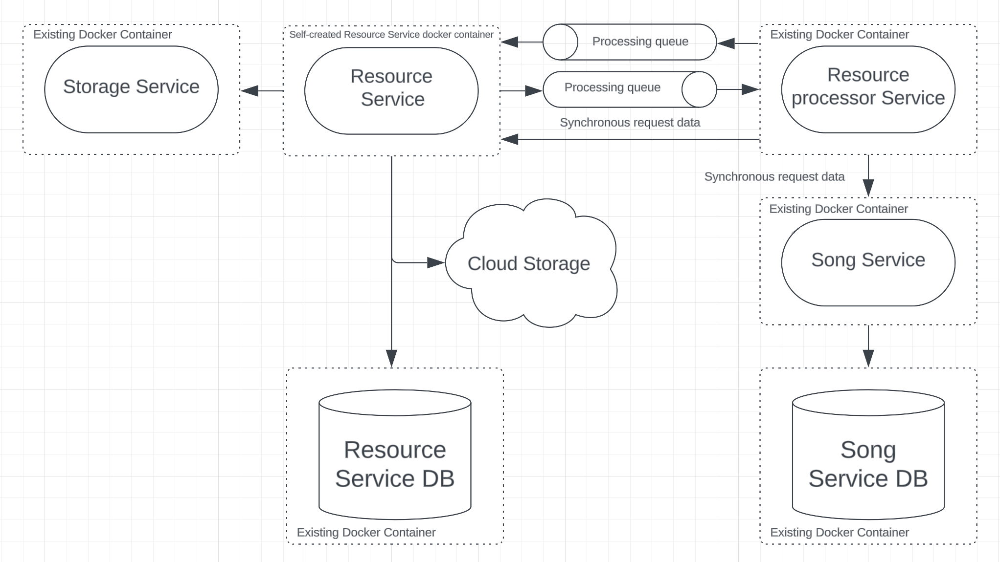
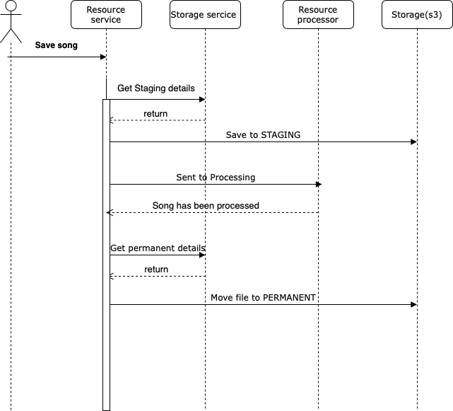

# Table of Content

- [What to do](#what-to-do)
- [Sub-task 1: Storage Service](#sub-task-1-storages-service)
- [Sub-task 2: Retry mechanism](#sub-task-2-retry-mechanism)
- [Sub-task 3: Resilience](#sub-task-3-resilience)

## What to do

In this module it's required to make communication between **Resources-Service** and other microservices fault-tolerant.
The microservice system should look like the one below:

<div align="center">
    
</div>

As you can see from the picture **Resources-Service** should invoke **Storages-Service**.
This is required to configure circuit breaker pattern in services communication.

Previous tasks implementation did not have any near-static data, so in order to emulate a stubbed circuit breaker,
we have to add one more element that emulates this data.

1. Now our files should be in different states depends on processing phase: **STAGING** - file in processing, *
   *PERMANENT** - file has been successfully processed;
2. To store and manage this states we will create **Storages-Service**. It will be asked by **Resources-Service** for
   state details;
3. For case when **Storages-Service** is unavailable, we will extend **Resources-Service** to use advantages of fault
   tolerance pattern.

## Sub-task 1: Storages Service

1) The **Storages-Service** will be used for management of **storage** types. Each storage type corresponds to state of
   uploaded resource.
   The service has next API:

<table>
    <tr>
        <td><b>GET /storages</b></td>
        <td colspan="6"><i>Gets storages list</i></td>
    </tr>
    <tr>
        <td rowspan="1"><b>Request</b></td>
        <td>Parameter</td>
        <td>Description</td>
        <td>Restriction</td>
        <td>Body example</td>
        <td>Description</td>
        <td>Restriction</td>
    </tr>
    <tr>
        <td rowspan="2"><b>Response</b></td>
        <td colspan="3">Body</td>
        <td>Description</td>
        <td colspan="2">Code</td>
    </tr>
    <tr>
        <td colspan="3">
            <p>[</p>
            <p>&nbsp;&nbsp;&nbsp;&nbsp;{</p>
            <p>&nbsp;&nbsp;&nbsp;&nbsp;&nbsp;&nbsp;&nbsp;&nbsp;"id": "1",</p>
            <p>&nbsp;&nbsp;&nbsp;&nbsp;&nbsp;&nbsp;&nbsp;&nbsp;"storageType": "PERMANENT",</p>
            <p>&nbsp;&nbsp;&nbsp;&nbsp;&nbsp;&nbsp;&nbsp;&nbsp;"bucket": "bucket_name",</p>
            <p>&nbsp;&nbsp;&nbsp;&nbsp;&nbsp;&nbsp;&nbsp;&nbsp;"path": "/files"</p>
            <p>&nbsp;&nbsp;&nbsp;&nbsp;}</p>
            <p>]</p>
        </td>
        <td>Existing storages list </td>
        <td colspan="2"><p>200 – OK</p>
                        <p>500 – Internal server error occurred.</p>
        </td>
    </tr>
</table>

The service could be run from existing docker [image](https://hub.docker.com/r/stky20/storages-ms-image/tags).

- Update the docker-compose.yml file with the following content:

```
storage-ms:
  image: stky20/storages-ms-image
  ports:
    - {STORAGES_MS_SERVER_PORT}:{INTERNAL_STORAGES_MS_SERVER_PORT}
  environment:
    - STORAGES_MS_SERVER_PORT={INTERNAL_STORAGES_MS_SERVER_PORT}
    - STAGING_STORAGE_NAME={STAGING_STORAGE_NAME}
    - PERMANENT_STORAGE_NAME={PERMANENT_STORAGE_NAME}
    - STAGING_STORAGE_PATH={STAGING_STORAGE_PATH}
    - PERMANENT_STORAGE_PATH={PERMANENT_STORAGE_PATH}
```

- Replace the following placeholders to appropriate values:\
  **STORAGES_MS_SERVER_PORT** - local machine port on which **Storages-Service** will be run\
  **INTERNAL_STORAGES_MS_SERVER_PORT** - internal docker container port on which **Storages-Service** will be run.\
  **STAGING_STORAGE_NAME** - cloud storage staging bucket name used by **Resources-Service**\
  **PERMANENT_STORAGE_NAME** - cloud storage permanent bucket name used by **Resources-Service**\
  **STAGING_STORAGE_PATH** - folder in staging bucket\
  **PERMANENT_STORAGE_PATH** - folder in permanent bucket

2) Update system to interact with new storage service:
   Prior to this task, the **Resources-Service** used single storage to store data.
   Now the data should be kept in different storages (different s3 buckets, folders in bucket, ect.) depending on
   processing stage.
   When **Storages-Service** starts, two predefined **Storage Types** will be created in **Storages-Service-DB**
   by default (using **CLOUD_STORAGE_STAGING_BUCKET_NAME**, **CLOUD_STORAGE_PERMANENT_BUCKET_NAME** from docker-compose
   configuration).
   Default **Storage Types**: **STAGING** and **PERMANENT**.

To find out details about each state and appropriate storage path **Resources-Service** should call **Storages-Service**.

So when new file comes to **Resources-Service** for processing, we save file to **STAGING** storage retrieved from *
*Storage Service**,
update file state and path in **Resources-Service-DB**, then send the file for further processing to queue.
When **Resources-Service** receives signal from **Resource Processor** that file has been successfully processed,
we change state of file to **PERMANENT**, update link in **Resources-Service-DB** and move file to **PERMANENT** storage.

<div align="center">
    
</div>

# Sub-task 2: Retry mechanism

While implementing communications between services it’s necessary to think about implementation of **Retry Mechanism**,
e.g:
[Retry Pattern](https://docs.microsoft.com/en-us/azure/architecture/patterns/retry).
Implementation can be based on
the [Spring Retry Template](https://docs.spring.io/spring-batch/docs/current/reference/html/retry.html)
or annotations for both synchronous and asynchronous communication.
Add **Retry Mechanism** to at list one service call.

## Sub-task 3: Resilience

And finally we implement circuit breaker pattern.
Imagine that storage service is down, but we do not want to make our users wait until we repair services.
So for such cases, when storage service in unavailable, we will store stub data in resource service to emulate response
from storage service.
Emulates response should be the same as storage service would return.

1) Add a [Resilience4j](https://mvnrepository.com/artifact/io.github.resilience4j/resilience4j-circuitbreaker) library
   for **Resources-Service**.
2) Add the circuit breaker config to services (when calling **Storages-Service-API** get storages for storing processed files).
3) When an exception returns from the called service provide returning of the stub result.
4) Simulate a failure of the service by shutting down a called service (**Storages-Service**) and test the circuit
   breaker.
