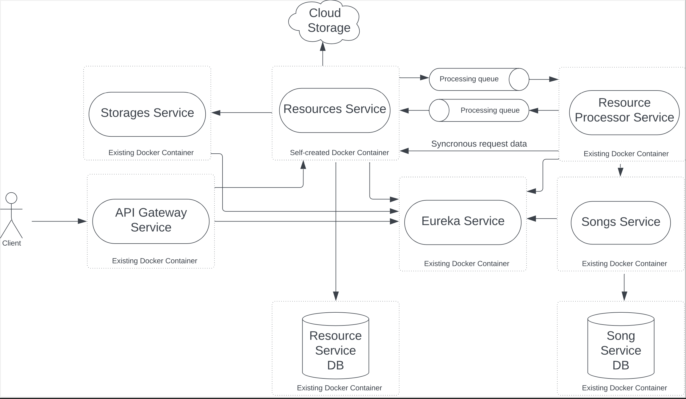

# Table of Content

 - [What to do](#what-to-do)
 - [Sub-task 1: Service Registry](#sub-task-1-service-registry)
 - [Sub-task 2: API Gateway](#sub-task-2-api-gateway)

## What to do

In this task, it is needed to change the configuration to use the existing **Service Registry** tool.
Sample implementation: [Eureka Example](https://www.javainuse.com/spring/cloud-gateway-eureka).

<div align="center">
    
</div>

## Sub-task 1: Service Registry

1) Update infrastructure of configuration to make sure that **Service Registry** is launched along with existing services.
For that corresponding docker image is provided.
2) Update clients: **Resources-Service** and all provided microservices containers, that they were using Eureka and can 
be called by service name instead of ip:port.
3) Implement Client-Side Balancing in **Resources-Service** (API calls to **Storages-Service** should be Load Balanced).

The **Eureka Service** provides functionality of **Service Registry**.
The service should be run from existing docker [image](https://hub.docker.com/repository/docker/stky20/eureka-ms-image).
To run **Eureka Service** as a docker container follow next steps:
- Update docker-compose.yml file with the following content:

```
services:
  eureka-ms:
    image: stky20/eureka-ms-image
    environment:
      - EUREKA_MS_SERVER_PORT={EUREKA_MS_SERVER_PORT}
    ports:
      - {EUREKA_MS_SERVER_PORT}:{EUREKA_MS_SERVER_PORT}
    restart: always
  
  songs-ms:
    ...
    environment:
      - SONGS_MS_APP_NAME={SONGS_MS_APP_NAME}
      - EUREKA_MS_URL=eureka-ms
      - EUREKA_MS_SERVER_PORT={EUREKA_MS_SERVER_PORT}
      ...
  
  resource-processor-ms:
    ...
    environment:
      - RESOURCE_PROCESSOR_MS_APP_NAME={RESOURCE_PROCESSOR_MS_APP_NAME}
      - RESOURCES_MS_APP_NAME={RESOURCES_MS_APP_NAME}
      - SONGS_MS_APP_NAME={SONGS_MS_APP_NAME}
      - EUREKA_MS_URL=eureka-ms
      - EUREKA_MS_SERVER_PORT={EUREKA_MS_SERVER_PORT}
      ...
      
  storages-ms:
    ...
    environment:
      - STORAGES_MS_APP_NAME={STORAGES_MS_APP_NAME}
      - EUREKA_MS_URL=eureka-ms
      - EUREKA_MS_SERVER_PORT={EUREKA_MS_SERVER_PORT}
    ...
    
  resources-ms:
    ...
    environment:
      - RESOURCES_MS_APP_NAME={RESOURCES_MS_APP_NAME}
      - STORAGES_MS_APP_NAME={STORAGES_MS_APP_NAME}
      - EUREKA_MS_URL=eureka-ms
      - EUREKA_MS_SERVER_PORT={EUREKA_MS_SERVER_PORT}
    ...

```

- Replace the following placeholders to appropriate values:
  - **EUREKA_MS_SERVER_PORT** - server port for **Eureka-Server**, by default 8761.
  - **RESOURCES_MS_APP_NAME** - **Resources-Service** spring application names 
(environment variable with the name RESOURCES_MS_APP_NAME is expected in provided containers to make calls to **Resources-Service**
using service registry).
  - **SONGS_MS_APP_NAME** - **Songs-Service** spring application names.
  - **RESOURCE_PROCESSOR_MS_APP_NAME** - **Resource-Processor-Service** spring application names.
  - **STORAGES_MS_APP_NAME** - **Storages-Service** spring application names.

- Do not forget to configure provided containers in docker-compose.yaml to enable eureka client with following options:
  - update **depends_on:** elements of docker compose configuration of all services with **eureka-ms** docker compose service; 
  - update lists of environment variables of docker compose services where it is required:
    - EUREKA_MS_URL={docker compose service name for eureka server};
    - EUREKA_MS_SERVER_PORT={docker compose service port for eureka server. Optional, by default it will use 8761 in all services}
    - ENABLE_EUREKA_CLIENT=true [this option enables eureka client in provided containers]

## Sub-task 2: API Gateway

1) Use API Gateway implementation - Spring Cloud Gateway.
The service should be run from existing docker [image](https://hub.docker.com/repository/docker/stky20/api-gateway-ms-image/).
2) Update infrastructure configuration to make sure that API Gateway is launched, exposed and there is a single-entry point in application:
- Update docker-compose.yml file with the following content:

```
services:
  api-gateway-ms:
    image: stky20/api-gateway-ms-image
    environment:
      - API_GATEWAY_MS_SERVER_PORT={API_GATEWAY_MS_SERVER_PORT}
      - EUREKA_MS_URL=eureka-ms
      - EUREKA_MS_SERVER_PORT={EUREKA_MS_SERVER_PORT}
      - RESOURCES_MS_APP_NAME={RESOURCES_MS_APP_NAME}
      - RESOURCE_PROCESSOR_MS_APP_NAME={RESOURCE_PROCESSOR_MS_APP_NAME}
      - SONGS_MS_APP_NAME={SONGS_MS_APP_NAME}
      - STORAGES_MS_APP_NAME={STORAGES_MS_APP_NAME}
    ports:
      - {API_GATEWAY_MS_SERVER_PORT}:{API_GATEWAY_MS_SERVER_PORT}
    restart: always
    depends_on:
      - eureka-ms
      - resources-ms
      - songs-ms
      - resource-processor-ms
      - storages-ms
```

3) Make sure that all services receive traffic from external clients through the API Gateway. 

**Note.** In case there are issues with running all services on your local machine, for example, not enough CPU range or RAM, here are the following options:
 - use [docker limits](https://docs.docker.com/config/containers/resource_constraints/)
 - use any cloud free tier system if it’s possible
 - use [EPAM Cloud](https://kb.epam.com/display/EPMCITFAQ/Personal+Projects)  
