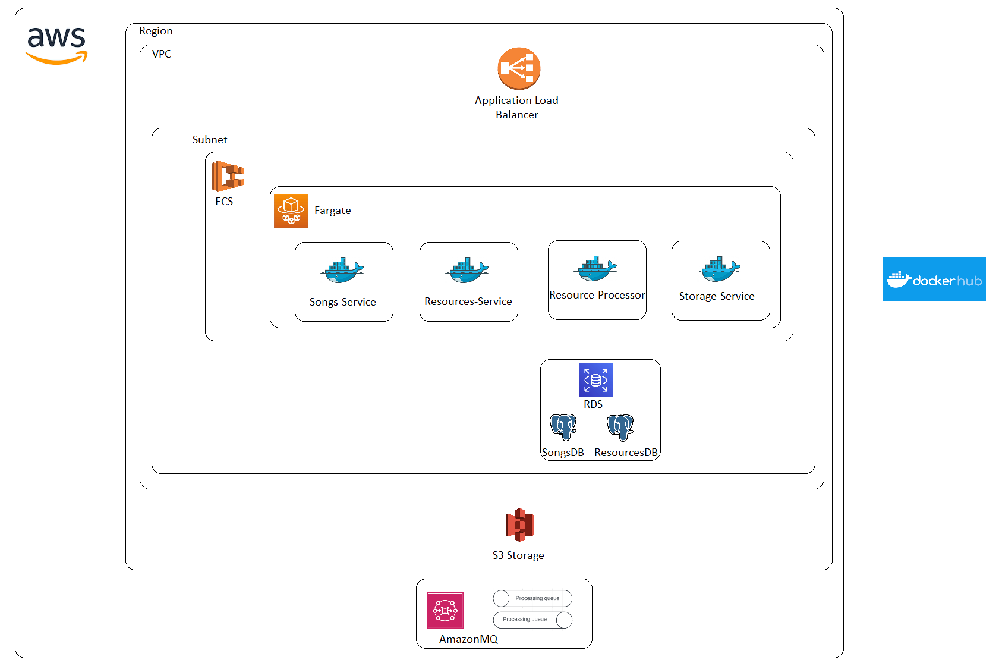

# Table of Content
 - [What to do](#what-to-do)
 - [Sub-task 1: Run microservices in cloud](#sub-task-1--microservices-in-cloud)
 - [Sub-task 2: Dispose all cloud resources](#sub-task-2--dispose-properly-all-used-cloud-resources)

__[TODO: check namings: microservices names, AWS services names and abbreviations, DB and AMQP broker names]__

## What to do

In this task it is required to run microservices in the Cloud.

**Note:** This task refers to Amazon Web Services (AWS). However, similar options are available from other Cloud 
Providers (Google Cloud, Azure, etc.) If you already have account with one of the providers feel free to use it and 
run microservices there.

This task is based on your implementation of **Resource-Service** packaged in docker container and other services
provided to you along the course as docker containers at Docker hub: **Resource-Processor-Service**, **Songs-Service**
and **Storages-Service**. [Rabbit MQ broker](https://docs.aws.amazon.com/amazon-mq/latest/developer-guide/welcome.html)
and [Database](https://docs.aws.amazon.com/AmazonRDS/latest/UserGuide/Welcome.html) should be created using AWS services.

Your image of **Resource-Service** should be uploaded to Docker hub, ECR or any other image registry available to you.

It is required to run all microservices as docker containers on selected Cloud Provider and use instruments of that
provider to configure service discovery.

<!-- DOCUSAURUS_CODE_TABS -->

<!--[AWS]-->

    

## Sub-task 1: Microservices in cloud

To do that with AWS fallow next steps:

1. Log in to your AWS account.
2. Start RabbitMQ as AWS service for that use
   [AmazonMQ service](https://us-east-1.console.aws.amazon.com/amazon-mq/home);
3. For the task use the same AWS Virtual Private Cloud with security groups for all running AWS resources.
4. All running resources shouldn't be publicly available except AWS ALB;
5. Start [PostgreSQL database in AWS RDS service](https://us-east-1.console.aws.amazon.com/rds/home)
   to be used as DB for **Songs-Service**, and start one more database instance of db provider (PostgreSQL, MySQL, etc.)
   used by your implementation of **Resources-Service**. (For sake of economy you can use one single instance of PostgreSQL
   for both microservices).

Wait while instances of RabbitMQ and Databases will have [Running| TODO: check status names] status.

6. Now you can start all provided services (**Storages-Service**, **Songs-Service**, **Resource-Processor-Service**) as
   containers in AWS. For this purpose we selected to use
   [AWS ECS service](https://docs.aws.amazon.com/AmazonECS/latest/developerguide/Welcome.html). To run containers without 
   having to manage servers or clusters of Amazon EC2 instances
   [AWS Fargate](https://docs.aws.amazon.com/AmazonECS/latest/userguide/what-is-fargate.html) is a great option.

   6.1. [Create ECS cluster for Fargate lunch type](https://docs.aws.amazon.com/AmazonECS/latest/developerguide/create-cluster-console-v2.html). \
   Notice in documentation that Namespace can be selected or created during Cluster creation (A namespace allows
   services that you create in the cluster to connect to the other services in the namespace without additional
   configuration), it will be required during ECS Services creation.  
   
   6.2. [Create Tasks Definitions for each service](https://docs.aws.amazon.com/AmazonECS/latest/developerguide/create-task-definition.html)
   using next environment variables:

- **Storages-Service**:
    - STAGING_STORAGE_NAME=postgres
    - PERMANENT_STORAGE_NAME=postgres
    - STAGING_STORAGE_PATH=STAGING
    - PERMANENT_STORAGE_PATH=PERMANENT

- **Songs-Service**,
    - SONGS_DB_URL=song-db
    - SONGS_DB_PORT=5432
    - SONGS_MS_PORT=8083

- **DB**
    - POSTGRES_DB=postgres
    - POSTGRES_PASSWORD=postgres

- **Resource-Processor-Service**
    - SONGS_MS_URL=songs-my-cluster
    - SONGS_MS_PORT=8083
    - RESOURCES_MS_URL=resources-mu-cluster
    - RESOURCES_MS_PORT=8080
    - 
    - RMQ_URL=rabbitmq
    - RMQ_PORT=5671
    - RMQ_USE_SSL=true
    - RMQ_UPLOADED_QUEUE=resource_uploaded
    - RMQ_PROCESSED_QUEUE=resource_processed
    - 
    - RABBITMQ_USER=rmquser
    - RABBITMQ_PASSWORD=rmqpassword

**Tip:** It is possible to keep all variables in single file in S3 bucket to reference it while declaring task definition,
it will eliminate manual creation of each environment variable for each Task Definition.

   6.3. Create [ECS Services](https://docs.aws.amazon.com/AmazonECS/latest/developerguide/ecs_services.html) for all Task
   Definitions from [AWS console](https://docs.aws.amazon.com/AmazonECS/latest/developerguide/ecs_services.html) enabling
   "Turn on Service Connect" option with "Client and server" configuration.

7. Now, when all system is ready, you can start your **Resource-Service** also using AWS ECS.

   7.1. Create Task Definition. Do not forget to set up correct environment variables required for correct communication
   with other services.

   7.2. Create Service in Cluster enabling:
    - "Turn on Service Connect" option with "Client and server" configuration
    - Configure [AWS Application Load Balancer](https://docs.aws.amazon.com/elasticloadbalancing/latest/application/introduction.html)
    - Configure access to microservices using Security group Inbound rules
    - Make sure that only **Resource-Service** is publicly available via AWS ALB public DNS.
    - Configure access to S3 bucket used by **Resource-Service**. For that corresponding IAM role can be added to the 
AWS ECS service.

## Sub-task 2: Dispose properly all used Cloud resources.
After verifying that all system works as expected make sure that all used resources are properly disposed.
- Stop AmazonMQ broker;
- Terminate AWS RDS database instances;
- Delete all ECS services in your cluster;
- Delete Namespace in AWS CloudMap;
- Deregister and delete all tasks revisions of Task definitions in AWS ECS.
- Remove S3 bucket used for the course; 

**Remember!**
> - Terminate/Remove all created resources/services once you finish Module
> - Do NOT keep instance running if you don’t use it
> - Carefully keep track of billing

**Reference solution:** Example of running microservices can be found in "Task reference solution".

<!--[AZURE]-->

<!--[Google Cloud]-->

<!-- END_DOCUSAURUS_CODE_TABS -->
