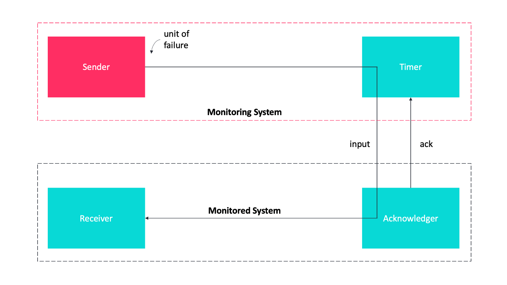

# Table of Content

 - [Fault tolerance](#fault-tolerance)
 - [Designing a Microservices Architecture for Failure](#designing-a-microservices-architecture-for-failure)
 - [Design Patterns: Top 5 Techniques for Implementing Fault Tolerance in Distributed Systems](#design-patterns-top-5-techniques-for-implementing-fault-tolerance-in-distributed-systems)
 - [The Future of Spring Cloud's Hystrix Project](#the-future-of-spring-clouds-hystrix-project)
 - [Related reading](#related-reading)
 - [Questions](#questions)
 
# Fault tolerance

You can build resilient microservices by including fault tolerance policies in your code.

Microservice-based applications are resilient when they can continue operating if there is a failure or error in some part of the system. Fault tolerance helps applications fail fast and recover smoothly by guiding how and when certain requests occur and by providing fallback strategies to handle common errors. For example, in an airline ticket application, different microservices might support scheduling, purchasing, and customer preferences. If one service fails, fault tolerance policies help contain the error and keep it from taking down the whole application.

## MicroProfile Fault Tolerance

The [MicroProfile Fault Tolerance](https://download.eclipse.org/microprofile/microprofile-fault-tolerance-2.0/microprofile-fault-tolerance-spec.html) feature defines a standard API to implement a set of fault tolerance policies. The policies that you implement in your code guide how long requests run, when they retry after an error, and what they do to recover when certain requests fail. MicroProfile Fault Tolerance makes it easy to build resilient microservices that provide reliable function, even when errors occur.

MicroProfile Fault Tolerance supports the following policies:

 - Timeouts
 - Retries
 - Fallbacks
 - Circuit Breakers
 - Bulkheads
 - Asynchronous

**Timeout**

The Timeout policy prevents a request from waiting forever by setting a time limit on how long it can run. If the request exceeds the time limit, the timeout policy fails the request, even if it returns successfully. This policy saves an application from allocating resources to an unresponsive service.

The following example shows a `@Timeout` annotation that is applied to the method `serviceA`, with a time limit of 400 ms.

```java
@Timeout(400) // timeout is 400ms
public Connection serviceA() {
   Connection conn = null;
   counterForInvokingServiceA++;
   conn = connectionService();
   return conn;
}
```

For more information, see [the Timeout annotation](https://openliberty.io/docs/21.0.0.2/reference/javadoc/microprofile-3.3-javadoc.html#package=org/eclipse/microprofile/faulttolerance/package-frame.html&class=org/eclipse/microprofile/faulttolerance/Timeout.html).

**Retry**

In some cases, the underlying causes of an error or delay are momentary. The Retry policy saves an operation from failing on a momentary error by trying the operation again and giving it another chance to succeed.

The Retry policy can be applied at either the class or method level. If it is applied to a class, all the methods in that class receive the same retry policy. If different retry policies are applied at a class level and at a method level within that class, the method level `@Retry` annotation overrides the class level policy for that particular method.

The following example shows a `@Retry` that is annotation is configured to retry an underlying service if the service throws an exception.

```java
@Retry(retryOn = Exception.class)
public void service() {
    underlyingService();
}
```

For more information, see [the Retry annotation](https://openliberty.io/docs/21.0.0.2/reference/javadoc/microprofile-3.3-javadoc.html#package=org/eclipse/microprofile/faulttolerance/package-frame.html&class=org/eclipse/microprofile/faulttolerance/Retry.html).

**Circuit Breaker**

The circuit breaker policy prevents repeated failures by setting conditions under which an operation fails immediately. If these conditions are met, the circuit breaker opens and fails the operation, which prevents repeated calls that are likely to fail.

There are three possible circuit states that are set by the circuit breaker. The transition between these states is determined by how the failure condition parameters are configured on the `@CircuitBreaker` annotation.

 - **Closed**: Under normal conditions, the circuit breaker is closed, which allows operations to continue running.
 - **Open**: When the configured error conditions are met, the circuit breaker opens and calls to the service that is operating under the circuit breaker fail immediately.
 - **Half-open**: After the configured delay period, an open circuit moves to a half-open state. In this state, the circuit accepts a configured number of trial calls. If any of these calls fail, the circuit breaker returns to the open state. If the configured number of trial calls succeed, the circuit moves to the closed state, which resumes normal operations.

The following example shows a circuit breaker policy that is configured on the `serviceA` method to open the circuit after three failures occur during a rolling window of four consecutive invocations. The circuit stays open for 1000 ms before it moves to half-open. After 10 consecutive successful invocations, the circuit moves back to the closed state.

```java
@CircuitBreaker(successThreshold = 10, requestVolumeThreshold = 4, failureRatio=0.75, delay = 1000)
public Connection serviceA() {
   Connection conn = null;
   counterForInvokingServiceA++;
   conn = connectionService();
   return conn;
}
```

For more information, see [the Circuit Breaker annotation](https://openliberty.io/docs/21.0.0.2/reference/javadoc/microprofile-3.3-javadoc.html#package=org/eclipse/microprofile/faulttolerance/package-frame.html&class=org/eclipse/microprofile/faulttolerance/CircuitBreaker.html).

**Bulkhead**

The Bulkhead policy prevents faults in one part of an application from cascading to the entire system and causing widespread failure. The `@Bulkhead` annotation limits the number of concurrent requests and saves an unresponsive service from wasting system resources.

In the following example, the `@Bulkhead` annotation is configured on the `serviceA` method to limit the number of concurrent calls to five. After the total number of concurrent calls reaches five, any additional calls fail with a `BulkheadException` error.

```java
@Bulkhead(5) // maximum 5 concurrent requests allowed
public Connection serviceA() {
   Connection conn = null;
   counterForInvokingServiceA++;
   conn = connectionService();
   return conn;
}
```

For more information, see [the Bulkhead annotation](https://openliberty.io/docs/21.0.0.2/reference/javadoc/microprofile-3.3-javadoc.html#package=org/eclipse/microprofile/faulttolerance/package-frame.html&class=org/eclipse/microprofile/faulttolerance/Bulkhead.html).

**Fallback**

The `@Fallback` annotation can be used as a last line of defense when other policies fail to solve an issue. The fallback starts after any other fault tolerance processing is complete. For example, if you use the `@Fallback` annotation together with the `@Retry` annotation, the fallback is called only after the maximum number of retries is exceeded.

The following example shows a `@Fallback` annotation that is configured to call the `fallbackForServiceB` method after the maximum two retries are exceeded.

```java
@Retry(maxRetries = 2)
  @Fallback(fallbackMethod= "fallbackForServiceB")
  public String serviceB() {
      counterForInvokingServiceB++;
     return nameService();
  }

  private String fallbackForServiceB() {
      return "myFallback";
  }
```

For more information, see [the Fallback annotation](https://openliberty.io/docs/21.0.0.2/reference/javadoc/microprofile-3.3-javadoc.html#package=org/eclipse/microprofile/faulttolerance/package-frame.html&class=org/eclipse/microprofile/faulttolerance/Fallback.html).

**Asynchronous**

You can use the Asynchronous policy to configure the completion of a request so that it occurs on a separate thread from where the request was received. With this policy, a thread can continue to receive new requests while it waits for the initial request to complete on a separate thread. When you use this notation together with other fault tolerance policies, any fault tolerance processing occurs on a different thread.

This configuration helps build resiliency into a microservice because fault tolerance policies such as Retry and Fallback can run on a different thread from where the initial call was received. That initial thread can continue receiving calls rather than having to wait for fault tolerance to resolve. The initial thread returns a `CompletionStage` object, which is completed after the execution thread is finished, whether successfully or by exception.

The following example shows an `@Asynchronous` annotation that is implemented on the `serviceA` method. In this configuration, a request to the `serviceA` method returns a `CompletionStage` object immediately while the completion of the method occurs on a different thread.

```java
@Asynchronous
public CompletionStage<Connection> serviceA() {
   Connection conn = null;
   counterForInvokingServiceA++;
   conn = connectionService();
   return CompletableFuture.completedFuture(conn);
}
```

For more information, see [the Asynchronous annotation](https://openliberty.io/docs/21.0.0.2/reference/javadoc/microprofile-3.3-javadoc.html#package=org/eclipse/microprofile/faulttolerance/package-frame.html&class=org/eclipse/microprofile/faulttolerance/Asynchronous.html).

## Coordinating multiple fault tolerance policies

You can maximize the resiliency of your application by configuring multiple fault tolerance policies to work together. In the following example, an airline ticket application can recover from an outage in a ticket pricing microservice (`priceService`) by implementing the timeout, asynchronous and fallback policies.

In this configuration, the `@Asynchronous` annotation immediately returns a `CompletionStage` object while the request to the pricing microservice is handled on a new thread. If the request waits for longer than 300 milliseconds, a `TimeoutException` is thrown on the new thread. Then, the `TimeoutException` triggers the fallback policy, which calls the `fallbackForPriceService` method, which might either display an error message or return the most recent cached pricing information. The result is then returned to the `CompletionStage` object.

```java
@Asynchronous
@Timeout(300)
 @Fallback(fallbackMethod= "fallbackForPriceService")
 public CompletionStage<Connection> priceService() {
     CompletableFuture<U> future = new CompletableFuture<>();
     future.completeExceptionally(new TimeoutException("Failure"));
    return future;
}

private CompletionStage<Connection> fallbackForPriceService() {
    return CompletableFuture.completedFuture(connection);
}
```

## Fault tolerance guides

Ready to start building more resilient microservices with MicroProfile Fault Tolerance? See the following guides to learn how different fault tolerance policies can work together to make your microservices resilient, reliable, and robust:

 - To explore how to use the Fallback policy to reduce the impact of failures and ensure continued operation, see [Building fault-tolerant microservices with the @Fallback annotation](https://openliberty.io/guides/microprofile-fallback.html).
 - To learn how to use the Timeout and Retry policies to make your microservices more resilient to common network problems, see [Failing fast and recovering from errors](https://openliberty.io/guides/retry-timeout.html).
 - To learn how to use the Bulkhead, Asynchronous, and Fallback policies to prevent faults from stopping an entire system, see [Limiting the number of concurrent requests to microservices](https://openliberty.io/guides/bulkhead.html).
 - To learn how to use the Circuit Breaker and Fallback policies to prevent repeated failed calls to a service, see [Preventing repeated failed calls to microservices](https://openliberty.io/guides/circuit-breaker.html).

# Designing a Microservices Architecture for Failure

A Microservices architecture makes it possible to **isolate failures** through well-defined service boundaries. But like in every distributed system, there is a **higher chance** for network, hardware or application level issues. As a consequence of service dependencies, any component can be temporarily unavailable for their consumers. To minimize the impact of partial outages we need to build fault tolerant services that can **gracefully** respond to certain types of outages.

This article introduces the most common techniques and architecture patterns to build and operate a **highly available microservices** system based on [RisingStack’s Node.js Consulting & Development experience](https://risingstack.com/).

_If you are not familiar with the patterns in this article, it doesn’t necessarily mean that you do something wrong. Building a reliable system always comes with an extra cost._

## The Risk of the Microservices Architecture

The microservices architecture moves application logic to services and uses a network layer to communicate between them. Communicating over a network instead of in-memory calls brings extra latency and complexity to the system which requires cooperation between multiple physical and logical components. The increased complexity of the distributed system leads to a higher chance of particular **network failures**.

One of the biggest advantage of a microservices architecture over a monolithic one is that teams can independently design, develop and deploy their services. They have full ownership over their service’s lifecycle. It also means that teams have no control over their service dependencies as it’s more likely managed by a different team. With a microservices architecture, we need to keep in mind that provider **services can be temporarily unavailable** by broken releases, configurations, and other changes as they are controlled by someone else and components move independently from each other.

## Graceful Service Degradation

One of the best advantages of a microservices architecture is that you can isolate failures and achieve graceful service degradation as components fail separately. For example, during an outage customers in a photo sharing application maybe cannot upload a new picture, but they can still browse, edit and share their existing photos.


In most of the cases, it’s hard to implement this kind of graceful service degradation as applications in a distributed system depend on each other, and you need to apply several failover logics (some of them will be covered by this article later) to prepare for temporary glitches and outages.


## Change management

Google’s site reliability team has found that roughly **70% of the outages are caused by changes** in a live system. When you change something in your service – you deploy a new version of your code or change some configuration – there is always a chance for failure or the introduction of a new bug.

In a microservices architecture, services depend on each other. This is why you should minimize failures and limit their negative effect. To deal with issues from changes, you can implement change management strategies and **automatic rollouts**.

For example, when you deploy new code, or you change some configuration, you should apply these changes to a subset of your instances gradually, monitor them and even automatically revert the deployment if you see that it has a negative effect on your key metrics.


Another solution could be that you run two production environments. You always deploy to only one of them, and you only point your load balancer to the new one after you verified that the new version works as it is expected. This is called blue-green, or red-black deployment.

**Want to learn more about building reliable mircoservices architectures?**

**Reverting code is not a bad thing**. You shouldn’t leave broken code in production and then think about what went wrong. Always revert your changes when it’s necessary. The sooner the better.

**Health-check and Load Balancing**

Instances continuously start, restart and stop because of failures, deployments or autoscaling. It makes them temporarily or permanently unavailable. To avoid issues, your load balancer should **skip unhealthy instances** from the routing as they cannot serve your customers’ or sub-systems’ need.

Application instance health can be determined via external observation. You can do it with repeatedly calling a `GET /health` endpoint or via self-reporting. Modern **service discovery** solutions continuously collect health information from instances and configure the load-balancer to route traffic only to healthy components.

**Self-healing**

Self-healing can help to recover an application. We can talk about self-healing when an application can **do the necessary steps** to recover from a broken state. In most of the cases, it is implemented by an external system that watches the instances health and restarts them when they are in a broken state for a longer period. Self-healing can be very useful in most of the cases, however, in certain situations it **can cause trouble** by continuously restarting the application. This might happen when your application cannot give positive health status because it is overloaded or its database connection times out.

Implementing an advanced self-healing solution which is prepared for a delicate situation – like a lost database connection – can be tricky. In this case, you need to add extra logic to your application to handle edge cases and let the external system know that the instance is not needed to restart immediately.

## Failover Caching

Services usually fail because of network issues and changes in our system. However, most of these outages are temporary thanks to self-healing and advanced load-balancing we should find a solution to make our service work during these glitches. This is where **failover caching** can help and provide the necessary data to our application.

Failover caches usually use **two different expiration dates**; a shorter that tells how long you can use the cache in a normal situation, and a longer one that says how long can you use the cached data during failure.


It’s important to mention that you can only use failover caching when it serves **the outdated data better than nothing**.

To set cache and failover cache, you can use standard response headers in HTTP.

For example, with the `max-age` header you can specify the maximum amount of time a resource will be considered fresh. With the `stale-if-error` header, you can determine how long should the resource be served from a cache in the case of a failure.

Modern CDNs and load balancers provide various caching and failover behaviors, but you can also create a shared library for your company that contains standard reliability solutions.

## Retry Logic

There are certain situations when we cannot cache our data or we want to make changes to it, but our operations eventually fail. In these cases, we can **retry our action** as we can expect that the resource will recover after some time or our load-balancer sends our request to a healthy instance.

You should be careful with adding retry logic to your applications and clients, as a larger amount of **retries can make things even worse** or even prevent the application from recovering.

In distributed system, a microservices system retry can trigger multiple other requests or retries and start a **cascading effect**. To minimize the impact of retries, you should limit the number of them and use an exponential backoff algorithm to continually increase the delay between retries until you reach the maximum limit.

As a retry is initiated by the client (browser, other microservices, etc.) and the client doesn’t know that the operation failed before or after handling the request, you should prepare your application to handle **idempotency**. For example, when you retry a purchase operation, you shouldn’t double charge the customer. Using a unique **idempotency-key** for each of your transactions can help to handle retries.

## Rate Limiters and Load Shedders

Rate limiting is the technique of defining how many requests can be received or processed by a particular customer or application during a timeframe. With rate limiting, for example, you can filter out customers and microservices who are responsible for **traffic peaks**, or you can ensure that your application doesn’t overload until autoscaling can’t come to rescue.

You can also hold back lower-priority traffic to give enough resources to critical transactions.


A different type of rate limiter is called the concurrent request limiter. It can be useful when you have expensive endpoints that shouldn’t be called more than a specified times, while you still want to serve traffic.

A fleet usage load shedder can ensure that there are always enough resources available to **serve critical transactions**. It keeps some resources for high priority requests and doesn’t allow for low priority transactions to use all of them. A load shedder makes its decisions based on the whole state of the system, rather than based on a single user’s request bucket size. Load shedders **help your system to recover**, since they keep the core functionalities working while you have an ongoing incident.

To read more about rate limiters and load shredders, I recommend checking out [Stripe’s article](https://stripe.com/blog/rate-limiters).

## Fail Fast and Independently

In a microservices architecture we want to prepare our services **to fail fast and separately**. To isolate issues on service level, we can use the _bulkhead pattern_. You can read more about bulkheads later in this blog post.

We also want our components to **fail fast** as we don’t want to wait for broken instances until they timeout. Nothing is more disappointing than a hanging request and an unresponsive UI. It’s not just wasting resources but also screwing up the user experience. Our services are calling each other in a chain, so we should pay an extra attention to prevent hanging operations before these delays sum up.

The first idea that would come to your mind would be applying fine grade timeouts for each service calls. The problem with this approach is that you cannot really know what’s a good timeout value as there are certain situations when network glitches and other issues happen that only affect one-two operations. In this case, you probably don’t want to reject those requests if there’s only a few of them timeouts.

We can say that achieving the fail fast paradigm in microservices by **using timeouts is an anti-pattern** and you should avoid it. Instead of timeouts, you can apply the _circuit-breaker_ pattern that depends on the success / fail statistics of operations.

**Bulkheads**

Bulkhead is used in the industry to **partition** a ship **into sections**, so that sections can be sealed off if there is a hull breach.

The concept of bulkheads can be applied in software development to **segregate resources**.

By applying the bulkheads pattern, we can **protect limited resources** from being exhausted. For example, we can use two connection pools instead of a shared on if we have two kinds of operations that communicate with the same database instance where we have limited number of connections. As a result of this client – resource separation, the operation that timeouts or overuses the pool won’t bring all of the other operations down.

One of the main reasons why Titanic sunk was that its bulkheads had a design failure, and the water could pour over the top of the bulkheads via the deck above and flood the entire hull.


**Circuit Breakers**

To limit the duration of operations, we can use timeouts. Timeouts can prevent hanging operations and keep the system responsive. However, using static, fine tuned timeouts in microservices communication is an **anti-pattern** as we’re in a highly dynamic environment where it’s almost impossible to come up with the right timing limitations that work well in every case.

Instead of using small and transaction-specific static timeouts, we can use circuit breakers to deal with errors. Circuit breakers are named after the real world electronic component because their behavior is identical. You can **protect resources** and **help them to recover** with circuit breakers. They can be very useful in a distributed system where a repetitive failure can lead to a snowball effect and bring the whole system down.

A circuit breaker opens when a particular type of **error occurs multiple times** in a short period. An open circuit breaker prevents further requests to be made – like the real one prevents electrons from flowing. Circuit breakers usually close after a certain amount of time, giving enough space for underlying services to recover.

Keep in mind that not all errors should trigger a circuit breaker. For example, you probably want to skip client side issues like requests with _4xx_ response codes, but include _5xx_ server-side failures. Some circuit breakers can have a half-open state as well. In this state, the service sends the first request to check system availability, while letting the other requests to fail. If this first request succeeds, it restores the circuit breaker to a closed state and lets the traffic flow. Otherwise, it keeps it open.


## Testing for Failures

You should continually **test your system against common issues** to make sure that your services can **survive various failures**. You should test for failures frequently to keep your team prepared for incidents.

For testing, you can use an external service that identifies groups of instances and randomly terminates one of the instances in this group. With this, you can prepare for a single instance failure, but you can even shut down entire regions to simulate a cloud provider outage.

One of the most popular testing solutions is the [ChaosMonkey](https://github.com/Netflix/chaosmonkey) resiliency tool by Netflix.

## Outro

Implementing and running a reliable service is not easy. It takes a lot of effort from your side and also costs money to your company.

Reliability has many levels and aspects, so it is important to find the best solution for your team. You should make reliability a factor in your business decision processes and allocate enough budget and time for it.

**Key Takeways**

 - Dynamic environments and distributed systems – like microservices – lead to a higher chance of failures.
 - Services should fail separately, achieve graceful degradation to improve user experience.
 - 70% of the outages are caused by changes, reverting code is not a bad thing.
 - Fail fast and independently. Teams have no control over their service dependencies.
 - Architectural patterns and techniques like caching, bulkheads, circuit breakers and rate-limiters help to build reliable microservices.

To learn more about running a reliable service check out [free Node.js Monitoring, Alerting & Reliability 101 e-book](https://risingstack.com/resources/node-js-monitoring-ebook).

# Design Patterns: Top 5 Techniques for Implementing Fault Tolerance in Distributed Systems

**Enables a system to continue operating properly in the event of the failure of some of its modules**

Many monitoring and fault tolerance techniques have been developed, applied, and improved over the past four decades to represent general solutions to recurring problems in the design of system architectures. And In this article, I will focus on the techniques you should use when communicating with other modules to make your modules fault-tolerant and monitoring in a distributed system.

## What’s a distributed system?


A distributed system is a system whose components are located on different networked computers, which communicate and coordinate their actions by passing messages to one another from any system.

## Fault Tolerance

This is an important term in the distributed system. It is the ability of a system to continue functioning in the event of a partial failure but overall performance may get affected.

Since distributed systems are comprised of various components, developing a system that is approximately a hundred percent fault-tolerant is practically very challenging.

**Why systems fail?**

There are two main reasons for the occurrence of fault as follows.

 - _Node failure_: hardware or software failure.
 - _Malicious error_: caused by unauthorized access.

**A system fails when the system cannot meet its promises.**

**Why we need fault tolerance in distributed systems?**

Using fault tolerance in distributed systems, we can get advantages of quality as follows.

 - _Reliability_: focuses on a continuous service with out any interruptions.
 - _Availability_: concerned with read readiness of the system.
 - _Security_: prevents any unauthorized access.

**A distributed system is one in which the failure of a computer you didn’t even know existed can render your own computer unusable**

## How to implement — fault tolerance patterns?

There are three aspects of fault tolerance techniques that are divided into error detection, error recovery, and error masking.


 - **Error Detection**: `Acknowledgement`, “Are You Alive”, `Circuit Breaker`, Fail-Stop Processor, “I Am Alive”.
 - **Error Recovery**: Backup, `Roll Forward` and `Roll Back`.
 - **Error Masking**: `Active Replication`, Semi-Active Replication, Semi-Passive Replication, Passive Replication Replication.

There are many patterns but we will only focus on important patterns that be applied popularly in practice.

## Acknowledgement

The idea is to detect errors in a system by acknowledging the reception of an input within a specified time interval.

**Context and Problem**

The Acknowledgement pattern applies to a system that the frequency of interactions between the monitored system and monitoring system may vary a lot and in a known time.

 - Minimizing the time overhead introduced by the detection technique. 
 - Decreasing the communication between the monitored system and the monitoring system.

**Solution**

The idea is to detect errors in a system by acknowledging the reception of input within a specified time interval.

**Structure**

In the Acknowledgement pattern, the `Sender` in conjunction with the `Timer` constitutes the **Monitoring System** and the `Receiver` in conjunction with the `Acknowledger` entity constitutes the **Monitored System**.

 - The `Sender` is individually responsible for contacting the **Monitored System**.
 - Whenever the `Sender` has sent the input to the `Receiver`, the `Timer` that is responsible for counting down the timeout period every time an input is provided to the **Monitored System**, is activated.
 - Upon receiving an input by the `Sender`, the `Receiver` notifies the `Acknowledger`. The `Acknowledger` is then responsible for sending an acknowledgment to the `Timer` for the received input. If the timeout period of the `Timer` expires for N consecutive times without receiving an acknowledgment from the **Monitoring System**, the `Timer` detects an error on the **Monitored System** and notifies the `Sender`.



**Consequences**

The Acknowledgement pattern has the following advantages:

 - The design complexity introduced is very low. 
 - Does not introduce any space overhead.

But the Acknowledgment pattern also has some disadvantages:

 - Does not provide means to tolerate faults in a system. Rather, it provides means to detect errors. 
 - It introduces relatively elevated space overhead that is proportional to the number of simultaneous errors it can deal with

## Circuit Breaker Pattern

If you’re in any way familiar with the way fuses work in your home’s electrical panel, you’ll understand the principles of a circuit breaker pattern.


**Context and Problem**

How to prevent a network or components failure from flowing to other components?

**Solution**

The solution to the above problem proposed by the `Circuit Breaker` pattern is based

**Structure**

The circuit breaker has 3 distinct states, `closed`, `open`, and `half-open`.


 - **Closed State**: the closed state is the default “everything is working as expected” state. Requests pass freely through. When certain failures happen, they cause a circuit break and closed moves to open. 
 - **Open State**: the open state rejects all requests for a fixed amount of time without attempting to send them. Once the breaker trips, it enters the open state. At this point, any requests to the service will fail automatically. 
 - **Half-open State**: the breaker allows a set number of requests through in order to test the status of the resource. The half-open state determines if the circuit returns to closed or open.

**Use cases**

We use this pattern to prevent an application from trying to invoke a remote service or access a shared resource if this operation is highly likely to fail.

But this pattern is not recommended for the following two use cases.

 - For handling access to local private resources in an application, such as in-memory data structure. In this environment, using a circuit breaker would add overhead to your system. 
 - As a substitute for handling exceptions in the business logic of your applications.

**How it’s used in practice?**

There are three various implementation approaches for the circuit breaker pattern: client-side circuit breaker, server-side circuit breaker and proxy circuit breaker.

One of the most famous implementations of circuit breakers is provided by the Hystrix³ library, which allows to wrap Java code in a procedure that will be controlled by a circuit breaker.

**Consequences**

The circuit breaker pattern requires additional requests and responses to perform some sort of handshaking before each communication.

## Roll Forward

Once we detect an error the system must recover from it in order to qualify as fault-tolerant.

**Context and Problem**

We apply this pattern when the errors are detectable and the system is capable of saving its current state and loading a new state⁴.

**Solution**

The roll-forward pattern avoids loss of work by using checkpoints to recover the components to a stable state immediately before the error or failure event.

**Structure**

The roll-foward pattern consists of elements as follows.

 - The `replicas`, which are copy versions of the original system, each replica is capable of exporting their state and importing a new state upon request. Each replica also must to mapped to a different unit of failure.
 - The `manager`, which is responsible for receiving all input meant for the fault-tolerant system and forwarding it to the appropriate `replica`. in the absence of errors, the `manager` triggers the copy of the new state from the `replica` that processed the latest input to the other `replicas` that kept a previously error-free state.
 - The `manager` also relies on an error detection mechanism to detect errors that may occur on the `replicas`. When such an error occurs on a `replica`, the `manager` is responsible for discarding that `replica`.
 - The `manager` must be mapped to a different unit of failure than any of the `replicas`.


**Consequences**

The design complexity and the time overhead in this pattern are relatively low but the patterns also have some of the following disadvantages.

 - The space overhead is relatively elevated and the entire system is replicated. 
 - The time overhead is in the absence of errors is high because it must copy its new state to another replica before the current replica is able to receive and process new input.

## Roll Back

This pattern is another technique to recover from the occurrence of errors using system replicas. It has similar functionality as the roll forward mechanism; however, one replica rolls back to the last error-free state if a failure occurs.

**Context and Problem**

We apply this pattern when the errors are detectable and the system is capable of saving its current state and loading a new state.

This pattern solves the problem of recovering from an error by minimizing the time overhead for error-free system execution and assurance that the error-free state restored after an error occurred is as close as possible to the last error-free state the failed replica.

**Solution**

Solving these above problems is based on the use of two replicas of the system and a storage to save the checkpoints.

**Structure**

The rollback pattern consists of elements as follows.

 - The `replicas`, which are copies of the original system identical to each other and which are monitored for errors. 
 - The `storage`, which is used to store the `checkpoints` that contain the state that the `replica` that processes the input exports at certain moments.
 - The `replicas` may replace the `storage` in the following way: when the checkpoints are created, each `replica` exports them to the other `replicas` and imports from them the checkpoints these `replicas` have created.

_Keep in mind that if the storage is used then it must not be subject to errors._


 - The `manager` is responsible for receiving all input meant for the fault-tolerant system and forward it to the appropriate `replica`. 
 - In the absence of errors, the `manager` triggers the copy of the new state from the replica that processed the last input to the `storage`. 
 - The `manager` also relies on an error detection mechanism to detect errors that may occur on the `replicas`. When such an error occurs on a `replica`, the `manager` is responsible for discarding that `replica`. The `manager` must be mapped to a different unit of failure than any of the `replicas`.

**Consequences**

The advantages and disadvantages of this pattern are equally like the roll-forward pattern.

## Active Replication Pattern

The Active replication pattern is the enhancement of the Fail-Stop Processor pattern from error detection to errror masking.

**Context and Problem**

Applications or critical systems that are deterministic and which can experience errors that are not related to the input they receive. The system should be able to experience errors that could lead to failures.

How to mask errors in a system so as to avoid system failure. Some applications, in particular, airline and health care systems require the masking of errors so as to avoid system failure that can lead to errors.

**Solution**

The solution to this problem is affected by the following forces:

 - The input received by the system must be processed and deliver the designated output independently of whether an error occurs on the system. 
 - The error-free execution of the system must suffer minimum time penalties. 
 - The time penalty introduced by the solution in the presence of errors must be kept very low. 
 - The system must be deterministic. 

We will use a set of processors which receive the same input and delivery order and conduct processing on their inputs independently and simultaneously. The output from each processor will be compared and the correct output will be selected and delivered to the system.

**Structure**

The entities introduced by the Active Replication pattern are as follows.

 - The `Sender` sends an input to the distributor and not directly to the system. 
 - The `Distributor` initializes all processors and delivers the same input to each respective processor for processing. 
 - `Processor 1, Processor 2 and Processor 3` receive input from the distributor and each performs the same operation on the input however they do so independently. 
 - All three processors deliver their output to the `Comparator` when they have completed processing on the input. The `Comparator` receives the outputs from the `Processors` and `compares` (e.g. Majority voting) on the three outputs. It selects one output and discards the `processor` that provided no output or an incorrect output that is, an output that is different from the one it selected as correct. 
 - The `Comparator` delivers the correct output to the system. The System represents the protected application or environment that gets the correct output from the `comparator`.


**Consequences**

The Active Replication Pattern has advantages as follows.

 - The time overhead introduced by this pattern in error-free system execution is low. In the presence of errors, the time overhead introduced by this pattern is also low. 
 - The design complexity is relatively low.

The Active Replication Pattern has the following disadvantages.

 - The space overhead of this pattern is very high, it takes 2N+1 replicas to mask N errors. 
 - The distributor and the comparator also are single points of failure in the system.

## Conclusion

Concluding this article, we can say that the objective of creating a fault-tolerant system is to prevent disruptions arising from a single point of failure, ensuring the high availability of mission-critical applications or systems. It helps the business is still going well.

# The Future of Spring Cloud's Hystrix Project

[Spring Cloud Hystrix Project](https://spring.io/guides/gs/cloud-circuit-breaker/) was built as a wrapper on top of the Netflix Hystrix library. Since then, It has been adopted by many enterprises and developers to implement the [Circuit Breaker](https://martinfowler.com/bliki/CircuitBreaker.html) pattern.

In November 2018 when Netflix announced that they are putting this project into maintenance mode, it prompted Spring Cloud to announce the same. Since then, no further enhancements are happening in this Netflix library. In SpringOne 2019, Spring announced that Hystrix Dashboard will be removed from Spring Cloud 3.1 version which makes it [officially dead](https://docs.pivotal.io/spring-cloud-services/3-1/release-notes.html).

As the Circuit Breaker pattern has been advertised so heavily, many developers have either used it or want to use it, and now need a replacement. [Resilience4j](https://resilience4j.readme.io/docs) has been introduced to fulfill this gap and provide a migration path for Hystrix users.

## Resilience4j

Resilience4j has been inspired by Netflix Hystrix but is designed for Java 8 and functional programming. It is lightweight compared to Hystrix as it has the Vavr library as its only dependency. Netflix Hystrix, by contrast, has a dependency on Archaius which has several other external library dependencies such as Guava and Apache Commons.

A new library always has one advantage over a previous library - it can learn from the mistakes of its predecessor. Resilience4j also comes with many new features.

**CircuitBreaker**

When a service invokes another service, there is always a possibility that it may be down or having high latency. This may lead to exhaustion of the threads as they might be waiting for other requests to complete. The [CircuitBreaker](https://resilience4j.readme.io/docs/circuitbreaker) pattern functions in a similar fashion to an electrical Circuit Breaker:

 - When a number of consecutive failures cross the defined threshold, the Circuit Breaker trips. 
 - For the duration of the timeout period all requests invoking the remote service will fail immediately. 
 - After the timeout expires the Circuit Breaker allows a limited number of test requests to pass through. 
 - If those requests succeed the Circuit Breaker resumes normal operation. 
 - Otherwise, if there is a failure the timeout period begins again.

**RateLimiter**

[Rate Limiting](https://resilience4j.readme.io/docs/ratelimiter) pattern ensures that a service accepts only a defined maximum number of requests during a window. This ensures that underline resources are used as per their limits and don't exhaust.

**Retry**

[Retry](https://resilience4j.readme.io/docs/retry) pattern enables an application to handle transient failures while calling to external services. It ensures retrying operations on external resources a set number of times. If it doesn't succeed after all the retry attempts, it should fail and response should be handled gracefully by the application.

**Bulkhead**

[Bulkhead](https://resilience4j.readme.io/docs/bulkhead) ensures the failure in one part of the system doesn't cause the whole system down. It controls the number of concurrent calls a component can take. This way, the number of resources waiting for the response from that component is limited. There are two types of bulkhead implementation:

 - The semaphore isolation approach limits the number of concurrent requests to the service. It rejects requests immediately once the limit is hit.
 - The thread pool isolation approach uses a thread pool to separate the service from the caller and contain it to a subset of system resources.
 
The thread pool approach also provides a waiting queue, rejecting requests only when both the pool and queue are full. Thread pool management adds some overhead, which slightly reduces performance compared to using a semaphore, but allows hanging threads to time out.

## Build a Spring Boot Application with Resilience4j

In this article, we will build 2 services - Book Management and Library Management.
In this system, Library Management calls Book Management. We will need to bring Book Management service up and down to simulate different scenarios for the CircuitBreaker, RateLimit, Retry and Bulkhead features.

**Prerequisites**

 - JDK 8
 - Spring Boot 2.1.x
 - resilience4j 1.1.x (latest version of resilience4j is 1.3 but [resilience4j-spring-boot2](https://mvnrepository.com/artifact/io.github.resilience4j/resilience4j-spring-boot2) has latest version 1.1.x only)
 - IDE like Eclipse, VSC or intelliJ (prefer to have VSC as it is very lightweight. I like it more compared to Eclipse and intelliJ)
 - Gradle
 - NewRelic APM tool ( you can use Prometheus with Grafana also)

**Book Management service**

_1) Gradle Dependency_

This service is a simple REST-based API and needs standard spring-boot starter jars for web and test dependencies. We will also enable swagger to test the API:

```groovy
dependencies {
    //REST
    implementation 'org.springframework.boot:spring-boot-starter-web'
    //swagger
    compile group: 'io.springfox', name: 'springfox-swagger2', version: '2.9.2'
    implementation group: 'io.springfox', name: 'springfox-swagger-ui', version: '2.9.2'
    testImplementation 'org.springframework.boot:spring-boot-starter-test'
}
```

_2) Configuration_

The configuration has only a single port as detailed configuration:

```yaml
server:
    port: 8083
```

_3) Service Implementation_

It has two methods _addBook_ and _retrieveBookList_. Just for demo purposes, we are using an ArrayList object to store the book information:

```java
@Service
public class BookServiceImpl implements BookService {

    List<Book> bookList = new ArrayList<>();

    @Override
    public String addBook(Book book) {
        String message  =   "";
        boolean status  =   bookList.add(book);
        if(status){
            message=    "Book is added successfully to the library.";
        }
        else{
             message=    "Book could not be added in library due to some technical issue. Please try later!";
        }
        return message;
    }

    @Override
    public List<Book> retrieveBookList() {
        return bookList;
    }
}
```

_4) Controller_

Rest Controller has exposed two APIs - one is POST for adding book and the other is GET for retrieving book details:

```java
@RestController
@RequestMapping("/books")
public class BookController {

    @Autowired
    private BookService bookService  ;

    @PostMapping
    public String addBook(@RequestBody Book book){
        return bookService.addBook(book);
    }

    @GetMapping
    public List<Book> retrieveBookList(){
        return bookService.retrieveBookList();
    }
}
```

_5) Test Book Management Service_

Build and start the application by using below commands:

```groovy
//build application
gradlew build

//start application
java -jar build/libs/bookmanangement-0.0.1-SNAPSHOT.jar

//endpoint url
http://localhost:8083/books
```

Now we can test the application using [Swagger UI](http://localhost:8083/swagger-ui.html)

Ensure the service is up and running before moving to build the Library Management service.

**Library Management service**

In this service, we will be enabling all of the Resilience4j features.

_1) Gradle Dependency_

This service is also a simple REST-based API and also needs standard spring-boot starter jars for web and test dependencies. To enable CircuitBreaker and other resilience4j features in the API, we have added a couple of other dependencies like - _resilience4j-spring-boot2, spring-boot-starter-actuator, spring-boot-starter-aop_. We need to also add micrometer dependencies (_micrometer-registry-prometheus, micrometer-registry-new-relic_) to enable the metrics for monitoring. And lastly, we enable swagger to test the API:

```groovy
dependencies {
    
    compile 'org.springframework.boot:spring-boot-starter-web'
    
    //resilience
    compile "io.github.resilience4j:resilience4j-spring-boot2:${resilience4jVersion}"
    compile 'org.springframework.boot:spring-boot-starter-actuator'
    compile('org.springframework.boot:spring-boot-starter-aop')
 
    //swagger
    compile group: 'io.springfox', name: 'springfox-swagger2', version: '2.9.2'
    implementation group: 'io.springfox', name: 'springfox-swagger-ui', version: '2.9.2'

    // monitoring
        compile "io.micrometer:micrometer-registry-prometheus:${resilience4jVersion}"
      compile 'io.micrometer:micrometer-registry-new-relic:latest.release'

    testImplementation 'org.springframework.boot:spring-boot-starter-test'
}
```

_2) Configuration_

Here, we need to do a couple of configurations:

 - By default CircuitBreaker and RateLimiter actuator APIs are disabled in spring 2.1.x. We need to enable them using management properties. Refer those properties in the source code link shared at the end of the article. We also need to add the following other properties 
 - Configure NewRelic Insight API key and account id

```yaml
management:
   metrics:
    export:
      newrelic:
        api-key: xxxxxxxxxxxxxxxxxxxxx
        account-id: xxxxx
        step: 1m
```

 - Configure resilience4j CircuitBreaker properties for "add" and "get" service APIs.

```yaml
resilience4j.circuitbreaker:
  instances:
    add:
      registerHealthIndicator: true
      ringBufferSizeInClosedState: 5
      ringBufferSizeInHalfOpenState: 3
      waitDurationInOpenState: 10s
      failureRateThreshold: 50
      recordExceptions:
        - org.springframework.web.client.HttpServerErrorException
        - java.io.IOException
        - java.util.concurrent.TimeoutException
        - org.springframework.web.client.ResourceAccessException
        - org.springframework.web.client.HttpClientErrorException
      ignoreExceptions:
```

 - Configure resilience4j RateLimiter properties for "add" service API.

```yaml
resilience4j.ratelimiter:
  instances:
    add:
      limitForPeriod: 5
      limitRefreshPeriod: 100000
          timeoutDuration: 1000ms
```

 - Configure resilience4j Retry properties for "get" service API.

```yaml
resilience4j.retry:
  instances:
    get:
      maxRetryAttempts: 3
      waitDuration: 5000
```

 - Configure resilience4j Bulkhead properties for "get" service API.

```yaml
resilience4j.bulkhead:
  instances:
    get:
      maxConcurrentCall: 10
      maxWaitDuration: 10ms
```

Now, we will be creating a _LibraryConfig_ class to define a bean for _RestTemplate_ to make a call to Book Management service. We have also hardcoded the endpoint URL of Book Management service here. Not a good idea for a production-like application but the purpose of this demo is only to showcase the resilience4j features. For a production app, we may want to use the service-discovery service.

```java
@Configuration
public class LibraryConfig {
    Logger logger = LoggerFactory.getLogger(LibrarymanagementServiceImpl.class);
    private static final String baseUrl = "https://bookmanagement-service.apps.np.sdppcf.com";

    @Bean
    RestTemplate restTemplate(RestTemplateBuilder builder) {
        UriTemplateHandler uriTemplateHandler = new RootUriTemplateHandler(baseUrl);
        return builder
                .uriTemplateHandler(uriTemplateHandler)
                .build();
   }
 
}
```

_3) Service_

Service Implementation has methods which are wrapped with _@CircuitBreaker, @RateLimiter, @Retry_ and _@Bulkhead_ annotations These all annotation supports _fallbackMethod_ attribute and redirect the call to the fallback functions in case of failures observed by each pattern. We would need to define the implementation of these fallback methods:

This method has been enabled with CircuitBreaker annotation. So if _/books_ endpoint fails to return the response, it is going to call _fallbackForaddBook()_ method.

```java
@Override
    @CircuitBreaker(name = "add", fallbackMethod = "fallbackForaddBook")
    public String addBook(Book book){
        logger.error("Inside addbook call book service. ");
        String response = restTemplate.postForObject("/books", book, String.class);
        return response;
    }
```

This method has been enabled with RateLimiter annotation. If the /books endpoint is going to reach the threshold defined in configuration defined above, it will call _fallbackForRatelimitBook()_ method.

```java
@Override
    @RateLimiter(name = "add", fallbackMethod = "fallbackForRatelimitBook")
    public String addBookwithRateLimit(Book book){
        String response = restTemplate.postForObject("/books", book, String.class);
        logger.error("Inside addbook, cause ");
        return response;
    }
```

This method has been enabled with Retry annotation. If the _/books_ endpoint is going to reach the threshold defined in configuration defined above, it will call _fallbackRetry()_ method.

```java
@Override
    @Retry(name = "get", fallbackMethod = "fallbackRetry")
    public List<Book> getBookList(){
        return restTemplate.getForObject("/books", List.class);
    }
```

This method has been enabled with Bulkhead annotation. If the _/books_ endpoint is going to reach the threshold defined in configuration defined above, it will call _fallbackBulkhead()_ method.

```java
@Override
    @Bulkhead(name = "get", type = Bulkhead.Type.SEMAPHORE, fallbackMethod = "fallbackBulkhead")
    public List<Book> getBookListBulkhead() {
        logger.error("Inside getBookList bulk head");
        try {
            Thread.sleep(100000);
        } catch (InterruptedException e) {
            // TODO Auto-generated catch block
            e.printStackTrace();
        }
        return restTemplate.getForObject("/books", List.class);
    }
```

Once the service layer is setup, we need to expose the corresponding REST APIs for each of the method so that we can test them. For that, we need to create the RestController class.

_4) Controller_

Rest Controller has exposed 4 APIs:
 - First one is a POST for adding a book
 - Second is again a POST for adding book but this will be used to demo Rate-Limit feature.
 - The third one is GET for retrieving book details.
 - Forth one is GET API for retrieving book details but enabled with bulkhead feature.

```java
@RestController
@RequestMapping("/library")
public class LibrarymanagementController {

    @Autowired
    private LibrarymanagementService librarymanagementService;
    @PostMapping
    public String addBook(@RequestBody Book book){
        return librarymanagementService.addBook(book);
    }

    @PostMapping ("/ratelimit")
    public String addBookwithRateLimit(@RequestBody Book book){
        return librarymanagementService.addBookwithRateLimit(book);
    }

    @GetMapping
    public List<Book> getSellersList() {
        return librarymanagementService.getBookList();
    }
    @GetMapping ("/bulkhead")
    public List<Book> getSellersListBulkhead() {
        return librarymanagementService.getBookListBulkhead();
    }
}
```

Now, the code is ready. We have to build and bring it up and running.

_5) Build and Test Library Management Service_

Build and start the application by using below commands:

```groovy
//Build
gradlew build

//Start the application
java -jar build/libs/librarymanangement-0.0.1-SNAPSHOT.jar

//Endpoint Url
http://localhost:8084/library
```

Now we can test the application using [Swagger UI](http://localhost:8084/swagger-ui.html)

## Run Test Scenarios for CircuitBreaker RateLimiter Retry and Bulkhead

**CircuitBreaker** - Circuit Breaker has been applied to addBook API. To test if it's working, we will stop the Book Management service.

 - First, observe the health of the application by hitting [URL](http://localhost:8084/actuator/health). 
 - Now stop the Book Management service and hit addBook API of Library Management service using swagger UI

At first step, It should show the circuit breaker state as "CLOSED". This is Prometheus metrics which we enabled through the micrometer dependency.

After we execute the second step, it will start failing and redirecting to the fallback method.
Once it crosses the threshold, which in this case is 5, it will trip the circuit. And, each call after that will directly go to the fallback method without making an attempt to hit Book Management service. (You can verify this by going to logs and observe the logger statement. Now, we can observe the /health endpoint showing CircuitBreaker state as "OPEN".

```json
{
    "status": "DOWN",
    "details": {
        "circuitBreakers": {
            "status": "DOWN",
            "details": {
                "add": {
                    "status": "DOWN",
                    "details": {
                        "failureRate": "100.0%",
                        "failureRateThreshold": "50.0%",
                        "slowCallRate": "-1.0%",
                        "slowCallRateThreshold": "100.0%",
                        "bufferedCalls": 5,
                        "slowCalls": 0,
                        "slowFailedCalls": 0,
                        "failedCalls": 5,
                        "notPermittedCalls": 0,
                        "state": "OPEN"
                    }                        
                }
            }
        }
    }
}
```

We have deployed the same code to PCF (Pivotal Cloud Foundry) so that we can integrate it with NewRelic to create the dashboard for this metric. We have used _micrometer-registry-new-relic_ dependency for that purpose.


**Rate Limiter** - We have created separate [API](http://localhost:8084/library/ratelimit) having the same addBook functionality but enabled with Rate-Limit feature. In this case, we would need Book Management Service up and running. With the current configuration for the rate limit, we can have a maximum of 5 requests per 10 seconds.


Once we hit the API for 5 times within 10 seconds of time, it will reach the threshold and get throttled. To avoid throttling, it will go to the fallback method and respond based on the logic implemented there. Below graph shows that it has reached the threshold limit 3 times in the last one hour:


**Retry** - Retry feature enables the API to retry the failed transaction again and again until the maximum configured value. If it gets succeeded, it will refresh the count to zero. If it reaches the threshold, it will redirect it to the fallback method defined and execute accordingly. To emulate this, hit the GET API (http://localhost:8084/library) when Book Management service is down. We will observe in logs that it is printing the response from fallback method implementation.

**Bulkhead** - In this example, we have implemented the Semaphore implementation of the bulkhead. To emulate concurrent calls, we have used Jmeter and set up the 30 user calls in the Thread group.


We will be hitting GET API () enabled with @Bulkhead annotation. We have also put some sleep time in this API so that we can hit the limit of concurrent execution. We can observe in the logs that it is going to the fallback method for some of the thread calls. Below is the graph for the available concurrent calls for an API:


## Summary

In this article, we saw various features that are now a must in a microservice architecture, which can be implemented using one single library resilience4j. Using Prometheus with Grafana or NewRelic, we can create dashboards around these metrics and increase the stability of the systems.

As usual, the code can be found over Github - [spring-boot-resilience4j](https://github.com/RajeshBhojwani/springboot-resilience4j)

# Related reading

 - [Fault tolerance](https://openliberty.io/docs/21.0.0.2/fault-tolerance.html)
 - [5 patterns to make your microservice fault-tolerant](https://itnext.io/5-patterns-to-make-your-microservice-fault-tolerant-f3a1c73547b3)
 - [Fault-tolerant patterns for Microservice](https://sksonudas.medium.com/fault-tolerant-patterns-for-microservice-8d0c40f4f514)
 - [Design Patterns: Top 5 Techniques for Implementing Fault Tolerance in Distributed Systems](https://levelup.gitconnected.com/design-patterns-top-5-techniques-for-implementing-fault-tolerance-in-distributed-systems-81bef4408c3b)
 - [Differences between MicroProfile Fault Tolerance 2.0 and 1.1](https://openliberty.io/docs/latest/mp-22-30-diff.html#ft)
 - [The Future of Spring Cloud's Hystrix Project](https://www.infoq.com/articles/spring-cloud-hystrix/)
 - [How To Implement Fault Tolerance In Microservices Using Resilience4j](https://javatechonline.com/how-to-implement-fault-tolerance-in-microservices-using-resilience4j/)

# Questions

 - What is Fault tolerance?
 - Which Fault-tolerant patterns do you know?
 - What is the different between Fault tolerance and Resilience?