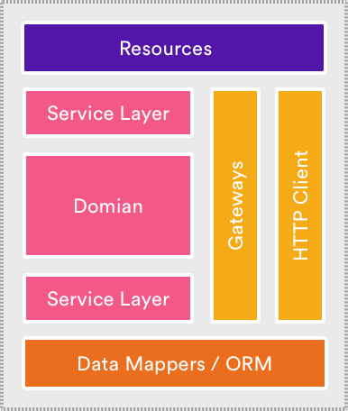

# Table of Content

 - [Testing Microservices](#testing-microservices)
 - [Microservices Testing Strategies, Types & Tools: A Complete Guide](#microservices-testing-strategies-types--tools-a-complete-guide)
 - [Related reading](#related-reading)
 - [Questions](#questions)

# Testing Microservices

It has only been a moment since the advantages of microservices surpassed those of monolithic systems, which has left little room for changes and innovation, thus far.

A monolithic application would be developed as a single unit. To make any iterations, an engineer would need to deploy an updated version of the server side application. Microservices, on the other hand, are developed with business-oriented APIs to encapsulate a core business capability. The principle of loose coupling helps eliminate or minimize dependencies between services and their consumers.

However, the microservices architecture has its own challenges, especially when it comes to keeping track of all updates going out simultaneously. One way to make sure you are not deploying a microservice with broken code, is to have a system in place for testing microservices – which is inherently different from testing a monolithic system.

This article summarizes a webinar on the topic, hosted by Piotr Litwiński, Principal Engineer at Zartis. You can watch the full webinar [here](https://www.youtube.com/watch?v=z2hCLOrXJ8M&feature=youtu.be).

## Why do we test microservices?

First of all – For peace of mind. In practice, testing microservices can help us eliminate many problems by avoiding a domino effect.

The biggest issue in a distributed environment is that you have a lot of moving parts within the systems and subsystems. It’s constantly changing, and a lot of services are interacting with each other simultaneously.

Imagine that you have 10 teams, constantly working on various aspects of your systems and subsystems, deploying multiple times a day. Without proper testing, you might experience some side effects because you weren’t aware of the changes made by other team members. This gets very complex and in case of a mistake, the rollbacks are usually quite substantial. Because of the dependency tree, taking out one of those microservices from the system might be difficult, as that usually implies you need to also revert other deployments which are dependent on this microservice.

## The Testing Pyramid

Let’s talk about what types of tests there are, how they cover different areas of your software and how they work together. The testing pyramid, which is a common concept today, is a good place to start.

At the bottom of the pyramid, we have tests that are cheap, fast and easy to develop – for instance, unit tests. The further up we go, the more complex the tests get. In addition to being more expensive to develop and maintain, they also run slower. Functional tests are usually easier to group with more classes, but they also have more lines of code. And then you have integration tests which are usually interacting with something else. With end-to-end (E2E) tests you can test your whole system or subsystem, which means a lot of configuration.

There are various tests that you can use, but the bottom line is that you need to plan how you want to test various features. **Sometimes it might be enough to test it on the unit level, but sometimes it’s just not possible because the feature is too complex or not reliable enough to test on lower levels.**

The idea is that you know the testing parameters and can plan the test layers that go one on top of another. This way you can rely on things that are lower in the pyramid to be covered and test the things that you know couldn’t be covered on lower layers.

Here is how setting up different testing layers looks in practice:

To study the diagram above, let’s assume that we have two services and there’s a load balancer sitting in front of them. When a request comes to a load balancer, it gets distributed to one of the services. Then that service translates those requests into messages and we see a message bus there, which is communicating to another service. There are multiple instances of that service, which are listening to changes reported by that message bus.

The idea is that you can test within your service itself, using the cheaper and faster methods to implement tests, represented by no.1 on the diagram above. The second layer of tests should add on to this, for instance, using a local counterpart, plugging in a local database, adding a Docker container etc. This way you can test integrations. Third layer of tests is the slowest and hardest to develop and maintain. When you are testing everything together, you need a proper environment to deploy it, run it, see the results, and wait for the results. What’s more, if something fails, it’s not that easy to actually see what went wrong, and it may require further investigation.

## When is it critical to implement all levels of testing and when is it too costly to consider?

This really depends on the feature you’re implementing. If it’s not necessarily “business critical”, maybe you do not need to implement all layers. At the same time, if it’s the core part of your business, it’s probably good to have everything covered with all layers of testing. However, given that you are building layers upon layers, tests are not really that expensive, because you would have a lot of building blocks in place already. The more familiar you are with those techniques, the easier it is to follow.

Let’s take a deeper look into all these types of tests and how you can set them up!

## Build-time Tests: Layer 1 and Layer 2 Tests

First and foremost, we have the classic **Unit tests**, and then there are other things you can deploy, such as testing your contracts. **Contract tests** are extremely important, if you can’t go back scoping your services and your modules. You can base all that on the contracts and test those things in isolation, so that you’re making sure that your contracts are not changed accidentally.

Imagine you have API responses, let’s say Asp.NET, and you’re replying in JSON. Your contract tests will verify if you still have the same capitalization and if order properties are still the same. It’s very easy to change the way you’re presenting the data and if someone uses JSON and forgets to change back to XML.

Then you can have **Service/Components/Functional tests**. In these types of tests, you need to use a lot of in-memory counterparts, emulators, stripped down versions of real services and everything is running on your machine. So it is not necessarily just running on the same process but everything is running locally.

Last but not least, we have **Single-Service Integration tests**. Let’s say, you’re developing on a dynamic DB instance on AWS and you’re trying to run a test against that. Usually, you can use some other counterparts, but sometimes there are edge cases that cannot be covered otherwise. Here it’s worth mentioning that this is mostly white box testing, which means that you know what you’re looking for. So, you need to know how this stuff works internally, if you want to write these kinds of tests.

## Environmental Tests: Layer 3 Tests

Here, as the name suggests, you need some sort of environment and it doesn’t need to be a full environment, but you need more than one service or system component to test. To that end, you can use simulators to test services running at the same time.

There are a few groups of tests that can be grouped as environmental tests. One of them is **Deployed Tests**. Deployed tests run instantly after a successful deployment and the purpose of this test is to verify if everything was configured properly. This means that you don’t focus too much on the logic, but test things such as having access to the database when you send a message; if that message is being processed properly to that column; if you have access to all the resources that your services need etc.

Then we have **End-to-end (E2E) Tests**. They’re usually more focused on use cases. Here, you would use an API and then expect some sort of notification being sent back by your system or subsystem.

Next group of tests is **Startup Checks**. They are similar to Deployed Tests, but they’re less flexible which means that this is actually part of the deployment process of your service. The idea is that you program tests for certain verifications and checks at the startup and you make sure that when your service is deployed, that you can, for instance, access the database, if the database schema is in the correct place, if the API’s that you are using are in the correct versions etc.. These Startup Checks will help you verify if everything that your service relies on is actually working as expected, using the correct versions, and so on.

Last but not least, we have **Exploratory Tests**. They’re semi automatic and mostly developed by QA team members. To some extent, you can actually run a series of automated tests to figure out if there are any ways to break up the services that are being tested. It is worth mentioning that  these tests are usually a mix of white box and black box tests, because for E2E or Exploratory Tests, you really need to know how stuff works internally.

_To sum up, build-time tests are focused heavily on the logic of your service, so you basically make sure that if you flip the switch, it reacts in the correct way. Whereas environmental tests are basically testing things from a configuration standpoint such as wrong passwords, expired certificates, etc. The purpose of environmental tests is to detect these kinds of issues, and act like a smoke test._

## System Tests: Layer 3 Tests

There are two more test groups that fit into the third layer tests, which are **Performance Tests** and **Resilience / Availability Tests**. Using these system tests, you can test your whole system or part of a subsystem depending on how you want to slice your tests.

Performance testing is related to the performance of your services. Setting these tests is tricky because you usually don’t need to have a full scale test environment, but you need to scale it up or down, or tailor it to be close enough. Instead of running 10 services, you can run 2 and if those two services can hold that much load, then it means the tank can hold 5x more, right? These tests should simulate the real traffic and show how the performance holds in various scenarios.

Resilience/Availability testing is more about how your system behaves, in case something goes wrong. Imagine that you have 20 services, and one of them is down. Does that conflict break the whole system down or is it just causing a system to operate with a warning like ‘Currently, you don’t have access to X part of the system, but the rest is still up and running’?

Here, it’s worth mentioning the importance of tracing for both Performance and Resilience tests. You can have hundreds or even thousands of processes, machines, containers and when you need to figure out where the problem is, having logs and metrics in place can save you a lot of time. You can either manually check the logs to see if there are any overflow of errors, if there are metrics that are indicating some issues, or you can also set automated alerts to get notified of issues in real-time.

## Pros and Cons of Testing Microservices

### Challenges of Testing Microservices

 - **Standardization On a Company Level**: The challenges of implementing the techniques we talked about above are usually related to standardization because some of these techniques require processes at company level. Automating processes at this level can be very difficult, because you need to get your tech team on the same page and make sure everyone agrees on a specific way of setting up the system to allow these tests.
 - **Dependencies Get More Complex & Costly**: The need to include team members working on different parts of the system means things are about to get even more complex. Creating dependencies means spending more time and therefore more money to continuously collaborate. There may also be additional costs for tools, if you don’t want to invest in building them in house. Your engineers may also need training to ease the learning curve. If you are introducing these techniques to your team, people need to get used to them and to working in this way.

### The Advantages of Testing Microservices

You may need to spend some time and resources on getting your team onboard and aligning your development and testing approach. However, in the log run, testing at lower levels has many advantages.

 - **Huge Savings in Time and Regression**: To give an example, currently we are working on regression for a client’s project and our goal is to cut down the testing time on each environment down to a couple of minutes, tops. The build time tests last four minutes, and once we deploy to an environment, the tests are running within three minutes. Altogether, the test time takes no more than 10 minutes. This is a huge win when you consider how much time it takes for an automated environment to test the whole subsystem.
 - **Catching Bugs Earlier**: **The earlier you catch a bug, the faster and cheaper it is to fix**. Considering the damage it could do to your business while a service is down, the cost of not catching a bug quickly can have real financial consequences.
 - **Confidence In Refactoring Or Expanding A System**: While refactoring or expanding a system, you can have the confidence that if anything goes wrong, you will be notified in real-time. Sometimes even before it goes to the production, so you don’t get a request from a customer asking why something is broken. Resolving issues before it reaches the customer will hugely increase your customer’s and team’s product confidence.
 - **Standardisation On a Company Level**: While we listed this as a disadvantage in the beginning, if done correctly, the advantages outweigh the disadvantages. Transitioning may be a challenge but once you do, everything becomes much easier from a management perspective. You can shuffle teams, and motivate people to change teams if they find different domains more interesting. Since all teams work under the same principles, with the same tools, and they have the same approach to contracts etc., your engineers will become valuable assets for different teams within the organisation.

# Microservices Testing Strategies, Types & Tools: A Complete Guide

## How Microservices Interact with Each Other?

Toby Clemson, CTO at B-Social, perfectly summarizes microservices interaction and testing, “By breaking a system up into small well-defined services, additional boundaries are exposed that were previously hidden. These boundaries provide opportunities and flexibility in terms of the level and type of microservices testing strategies that can be employed.”

**Microservice testing**

With reference to the above image, **Resources act as a mapper** between the application protocol, exposed by the service and messages to object representing the domain.

**Service logic includes Service layer + Domain + Repositories**, which represents the business domain.

When microservice needs to persist objects from the domain between requests, **Object Relation Mapping** or more lightweight **Data mapper** comes into play.

Out of many microservices testing strategies, whichever you decide to opt for, should provide coverage for each of these communications at the finest granularity possible

## Microservices Testing Types

When it comes to microservices testing, the more coarse-grained a test is, the more brittle and time-consuming it becomes to write, execute and maintain it. The concept helps us in understanding the relative number of tests that must be written at each granularity. This is precisely explained by Mike Cohn’s test pyramid.

As we move towards the top layers of the pyramid, the scope of the tests increases and the number of tests that must be written decreases.

Let’s explore microservices testing types.

## Unit Testing for Microservices

Microservices are itself build on the notion of splitting the smallest unit of business logic. These services then communicate with each other over a network. Therefore Unit testing is all the more important in this context to validate each business logic aka microservices separately.

Do not get confused between [unit testing and functional testing](https://www.simform.com/blog/unit-testing-vs-functional-testing/). They are a way different beast.

Although the size of the unit under test is not defined anywhere. Consider keeping the testing units as small as possible. It becomes easier to express the behavior if the test is small since the branching complexity of the unit is lower.

The only difficulty in writing unit test highlights when a module is broken down into independent more coherent pieces and tested individually. On the other side, this also makes Unit testing a powerful design tool when combined with [Test-Driven Development(TDD)](https://www.simform.com/blog/what-is-tdd/).

Toby Clemson describes Unit testing in terms of microservice testing into 2 subgroups:

 - _**Sociable** focuses on testing the behavior of the module by observing changes in their state._
 - _**Solitary** looks at the interactions and collaborations between an object and its dependencies, which are replaced by the test doubles._

In some situations, the Unit test doesn’t pay off much. There is an inverse relationship between the size of microservices and the complexity of the test suit. As the size of service decreases, the complexity increases. In such a scenario, component testing can provide value.

It’s always suggested to keep the test suit small, focussed and high value

The intention of the Unit tests and testing is to constrain the behavior of the unit under tests. But unfortunately, test also constrains the implementation process. Therefore, the value of a unit test is constantly questioned compared to the cost of maintaining it.

Avoid false positives by combining microservices with unit testing. Limiting the scope of tests also makes tests run faster. With the dual benefits of focus and speed, unit tests are indispensable to microservices

So, does the Unit test provide a guarantee about the system? It provides the coverage of each module in the system in isolation.

But what about when they work together? Perform more coarse-grained testing to verify that each module correctly interacts with its collaborators. It works every time!

## Microservice Integration testing

Integration testing verifies the communication path and interactions between the components to detect interface defects. How it’s done?

Integration test collects microservices together to verify that they collaborate as intended to achieve some larger piece of business logic. Also, it tests the communication path through a subsystem to check for any incorrect assumptions each microservices has about how to interact with its peers.

Integration tests can be written at any granularity, but for microservice, the granularity is inferred by its usage.

While writing an integration suit it’s important to remember the end goal.

According to Martin Fowler an Integration test “exercises communication paths through the subsystem to check for any incorrect assumptions each module has about how to interact with its peers”

One of the most important aspect of service to service testing is- tracing. What exactly happens in the Integration test is that each request would touch multiple services before it circles back to the user with a response. Therefore it becomes imperative to have observability and monitoring of request across service. Tools like Jaegar can help you with tracing.

These are not contradicting views and not at all mutually exclusive. In some scenarios when service talks to a single data store, the unit under test must involve the attendant I/O. While at other times, which is the usual case, when transactions are distributed it becomes a lot trickier to decide what the single unit under test should be.

One of the companies that worked with a highly distributed system is **Uber**, but testing always remained a challenge for them.

There is a lot of talks about different architectural patterns such as **Event Sourcing** and **Command Query Responsibility Segregation**, but the missing part is their testing strategy.

This approach not only slows down the feedback cycle but also increases the complexity of the test suit.

In terms of Charity Majors, “Integration testing is not just ineffectual for a complex distributed system, it is also a black hole for infinite engineering cycles with no commensurate payoff.”

With all these constraints and pitfalls, “The Step Up Rule”, a term coined by Cindy, comes as a rescue. She advocates testing at one layer above what’s generally advocated for. In this model Unit test would look like an integration test, Integration test would look like testing against real production and testing in production will more like monitoring and exploration.

The diagram looks like this:

## Component Testing in Microservices

A component or microservice is a well-defined coherent and independently replaceable part of a larger system. Once we execute unit tests of all the functions within microservices, it’s time to test microservice itself in isolation.

Component tests should be implemented within each microservice’s code repository. In a typical application, we will have a number of microservices. And hence, to test a single microservice in isolation, we need to mock the other microservices. Isolating the microservices in this way using test doubles avoids any complex behavior they exert on execution.

By writing the test at the granularity of the microservices layer, the API behavior is driven through test from the consumer perspective. At the same time, the component tests will test the interaction of microservices with the database, all as one unit.

However, there may arise a challenge with component tests. When you are ensuring the interfacing of different microservices, is it the same in the testing environment as well?

The major benefit of component testing is that it lets you test microservices in isolation which is easier, faster, more reliable and cheap. At the same time, one major drawback is microservices may pass the tests but the application will fail in production. At the same time, it leaves us with a big question- how to make sure that our test doubles always replicate the same behavior of the invoked services.

## Contract Testing in Microservices

When some consumer couples to the interface of a component to make use of its behavior, a contract is formed between them.

If its a contract, it should have some exchange in between. What do consumer and component exchange? Its input and output data structures, side effects and performance and concurrency characteristics.

In this case, the component is microservice, so the interface would be API exposed by each consuming service.

One of the basic properties of microservice architecture is that microservice represents a unit of encapsulation. There is a contract through API between each service and Contract testing revels different languages, stack, and patterns between each service.

Being a tester you have to write an independent test suit that verifies only those aspects of producing services that are in use.

Consider this topology, an example of microservice architecture.

Here service A is talking to Service B, also involves service B talking to Redis and service C.

In contract test, we would only test the smaller unit that is service A’s interaction with service B.

And we will do this by creating a fake for service B and testing A’s interaction with the fake.

Service A also talks with Riak. So in this case, the smallest unit to be tested would be the communication between service A and Riak.

According to Maarten Groeneweg contract testing consist of three steps.

 - “As a consumer of an API, you write a “contract”. This contract states what you expect from the provider (of an API). Based on this contract generates a mock of the provider.
 - As a consumer, you can test your own application against the mock of the provider.
 - The contract can be sent over to the provider who can validate if the actual implementation matches the expectations in the contract.”

Groeneweg talks about some anti-patterns in contract testing. These are:

 - _Contract test is beneficial to best fit the consumer’s wishes but sometimes it moves from consumer-driven to consumer dictated. Brief about it in the next section._
 - _Writing contract test before having a good face to face discussion is a bad idea. This also applies to doing feature request before contract test._
 - _Typical scenarios such as zero result or failed authentication are quickly overseen. This should be avoided through proper coverage._
 - _Only create a contract test for what you need. This gives the provider more freedom to change and optimize his service._

Let’s consider a consumer demands a specific combination of fields in response. For this to work, the provider team has to go across databases, which will make it hard to implement them. Even if they implement it, the solution will be very slow and everyone will be frustrated. This is what is called as consumer dictated contract testing.

The best solution would be to cooperate on the contract and find the solution which works best for everyone. More useful resources on contract testing can be found [here](http://lazytesting.com/contract-testing/).

## End-to-End Testing in Microservices

We usually treat the system as a black box while performing end to end tests. Because, of course the intention differs from other tests, it verifies that the system as a whole meets business goals irrespective of the component architecture in use.

How end to end test provides value to microservice architecture? As microservice includes more moving parts for the same behavior, it provides coverage of the gaps between the service. In addition to that, you can test the correctness of message passing between the service.

These are the go-to instruction how to write end-to-end test suit:

 - Write a few ends to end tests as possible.
 - Focus on personas an user journeys
 - Choose your end wisely
 - Rely on infrastructure as code for repeatability
 - Make test data independent

## Microservice Performance Testing

Performance testing is the most complex than any other microservices testing strategies. It’s because of the high number of moving parts and supporting services or resources.

The Pareto Principle. The Pareto Principle or the 80/20 rule states that 80% of the effects derive from 20% of the cause.

In simple terms- Don’t try to simulate reality perfectly, your configuration will be a lot simpler.

## Microservices Testing Example: How Spotify test their microservices

Spotify prefers Integration test over other tests. It verifies the correctness of their services in a more isolated fashion while focusing on the interaction points and making then very explicit.

They spin the database, populate it, start the service, and query the actual API in the test.

Sometimes many services don’t even have Unit tests, which they claim is not required at all. They save Unit tests for parts of the code that are naturally isolated and have internal complexity of their own. Therefore they have different test pyramid when compared to the traditional ones.

This strategy helps them achieve three goals they aim for:

 - _Confidence, that the code does what it should._
 - _Provide feedback that is fast and reliable. They fall short a bit for this, but it’s fast enough._
 - _Easy maintenance. Since they perform edge testing they can do maintenance really fast._

## Microservices Testing Tools

 - **Goreplay** is an open-source network monitoring tool that records your live traffic. This tool can be used for capturing and replaying live HTTP traffic into your microservices test environment.
 - **Mountebank** is an open-source tool that provides cross-platform, multi-platform test doubles over the wire. You can simply replace real dependencies with Mountebank, and test like you’d do with traditional stubs and mocks.
 - **VCR** helps you in recording your test suite’s HTTP interactions that can be played later during future tests for fast, accurate and reliable tests. 
 - **Wilma** is a service virtualization tool with the combines capability of Service Stub and a HTTP/HTTPS Transparent Proxy. It is easily expandable via plug-ins and can be configured on-the-fly.
 - **Hikaku** is a library that helps you in making sure that the implementation of REST-API meets its specifications. 
 - **Mitmproxy** is a free and open-source interactive HTTPS proxy that can be used for debugging, testing, privacy measurements, and penetration testing. 
 - **Wiremock** is a simulator for HTTP-based APIs. Unlike general purpose mocking tools, it works by creating an actual HTTP server that your code under test can connect to as it would a real web service.

# Related reading

 - [Testing Microservices](https://www.zartis.com/testing-microservices/)
 - [Microservices Testing Strategies, Types & Tools: A Complete Guide](https://www.simform.com/blog/microservice-testing-strategies/)
 - [Testing Strategies in a Microservice Architecture](https://martinfowler.com/articles/microservice-testing/)
 - [What Are Different Types of Tests for Microservices?](https://www.parasoft.com/blog/what-are-different-types-of-tests-for-microservices/)
 - [Testing Microservices](https://www.youtube.com/watch?v=uUR8m8AdJvM&t=618s) [Video]
 - [Testing Java Microservices: From Development to Production](https://www.youtube.com/watch?v=V80MztOCCjo) [Video]
 - [A Better Approach for Testing Micro Services](https://www.youtube.com/watch?v=BhjFUVuPa2U) [Video]

# Questions

 - What are the best practices in writing tests?
 - What are the different types of testing?
 - Which testing strategies Do you know?
 - What is Test-Driven-Development? 