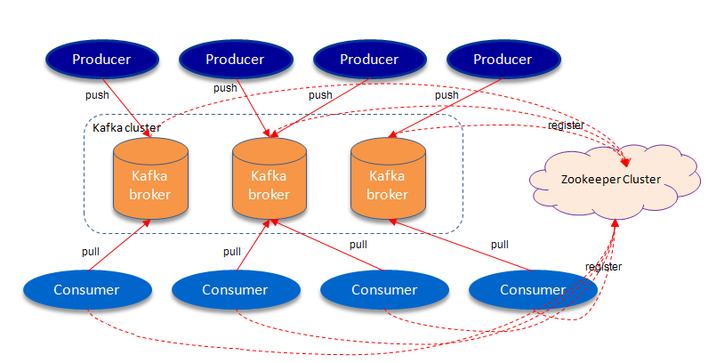
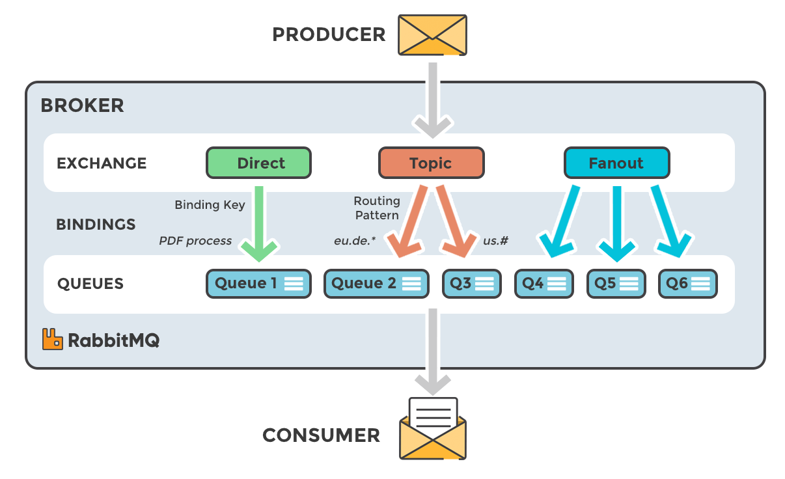
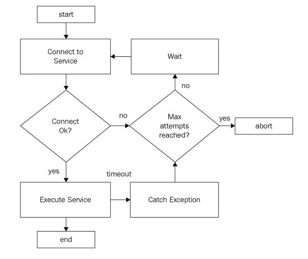

# Table of Content

 - [Microservice Architecture — Communication & Design Patterns](#microservice-architecture--communication--design-patterns)
 - [Communication Over Microservices](#communication-over-microservices)
 - [Asynchronous communication in Microservices](#asynchronous-communication-in-microservices)
 - [Microservices Choreography vs Orchestration: The Benefits of Choreography](#microservices-choreography-vs-orchestration-the-benefits-of-choreography)
 - [Retry Pattern](#retry-pattern)
 - [Related reading](#related-reading)
 - [Questions](#questions)

# Microservice Architecture — Communication & Design Patterns

Handling inter-process communication & execution flow in microservices

The goal of the [microservices](https://en.wikipedia.org/wiki/Microservices) is to sufficiently decompose/decouple the application into loosely coupled services organized around business capabilities. The distributed micro-units collectively serve application purposes.

Transactions (Read and Write) spanning over multiple services becomes inevitable after breaking a single application into microservices. Then **communication across microservices boundaries — workflow management — data storage mechanism becomes challenging**. The system should adhere to a canon known as the [Fallacies of distributed computing](https://en.wikipedia.org/wiki/Fallacies_of_distributed_computing). [**ACIDity**](https://en.wikipedia.org/wiki/ACID) guaranteed by the database system cannot be ensured when the transaction is handled across multiple services (each with its own business logic & database). [**CAP theorem**](https://en.wikipedia.org/wiki/CAP_theorem) dictates that you will have trade-offs between consistency(C) and availability (A) since Partition tolerance (P) is an undesirable reality in a distributed system. In this blog post, we will explore the solutions to these challenges and design patterns.

## Coordinating Inter-service Communication

Clients & services targetting a different context & goals can communicate through different mechanisms. Depending upon protocol, it can be synchronous or asynchronous.

## Synchronous Communication — Request Response Approach

In synchronous communication, a predefined source service address required, where exactly to send the request, and **BOTH the service** (caller and callee) should be up and running at the moment. Though Protocol may be synchronous, I/O operation can be asynchronous where the client need not necessarily wait for the response. This is a difference in **I/O and Protocol**. The common request-response approach common to web API includes REST, GraphQL, and gRPC.

## Asynchronous Communication

In the case of asynchronous communication, callers need not have the specific destination of the callee. Handling multiple consumers at a time becomes relatively easy (as services may add up consumers). Moreover, the message queues up if the receiving service is down & proceeds later when they are up. This is particularly important from the perspective of **loose coupling, multi-service communication, and coping up with partial server failure**. These are determining factors for inclining **microservices towards Async communication**. Asynchronous protocols like MQTT, STOMP, AMQP are handled by platforms like Apache Kafka Stream, RabbitMQ.

Understanding where and when to use synchronous model versus asynchronous model is a foundational decision to designing effective microservice communication. You can analyze the REST-based vs asynchronous communication in microservices [here](https://solace.com/blog/messaging-between-microservices/).

## Message & Event

In asynchronous communication, the common mechanism is messaging & event streaming.

## Message

A message is an item of data that is sent to a specific destination that encapsulates the **intention/action** (what has to happen) and distributed through channels such as messaging. Queues store messages until they are processed and deleted. In a message-driven system, addressable recipients await the arrival of messages and react to them, otherwise lying dormant.

## Event

The event encapsulates the change in the state (what has happened) and listeners are attached to the sources of events such that they are invoked when the event is emitted.

 - Domain Events — Event associated with the business domain generated by the application (OrderRequested, CreditReserved, InventoryReserved in the following diagram). These events are a concern for Event Sourcing.
 - Change Events — Event generated from database indicating state transition. These events are a concern for Change Data Capture.

Event streamers are durable, persistent, fault-tolerant without any idea of the consumers. In such a case the processor is dumb (in a sense it acts as a message router only) and the client/services own the domain-centric logic making **dump processor and active clients**. This avoids complex integration platforms such as ESB used in traditional SOA design.

## Microservice Principle — Smart consumer Dumb Pipe

The microservice community promotes the philosophy of smart endpoints and dumb pipes. Martin Fowler advocates what he calls [smart endpoints and dumb pipes for microservices communication](https://simplicable.com/new/smart-endpoints-and-dumb-pipes). ESB that ruled the SOA universe has multiple problems associated with complexity, cost, and troubleshooting.

## Protocols of Asynchronous Communication

 - **MQTT** — Message Queue Telemetry Transport ([MQTT](https://en.wikipedia.org/wiki/MQTT)) is an ISO standard pub-sub based lightweight messaging protocol used [widely in the Internet Of Things](https://www.integrasources.com/blog/mqtt-protocol-iot-devices/).
 - **AMQP** — Advanced Message Queuing Protocol (AMQP) is an open standard application layer protocol for message-oriented middleware.
 - **STOMP** — Simple Text Oriented Messaging Protocol, ([STOMP](http://stomp.github.io/)), is a text-based protocol modeled on HTTP for interchanging data between services.

For an in-depth comparison of these protocols, refer [here](https://lists.oasis-open.org/archives/amqp/201202/msg00086/StormMQ_WhitePaper_-_A_Comparison_of_AMQP_and_MQTT.pdf).

## Common Messaging / Streaming Platform

 - [ActiveMQ](https://activemq.apache.org/)
 - [Kafka](https://kafka.apache.org/)
 - [RabbitMQ](https://www.rabbitmq.com/)
 - [Redis Streams](https://redis.io/docs/manual/data-types/streams/)

Some of the common baseline for evaluation criteria include availability, persistence/durability, durability, pull/push model, scalability & consumer capability. You can refer [here](https://otonomo.io/redis-kafka-or-rabbitmq-which-microservices-message-broker-to-choose/) for a detailed comparison of these platforms.

## Microservices Design Pattern

Microservices are built on the principle of independent and autonomous services, scalability, high cohesion with loose coupling, and fault tolerance. This will introduce challenges including complex administration and configuration. A design pattern is about describing a reusable solution to a problem in a given specific context. We will discuss these patterns to address the challenges to provide proven solutions to make architecture more efficient.

## Saga Pattern — Maintaining Atomicity Across Multiple Services

A single transaction is likely to span across multiple services. For example, in an e-commerce application, a new order (linked with order service) should not exceed the customer credit limit (linked with customer service) and the item (linked with inventory service) should be available. This transaction simply cannot use a local ACID transaction.

A saga is a sequence of local transactions that updates each service and publishes a message/event to trigger the next local transaction. In case of failure of any of the local transactions, saga executes series of **compensating transactions** that undo changes made by preceding local transactions thereby preserving **atomicity**.

 - **Choreography Based saga** — participants exchange events without a centralized point of control.
 - **Orchestration Based saga** — a centralized controller tells the saga participants what local transactions to execute.

Choosing among these two patterns depends upon workflow complexity, participants number, coupling, and other factors explained in detail [here](https://docs.microsoft.com/en-us/azure/architecture/reference-architectures/saga/saga).

## Two-Phase Commit

Similar to the saga, a transaction occurs in two-phase: Prepare & Commit phase. In the prepare phase, all participants are asked to prepare data & in the commit phase, actual changes are made. However, being synchronous with unwanted side effects and performance issues, it is considered [impractical within microservice architecture](https://developers.redhat.com/blog/2018/10/01/patterns-for-distributed-transactions-within-a-microservices-architecture/#:~:text=When%20a%20microservice%20architecture%20decomposes,services%2C%20it%20can%20break%20transactions.&text=If%20any%20step%20fails%2C%20the,guaranteed%20by%20the%20database%20system.).

## Event Sourcing — Alternative to State Oriented Persistence

The traditional way to persist the data is to keep the latest version of the entity state by updating existing data. Suppose, if we have to change the name of a user entity, we mutate the present state with a new user name. What if we need a state rebuild at any point in time or a time travel? In such cases, we need to consider the alternatives to this persistence strategy.

In contrast to this state-oriented persistence, Event Sourcing stores each state mutation as a separate event called event and the application state is stored as a sequence/logs of **immutable** events instead of modifying the data. By selectively replaying the events, we can know the application state at any point in time. The application persists in the append-only event log called event store. A well-known example is the transaction log of transactional database systems.

Event sourcing depends upon three service layers:

 - **Command**: request for state change handled by a command handler.
 - **Event**: immutable representation of state change.
 - **Aggregate**: aggregated representation of the current state of Domain Model.

Event sourcing is beneficial in terms of providing accurate audit logging, state rebuild — any point of time, easy temporal queries, time travel, performance & scalability factors. Netflix addressed [offline download features](https://netflixtechblog.com/scaling-event-sourcing-for-netflix-downloads-episode-2-ce1b54d46eec) with event sourcing. The implementation details with a typical example are discussed [here](https://www.eventstore.com/blog/what-is-event-sourcing).

## CQRS — Command Query Responsibility Segregation

What if we design CRUD operation in such a way that it can be handled by two independent reads & write models? It obviously adds complexity to the system but what are the benefits & when do we need it? This segregation facilitates adding another layer of scalability, performance, and flexibility allowing granular read-write optimization in addressing sophisticated domain models.

CQRS cleanly separates the model/object making the change in the application from the model/object that reads the application data. Commands are simply the methods whose sole purpose is performing the action (Create, Update, Delete) and is either accepted or rejected — without revealing system state. Queries are methods that read the system state without any modification. A step further, we can split the writing part and read part (can be managed by multiple databases) of the data store by introducing a mechanism to keep in sync.

## Event Sourcing and CQRS

These are often cited as complementary patterns.

**You can use CQRS without Event Sourcing, but with Event Sourcing, you must use CQRS” - Greg Young — [CQRS and Event Sourcing — Code on the Beach 2014](https://www.youtube.com/watch?v=JHGkaShoyNs&feature=youtu.be).**

As mentioned earlier, the event store consists of a sequence of immutable events. Oftentimes business requirements want to **perform complex queries, that can’t be answered by a single aggregate**. Replaying the sequence of events each and every time will be computationally costly (and will not be practical in huge data sets). In such a case, segregation will prove beneficial.

In the following diagram, the command updating event store will publish events. The query service consumes change log events and builds a projection for future queries.

## Transactional Outbox Pattern

In some contexts, we need to make updates in the database and invoke another action typically on the external system. For e.g, in an e-commerce application, we need to save orders and send an email to the customer. If either of the transaction fails, it could leave the system inconsistent.

In such a case, **outbox** and **message relay** can work together to reliably persist state and invoke another action. An “**outbox**” table resides in the service’s database. Along with the primary changes (for e.g. creating order in order table), the record representing the event(orderPlaced) is also introduced to the outbox table in the same database transaction. In the non-relational database, it is usually implemented by storing events inside the document.

The message relay then reads the outbox table and forwards the message to the corresponding destination. The message dispatching process can be polling publisher (polls the outbox table) or transaction log tailing (tail the database commit log).

## Change Data Capture (CDC)

Application states are persisted in the database. Change Data Capture tracks changes in a source database and forwards those changes to the target destination to synchronize with the same incremental changes. CDC can be [Log Based](https://debezium.io/blog/2018/07/19/advantages-of-log-based-change-data-capture/) ( transactional databases store all changes in a transaction log ) or Query Based (regularly checking the source database with the query as transaction log may not be available in databases like [Teradata](https://www.teradata.com/)).

The following diagram represents the Log-based CDC for capturing new entries in the outbox table (using [Debezium connector for Postgres](https://debezium.io/documentation/reference/1.9/connectors/postgresql.html)) and stream them to Apache Kafka. Event capture happens with a very low overhead in near-real-time and the events are subscribed destination services.

## Considerations for Microservice Design

We will briefly introduce some miscellaneous ideas/principle required while designing microservices.

## Idempotent Transactions

Idempotent transactions are those transactions making multiple identical requests that have the same effect as making a single request. In a [REST API](https://en.wikipedia.org/wiki/Representational_state_transfer), the GET method is Idempotent (can be called repeatedly guaranteeing the result same as processing the method once) whereas the POST method is not Idempotent (item keeps adding on each request).

Within the context of a distributed system, [**you cannot have exactly-once message delivery**](https://bravenewgeek.com/you-cannot-have-exactly-once-delivery/). Message broker, such as Apache Kafka or RabbitMQ implements **at-least-once delivery** that creates the possibility of multiple invocations for the same transaction. Thus, in a distributed system consumer needs to be idempotent. If a consumer is not idempotent, multiple invocations can lead to bugs & inconsistencies.

Airbnb implemented [“**Orpheus**”, a general-purpose idempotency library](https://medium.com/airbnb-engineering/avoiding-double-payments-in-a-distributed-payments-system-2981f6b070bb#:~:text=This%20is%20critical%20for%20Airbnb,API%20to%20achieve%20eventual%20consistency.), across multiple payments services with an **idempotency key** is passed into the framework, representing a single idempotent request. Paypal implemented idempotency in the API using [MsgSubId (Message submission ID)](https://developer.paypal.com/docs/archive/express-checkout/integration-guide/ec-related-ops/#api-idempotency) and Google Service Payment implemented idempotency with request ID.

## Eventual Consistency

In a distributed system, consistency defines whether & how the updates made to one node/services are propagated to all services. Also referred to as **Optimistic Replication**, Eventual consistency is simply an acknowledgment that there is an unbounded delay in propagating the change made on one machine to all the other copies.

Network Partition is an undesirable reality of distributed systems that networks can fail. Since Partition tolerance (P) is inevitable, CAP theorem dictates that you will have trade-offs between consistency and availability. If you pick availability, you cannot have strong consistency, but still, you can provide eventual consistency in your system.

Many business systems are more tolerant of data inconsistencies than usually believed favoring availability over consistency. The [**BASE**](https://www.techopedia.com/definition/29164/basically-available-soft-state-eventual-consistency-base) (**B**asically **A**vailable, **S**oft state, and **E**ventual Consistency) system is prized over the ACID system.

_“Maintaining strong consistency is extremely difficult for a distributed system, which means everyone has to manage eventual consistency.” — Martin Fowler_

## Distributed Tracing

In microservices, metadata associated with the request (that may span over multiple services) will be helpful for different reasons: monitoring, log aggregation, troubleshooting, latency and performance optimization, service dependency analysis, and distributed context propagation.

Distributed tracing is the process of capturing **metadata** of requests starting from start to end ensuring logging overhead is kept minimum. A **unique transaction ID** is assigned to external requests & passed through the call chain of each transaction in a distributed topology & included in all messages (along with timestamp and metadata).

Unique Identifiers can be generated by using Database Ticket Server (as used by [Flickr](https://code.flickr.net/2010/02/08/ticket-servers-distributed-unique-primary-keys-on-the-cheap/)), UUID, or Twitter SnowFlake. Common Distributed Tracing tools include [OpenTracing](https://opentracing.io/), [Jaeger](https://www.jaegertracing.io/), [Zipkin](https://zipkin.io/), and [AppDash](https://opentracing.io/registry/appdash/).

## Service Mesh

Service mesh in microservices is a configurable network infrastructure layer that handles interprocess communication. This is akin to what is often termed as sidecar proxy or sidecar gateway. It provides functionalities such as:

 - Load Balancing
 - Service Discovery
 - Health Checks
 - Security

[Envoy](https://www.envoyproxy.io/) is the popular open-source proxy designed for cloud-native applications. [Istio](https://istio.io/) is an open platform to connect, manage, and secure microservices popular in the Kubernetes community.

In order to expose your microservices API towards client application, refer to my [blog post: Microservices Design — API Gateway Pattern](https://blog.devgenius.io/microservices-design-api-gateway-pattern-980e8d02bdd5).

# Communication Over Microservices

Proper choice of the communication protocol over Microservices makes the application more responsive and efficient. Various aspects need to be considered regarding communication before breaking down into services.

There are 2.5 quintillion bytes of data generated every day. Software built using monolithic architecture may face problems like difficulties in scaling, longer time to ship, spaghetti code, etc.

Microservice architecture has become the de facto choice for modern application development. As the name suggests, Microservice architecture is an approach to building a server application as a set of small services.

With the wide adoption of trending architecture, there are lots of challenges to deal with small service as it doesn’t suggest common standards and patterns. The implementation depends on team maturity and business requirements. Architecture becomes more mature and independent as the team faces the problems over time.

As the services get deployed independently, it requires an efficient protocol to communicate between the services. Improper use of the communication protocol may lead to poor performance in applications.

## Communication Protocol

There are two styles of communication: synchronous and asynchronous. These are the foundations for the request-response and the event-driven patterns.

## Synchronous Protocol

The client requests service and waits for the response. The synchronous protocol is blocking, i-e CPU waits for the response. HTTP is a type of synchronous communication. Modern web applications follow the RESTful architectural style to build APIs for inter-process communication. REST treats every object or entity as a service resource that is accessed by using the HTTP verbs. Generally, the data are exchanged between services in the JSON format. HTTP verbs are used to manipulate the resources in the server. A post request creates the new resource and a put request updates a resource.

While accessing resources from the microservices, it assumes to get a response in a short period. A client that requires the real-time update on the user interface uses the synchronous protocol. The application developer uses the interface definition language to build services. There are few options such as Swagger, RAML which are widely used.

## Asynchronous Protocol

Synchronous communication between the microservices lags in performance. Microservices may form a chain of requests between services to respond to a single client. Asynchronous communication is recommended over the synchronous to be a resilient microservices. The asynchronous protocol is non-blocking in nature. If services form the chain of request over microservices it increases the communication overhead which leads to poor performance. It follows the event-driven architecture, there may be one to one and one to many mapping between event producer and consumer.

 - Single Receiver: Each request has one sender and one receiver. In the case of multiple requests, they get queued because of the single receiver which can consume one at a time.
 - Multiple Receiver: Each request can be processed by zero to multiple receivers. This is based upon the event-bus interface or message broker while exchanging data between the microservices through events.

## Publish-subscriber Pattern

When any events occur in the services it may need to communicate with other services to complete the job. Publisher and subscriber model is an asynchronous pattern which reduces the coupling in the distributed system.

 - Publisher: The publisher doesn’t need the subscriber to be up and available. It sends a message to the message queue. Nor does the publisher need to know about the subscriber application that needs to receive the message. Once the message is published in the specific topic the message gets broadcast in the channel to notify the subscribers. Subscribers consume the message in the queue.
 - Subscriber: The subscriber subscribes to a particular topic to get notified once the message is published in the respective topic. There may be many subscribers as client request grows.
 - Input Channel: Channel used by the publisher to send message to the subscriber.
 - Output Channel: Channel used by the subscriber to consume the message.
 - Message Broker: Message from the publisher is copied from the input channel to the output channel of interested subscribers, this mechanism is handled by the message broker. All these events occur asynchronously. There are many message broker and third-party services to facilitate the publish/subscribe protocol. Among them, _RabbitMQ, Amazon SQS, Redis, Apache Kafka, Amazon SQS, Google Cloud Pub/Sub_ are used widely.

## Choosing Message Broker

Choosing a message broker as per business requirements is the crucial portion of service communication. There are various parameters for choosing the right message broker.

 - Broker Scale: The number of messages sent per second in the system
 - Data Persistency: The ability to recover messages
 - Consumer capability: The broker capability to deal with one to one and one to many

## Comparisons Between Message Broker

 - **RabbitMQ**: It provides the flexibility to send messages up-to 50k per second. Message brokers can be configurable to both transient and persistent. The subscriber can be both one or many as per need. It follows the Advanced message queuing protocols. RabbitMQ is best suited for complex routing. General programming languages are supported.
 - **Kafka**: Kafka is an open-source stream-processing software platform developed by LinkedIn. It has high-throughput, low latency for handling real-time data feeds. It provides the data persistency as well and supports one to many subscribers only. It is best to fit to play with large amounts of data.
 - **Redis**: Redis is an in-memory data structure project implementing a distributed, in-memory key-value database with optional durability. It can send up to a million messages per second. It is best suited for the use case of short message retention and where persistence doesn’t matter. It supports one to many subscribers and provides extremely fast service.

## Design Pattern Based upon Communication

 - **ORCHESTRATION**: In orchestration, there is a single orchestrator that acts as a coordinator to send responses for clients. Orchestrator synchronously manages all services to serve clients. In this pattern, services are tightly coupled to each other. Once the coordinator goes down there will be a single point of failure. As all services communicate synchronously, the time to send response grows as the interaction between services increases.

 - **CHOREOGRAPHY**: Central orchestrator creates the dependencies within the microservices. In microservice, each service should be able to stand on its own. Choreography solves some of the problems of orchestrators. It enables faster processing as it can execute parallel/asynchronously. Services can be plugged as the user grows because the publisher doesn’t have to be aware of the subscriber.

Direct client to microservice communication approaches each microservice has a public endpoint. The client directly consumes the endpoint of services in the production environment. Most of the time these services have communication by means of Advanced messaging queue, gRPC, unlike HTTP protocol. Clients may not be able to have communication with services in that scenario. Clients also get coupled tightly with the services. Clients have to make too many requests to render a single user interface as all the services are broken into small manageable pieces. Clients will not be able to handle the cross-cutting concerns such as authorization, data transformations, and dynamic request dispatching.

## API Gateway

API gateway is a hybrid approach to both orchestrator and choreography. While designing the large or complex microservice-based application having multiple client apps like Android, iOS, and Single Page Applications, etc, API Gateway is a better approach to deal with. It is similar to the Facade pattern from object-oriented design. It provides the abstraction of the internal communication of microservices as it is tailored to each client. It might have other responsibilities such as authentication, monitoring, load balancing, caching, request shaping, and static response handling.

It provides a single entry point for a group of services. As it is the single entry point for every client app there will be a single point of failure. To deal with that problem API gateway can be segregated to handle clients as per business requirements. It also has many drawbacks like a possible single point of failure, tightly coupling between internal microservice. API gateway may become a bottleneck if it has not configured for scaling.

## Conclusion

The synchronous communication protocol may form a chain of requests while sending a response to the client, which may lead to bad user experience and a single point of failure. Asynchronous communication is preferred over the synchronous which will be more responsive and fault-tolerant. While building applications, proper architecture plays an important role to make applications more robust, fault-tolerant, and scalable. Each architecture has its pros and cons. If the microservices have to serve multiple clients then API Gateway pattern can be best matched but to some extent only. Proper architecture decisions as per business requirements and best communication protocol between the microservices may lead to better performance, scalability, and fault-tolerant projects.

# Asynchronous communication in Microservices

Microservice oriented architecture provides ideal platform for continuous delivery and offers increased resilience. They foster faster innovation to adapt to changing market conditions, increase developer productivity and improved scalability in real time. Each microservice is implemented as an atomic and self sufficient piece of software and implementing a microservice architecture will often require to make multiple calls to many such single responsibility and independent pieces.

Though we can have synchronous request/response calls when the requester expects immediate response, integration patterns based on events and asynchronous messaging provide maximum scalability and resiliency. In order to build scalable architectures, we need event-driven and asynchronous integration between microservices.

There are a lot of options for asynchronous integration. Some of the widely used ones are:

 - Kafka
 - RabbitMQ
 - Google Pub/Sub
 - Amazon Services
 - ActiveMQ
 - Azure Services

## Communication Types

**Message Queuing**

In this system, messages are persisted in a queue. One or more consumers can consume the messages in the queue, but a particular message can be consumed by a maximum of one consumer only. Once a consumer reads a message in the queue, it disappears from that queue. If there are no consumers available at the time the message is sent, it will be kept until a consumer is available that can process the message.

**Publish subscribe**

In the publish-subscribe system, messages are persisted in a topic. Consumers can subscribe to one or more topics and consume all the messages in that topic. In the Publish-Subscribe system, message producers are called publishers and message consumers are called subscribers.

## Implementations

**Kafka:**

Kafka is the most popular open source distributed publish-subscribe streaming platform that can handle millions of messages per minute. The key capabilities of Kafka are:

 - Publish and subscribe to streams of records
 - Store streams of records in a fault tolerant way
 - Process streams of records as they occur

Those features make Kafka a natural choice for a number of use cases which are listed [here](https://kafka.apache.org/uses)

The Key Components of Kafka architecture are: Topics, Partitions, Brokers, Producer, Consumer, Zookeeper.

Core APIs in Kafka include:

 - Producer API allows an application to publish a stream of records to one or more Kafka topics.
 - Consumer API allows an application to subscribe to one or more topics and process the stream of records produced to them.
 - Streams API allows applications to act as a stream processor, consuming an input stream from one or more topics and producing an output stream to one or more output topics, effectively transforming the input streams to output streams. It has a very low barrier to entry, easy operationalization, and a high-level DSL for writing stream processing applications. As such it is the most convenient yet scalable option to process and analyze data that is backed by Kafka.
 - Connect API is a component that you can use to stream data between Kafka and other data systems in a scalable and reliable way. It makes it simple to configure connectors to move data into and out of Kafka. Kafka Connect can ingest entire databases or collect metrics from all your application servers into Kafka topics, making the data available for stream processing. Connectors can also deliver data from Kafka topics into secondary indexes like Elasticsearch or into batch systems such as Hadoop for offline analysis.

More details [here](https://kafka.apache.org/intro)

Kafka is written in Scala and Java. It was originally developed by LinkedIn and donated to the Apache Foundation.

## Kafka as a Messaging System

Kafka is a distributed, replicated commit log. Kafka does not have the concept of a queue which might seem strange at first, given that it is primary used as a messaging system. Queues have been synonymous with messaging systems for a long time. Let’s break down “distributed, replicated commit log” a bit:

 - Distributed because Kafka is deployed as a cluster of nodes, for both fault tolerance and scale
 - Replicated because messages are usually replicated across multiple nodes (servers).
 - Commit Log because messages are stored in partitioned, append only logs which are called Topics. This concept of a log is the principal killer feature of Kafka.

Kafka uses a pull model. Consumers request batches of messages from a specific offset. Kafka permits long-pooling, which prevents tight loops when there is no message past the offset. A pull model is logical for Kafka because of its partitions. Kafka provides message order in a partition with no contending consumers. This allows users to leverage the batching of messages for effective message delivery and higher throughput.

It is a dumb broker / smart consumer model — does not try to track which messages are read by consumers. Kafka keeps all messages for a set period of time.

## RabbitMQ

The core idea in the messaging model in RabbitMQ is that the producer never sends any messages directly to a queue. Actually, quite often the producer doesn’t even know if a message will be delivered to any queue at all.

Instead, the producer can only send messages to an exchange. An exchange is a very simple thing. On one side it receives messages from producers and the other side it pushes them to queues. The exchange must know exactly what to do with a message it receives. Should it be appended to a particular queue? Should it be appended to many queues? Or should it get discarded. The rules for that are defined by the exchange type (direct, topic, headers and fanout)

The super simplified overview:

 - Publishers send messages to exchanges
 - Exchanges route messages to queues and other exchanges
 - RabbitMQ sends acknowledgements to publishers on message receipt
 - Consumers maintain persistent TCP connections with RabbitMQ and declare which queue(s) they consume
 - RabbitMQ pushes messages to consumers
 - Consumers send acknowledgements of success/failure
 - Messages are removed from queues once consumed successfully

It is a smart broker / dumb consumer model — consistent delivery of messages to consumers, at around the same speed as the broker monitors the consumer state.

RabbitMQ uses a push model. Push-based systems can overwhelm consumers if messages arrive at the queue faster than the consumers can process them. So to avoid this each consumer can configure a prefetch limit (also known as a QoS limit). This basically is the number of unacknowledged messages that a consumer can have at any one time. This acts as a safety cut-off switch for when the consumer starts to fall behind.This can be used for low latency messaging.

The aim of the push model is to distribute messages individually and quickly, to ensure that work is parallelized evenly and that messages are processed approximately in the order in which they arrived in the queue.

RabbitMQ is written in Erlang. Pivotal develops and maintains RabbitMQ.

## Google cloud Pub/Sub

Cloud Pub/Sub is a fully-managed real-time messaging service that allows you to send and receive messages between independent applications. You can leverage Cloud Pub/Sub’s flexibility to decouple systems and components hosted on Google Cloud Platform or elsewhere.

Here is the overview of the flow in cloud Pub/Sub system:

 - A publisher application creates a topic in the Cloud Pub/Sub service and sends messages to the topic. A message contains a payload and optional attributes that describe the payload content.
 - The service ensures that published messages are retained on behalf of subscriptions. A published message is retained for a subscription until it is acknowledged by any subscriber consuming messages from that subscription.
 - Cloud Pub/Sub forwards messages from a topic to all of its subscriptions, individually. Each subscription receives messages either by Cloud Pub/Sub pushing them to the subscriber’s chosen endpoint, or by the subscriber pulling them from the service.
 - The subscriber receives pending messages from its subscription and acknowledges each one to the Cloud Pub/Sub service.
 - When a message is acknowledged by the subscriber, it is removed from the subscription’s message queue.

Publishers can be any application that can make HTTPS requests to googleapis.com: an App Engine app, a web service hosted on Google Compute Engine or any other third-party network, an installed app for desktop or mobile device, or even a browser.

Pull subscribers can also be any application that can make HTTPS requests to googleapis.com. Push subscribers must be Webhook endpoints that can accept POST requests over HTTPS.

More details [here](https://cloud.google.com/pubsub/)

## Amazon Services

**Amazon MQ** is a managed message broker service for Apache ActiveMQ that makes it easy to set up and operate message brokers in the cloud.

**Amazon Simple Queue Service (SQS)** is Amazon’s cloud-based message queuing system made available as part of Amazon Web Services (AWS). Unlike the other brokers mentioned here, there is barely any setup/deployment required for an application to use SQS. All you need is AWS credentials to be able to use it. Since it is a SaaS (Software-as-a-service), this makes it a much lower-cost option since there is no infrastructure cost. You only pay for what you use. SQS also has the notion of in-flight messages. This means that the message is pulled off the queue but never deleted until the ‘delete‘ command is sent for that message ID. So if you lose your worker mid-processing of the event, that event isn’t lost for good.

One drawback of the SQS implementation is the need for polling of a message queue to determine if new messages have appeared. This is a bit of an issue being as you must now model your application to perform a polling cycle in order to determine if new messages are available.

In other words, it offers serverless queues — you don’t have to pay for the infrastructure, just the messages you send and receive.

**Amazon Simple Notification Service (Amazon SNS)** is a web service that makes it easy to set up, operate, and send notifications from the cloud. Amazon SNS follows the “publish-subscribe” (pub-sub) messaging paradigm, with notifications being delivered to clients using a “push” mechanism that eliminates the need to periodically check or “poll” for new information and updates. With simple APIs requiring minimal up-front development effort, no maintenance or management overhead and pay-as-you-go pricing, Amazon SNS gives developers an easy mechanism to incorporate a powerful notification system with their applications.

It is comparable to serverless topics. It will notify your services when a message arrives, but if you’re offline you can miss it. SNS can feed into SQS, so if you have some service that may be up and down, you can guarantee it gets SNS messages by queuing them in SQS for it to consume on its schedule.

## ActiveMQ

ActiveMQ is a Java-based open source project developed by the Apache Software Foundation. ActiveMQ makes use of the Java Message Service (JMS) API, which defines a standard for software to use in creating, sending, and receiving messages.

ActiveMQ sends messages between client applications — producers, which create messages and submit them for delivery, and consumers, which receive and process messages. The ActiveMQ broker routes each message through one of two types of destinations:

A queue, where it awaits delivery to a single consumer (in a messaging domain called point-to-point), or a topic, to be delivered to multiple consumers that are subscribed to that topic (in a messaging domain called publish/subscribe, or “pub/sub”)

ActiveMQ gives you the flexibility to send messages through both queues and topics using a single broker. In point-to-point messaging, the broker acts as a load balancer by routing each message from the queue to one of the available consumers in a round-robin pattern. When you use pub/sub messaging, the broker delivers each message to every consumer that is subscribed to the topic.

## Azure Services

**Service Bus** is a brokered messaging system. It stores messages in a “broker” (for example, a queue) until the consuming party is ready to receive the messages.

**Event Grid** uses a publish-subscribe model. Publishers emit events, but have no expectations about which events are handled. Subscribers decide which events they want to handle.

**Event Hub** is an event ingestor capable of receiving and processing millions of events per second. Producers send events to an event hub via AMQP or HTTPS. Event Hubs also have the concept of partitions to enable specific consumers to receive a subset of the stream. Consumers connect via AMQP.

More details [here](https://docs.microsoft.com/en-us/azure/event-grid/compare-messaging-services)

## When to use What

Prefer Kafka — When your application needs highly scalable messaging, able to receive a very high number of events, coming from different sources, and delivering them to different clients over a common hub. Message consumers can consume the data as they wish, and re-read and replay messages on demand. For this use case, Apache Kafka’s ability to scale to hundreds of thousands of events per second, delivered in partitioned order, for a mix of online and batch clients is the best fit.

Prefer Kafka if you need your messages to be persisted as well.

Prefer RabbitMQ — When you need a finer-grained consistency control/guarantees on a per-message basis (dead letter queues, etc.). When your application needs variety in point to point and publish/subscribe messaging. When you have complex routing to consumers and integrating multiple services/apps with non-trivial routing logic.

# Microservices Choreography vs Orchestration: The Benefits of Choreography

Microservices architecture — a software design paradigm in which an application and business use case is broken up into a set of composable services — promise [many technical benefits](https://solace.com/blog/microservices-advantages-and-disadvantages/) to enterprise organizations. First, they’re small, lightweight, and easy to implement. Second, they enable reusability that reduces the cost of developing or changing applications, ensures the efficient use of resources, and makes it easy to scale applications on demand. At a high level, there are two approaches to getting microservices to work together toward a common goal: orchestration and choreography.

Orchestration entails actively controlling all elements and interactions like a conductor directs the musicians of an orchestra, while choreography entails establishing a pattern or routine that microservices follow as the music plays, without requiring supervision and instructions.

The adoption of microservices is growing rapidly, as evidenced by a [recent study](https://siliconangle.com/2018/05/02/new-study-shows-rapid-growth-microservices-adoption-among-enterprises/) from Dimensional Research on behalf of LightStep which found that almost all the surveyed senior development stakeholders who have deployed microservices expect it to become their default application architecture.

That said, there are many challenges associated with the implementation of microservices – many related to how microservices interact with one another to achieve a business outcome. Choosing between microservices choreography vs orchestration will make a difference in how seamlessly the services function behind the scenes and whether you succeeded in building a microservices architecture or distributed monolith.

## How Orchestration Can Kill Microservices and Create a Distributed Monolith

In an orchestra, each musician is awaiting command from the conductor. They are each an expert at playing their instrument, whether it be a violin, bass drum or clarinet, have practiced ad nauseum, and have the sheet music for their part – and yet they’d be collectively lost without the conductor.

In orchestration, one service controller handles all communications between microservices, and directs each service to perform the intended function. In our symphony example, the function would be “play the music.”

## Disadvantages of Microservices Orchestration

One [disadvantage of orchestration](https://www.youtube.com/watch?v=fvXkN5cFMFY&t=32s) is that the controller needs to directly communicate with each service and wait for each service’s response. Now that these interactions are occurring across the network, invocations take longer and can be impacted by downstream network and service availability.

In smaller environments this may work fine, but things fall apart when you’re talking about hundreds or even thousands of microservices. You’ve basically created a distributed monolithic application that’s slower and more brittle than those of the past! Just like a conductor would lose their ability to effectively manage a massive orchestra, because each musician is awaiting individual attention, its not viable to ask a service control to manage that many microservices.

## Tight coupling

When orchestrating microservices, you’ll find that they’re highly dependent upon each other — when they’re synchronous, and each service must explicitly receive and respond to requests to make the whole service work, failure at any point could stop the process in its tracks.

When we’re talking about microservices in an enterprise environment, sometimes thousands of microservices are applied to a single business function. At this scale, one-to-one interactions simply can’t keep up with business demand.

## Reliance on RESTful APIs

An orchestration approach also relies on RESTful APIs — which are typically created as tightly coupled services — so using them can actually increase the tight coupling in your architecture. Plus, building new functionality comes at a high cost and has a high impact on the API.

So if RESTful APIs and orchestration can’t scale, what does a solution look like for deploying and managing microservices? The answer will take us out of the orchestra pit and onto the stage

## The Benefits of Choreographing Services with Event Streams

If conducting a symphony is a good metaphor for service orchestration, then a dance team works well for choreography. In a dance team, everyone knows what they’re supposed to be doing, and is able and required to take the right step as each beat hits.

To choreograph microservices, you need a way of exchanging messages between microservices whenever something happens – you need an [event broker](https://solace.com/what-is-an-event-broker/). The moment a given microservice sends a message, they’re done. Everything else happens in an asynchronous manner, without waiting for a response or worrying about what happens next. Each service is observing its environment, and any other service that subscribes to that channel of messages will know what to do from there.

In our analogy, the dancers (microservices) listen to the music (the event broker) and make the necessary moves because they’re all following the same choreography.

## Loose service coupling for agility and fault tolerance

Adding and removing services is much simpler in a choreographed microservices architecture. All you need to do is connect the microservice to (or disconnect it from) the appropriate channel in the event broker. With [loose service coupling](https://specify.io/concepts/microservices#choreography), the addition and removal of microservices doesn’t break existing logic, resulting in less development churn and flux.

The fact that choreography isolates microservices means if one application fails, business services not dependent on it can carry on while the issue is rectified. It is also not required for each service to have complex, built-in error handling in the case of network failures since it’s the event broker’s responsibility.

With a RESTful API, errors can cause cascading problems. This can result in tasks that could have been executed being blocked by a single communication problem, resulting in idle workers. In addition, any outages result in disappointed customers and potentially, the loss of business.

## Faster, more agile development

In this fast-paced landscape where time to market is critical, the speed at which you are able to develop and modify applications can have a serious impact on business. Development teams being impacted by changes to other services is a common barrier to agility. Choreographed, event-driven microservices allows for development teams to operate more independently and focus on their key services. Once these services have been created, they are now easily able to be shared between teams. This reuse of developed components is a huge savings in both labour and time.

## More consistent, efficient applications

When creating a microservice that has one specific function, you’re able to create a more modular codebase. Each microservice handles a specific business function and together, as a unit, they perform the business process.

The ability to reuse these microservices as part of many business processes keeps your system consistent and makes it easier to create or modify services because you can tap into code that’s already been proven to perform a given function.

## Teach Your Microservices to Dance

The time has passed for a RESTful API-only approach – for architecture that delivers business services faster and more reliably, and that scales with ease, a better approach is to choreograph the microservices interactions. As event-driven architecture and microservices sweep across your software development landscape, a choreographed approach to communication between services will save your company time and money while improving the experience you offer your customers.

Want to learn more about enabling event-driven microservices? Find more blogs and videos (some even featuring yours truly) in the microservices section of our [Resources Hub](https://solace.com/resources/solace-microservices-resources). You can also download the [The Architect’s Guide to Event-Driven Microservices](https://solace.com/resources/white-papers/wp-download-event-driven-microservices-lp) for more information.

# Retry Pattern

The retry pattern is an extremely important pattern to make applications and services more resilient to transient failures. A transient failure is a common type of failure in a cloud-based distributed architecture. This is often due to the nature of the network itself (loss of connectivity, timeout on requests, and so on). Transient faults occur when services are hosted separately and communicate over the wire, most likely over a HTTP protocol. These faults are expected to be short-lived. Repeating such a request that has previously failed could succeed on a subsequent attempt.

## Retry Strategies

The different retry strategies are:

 - **Retry** – The source application can immediately retry to send the request to the service. If the specific fault is unusual or rare, the probability of success when repeating the request is very high.
 - **Retry after a delay** – The source application can retry to send the request to the cloud service after a period of time (that normally increases exponentially). This is a common practice when the failure event is due to reasons such as cloud service busy and so on.If the fault is caused by one of the more commonplace connectivity or busy failures, then the application has to wait for some time and try again.
 - **Sliding Retry** – The source application will retry repeatedly based on schedule and keeps adding an incremental delay in subsequent tries. For example, the retry logic may multiply the waiting period of 60 seconds by increment a try count from 1 to the number of tries and so on. This helps in reducing the overall number of retries.
 - **Retry With Jitter** – The sliding retry and the exponential backoff retry add a predictable sequence in their retry and backoff timelines. If there are multiple calls to the service at the same time and the same retry policy is applied then all the calls will retry and back off at the same time. To prevent this we need to add a certain randomness to the retry logic. This can be one by introducing a jitter to the retry policy. The jitter is a random calculation that results in different retry and backoff timelines for various calls.
 - **Cancel** – The source application can cancel the request to the cloud service and throw an exception. This is a common practice when the failure is not transient or is likely to be unsuccessful if repeated.

A real world example of policies based on retry strategy is at [this Azure guidance](https://docs.microsoft.com/en-us/azure/architecture/best-practices/retry-service-specific).

# Related reading

 - [Microservice Architecture — Communication & Design Patterns](https://blog.devgenius.io/microservice-architecture-communication-design-patterns-70b37beec294)
 - [Communication in a microservice architecture](https://docs.microsoft.com/en-us/dotnet/architecture/microservices/architect-microservice-container-applications/communication-in-microservice-architecture)
 - [How to make Microservices Communicate?](https://www.youtube.com/watch?v=9QsDN6-M3ec)
 - [Design Patterns for Microservice-To-Microservice Communication](https://dzone.com/articles/design-patterns-for-microservice-communication)
 - [Asynchronous communication in Microservices](https://medium.com/@aamermail/asynchronous-communication-in-microservices-14d301b9016) 
 - [Patterns for Microservices — Sync vs. Async](https://dzone.com/articles/patterns-for-microservices-sync-vs-async) 
 - [Inter-Process Communication in a Microservices Architecture](https://dzone.com/articles/building-microservices-inter-process-communication-2)
 - [Design Patterns for Microservices](https://www.rajeshbhojwani.co.in/2018/11/design-patterns-for-microservices.html)
 - [Building Microservices: Using an API Gateway](https://www.nginx.com/blog/building-microservices-using-an-api-gateway/)
 - [Redis, Kafka or RabbitMQ: Which MicroServices Message Broker To Choose?](https://otonomo.io/redis-kafka-or-rabbitmq-which-microservices-message-broker-to-choose/)
 - [Orchestration Pattern](https://medium.com/gbtech/orchestration-pattern-3d8f5abc3be3)
 - [Choreography pattern](https://docs.microsoft.com/en-us/azure/architecture/patterns/choreography)
 - [Microservices — When to React Vs. Orchestrate](https://medium.com/capital-one-tech/microservices-when-to-react-vs-orchestrate-c6b18308a14c)
 - [Microservices Choreography vs Orchestration: The Benefits of Choreography](https://solace.com/blog/microservices-choreography-vs-orchestration/)
 - [Retry Pattern – Microservice Design Patterns](https://www.vinsguru.com/retry-pattern/)
 - [Spring 5 WebClient](https://www.baeldung.com/spring-5-webclient)
 - [The Guide to RestTemplate](https://www.baeldung.com/rest-template)
 - [Exploring the New HTTP Client in Java](https://www.baeldung.com/java-9-http-client)
 - [Introduction to Spring Cloud OpenFeign](https://www.baeldung.com/spring-cloud-openfeign)
 - [Microservice communication and integration: what are my options?](https://www.youtube.com/watch?v=4KQoYVX9lNM) [Video]
 - [Messaging and Microservices](https://www.youtube.com/watch?v=rXi5CLjIQ9k) [Video]
 - [Orchestration Pattern](https://www.youtube.com/watch?v=R0gSwuS8zTM) [Video]
 - [Orchestration vs Choreography](https://www.youtube.com/watch?v=cYENNwDK2dA&t=60s) [Video]

# Questions

 - What ways of communication between microservices do you know?
 - Advantages and disadvantages of different communication approaches between microservices.
 - Why particular way of communication chosen for different actions?
 - Orchestration vs Choreography patterns in microservice architecture.
 - Is it possible to have multiple subscriptions on a single message broker queue?
 - What do you know about Retry mechanism in microservices and what is it used for?
