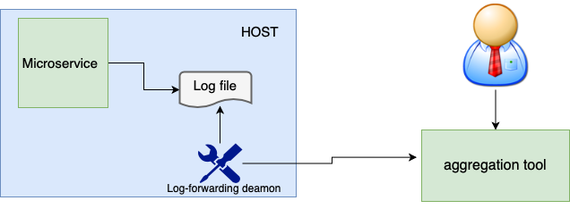
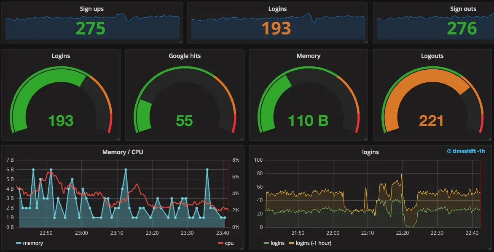
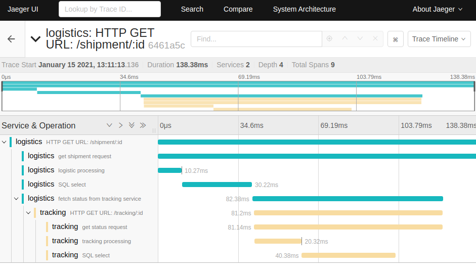
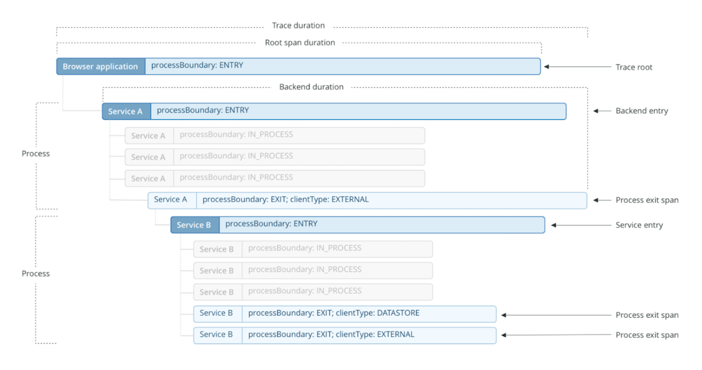
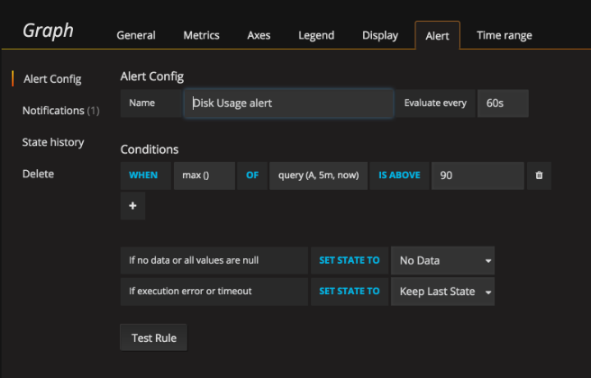

# Table of Content

- [Introduction: monitoring and observability](#introduction-monitoring-and-observability)
- [Building Blocks](#building-blocks)
    - [Log aggregation](#log-aggregation)
    - [Metrics aggregation](#metrics-aggregation)
    - [Distributed tracing](#distributed-tracing)
    - [Are you doing OK?](#are-you-doing-ok)
    - [Alerting](#alerting)
    - [Semantic monitoring](#semantic-monitoring)
- [Tools](#tools)
- [Examples](#examples)
- [Related reading](#related-reading)
- [Questions](#questions)

# Introduction. Monitoring and observability

## Monitoring
Organizations that have embraced the DevOps mindset usually start decomposing the application to a microservices architecture, in order to gain operability and reduce repair time if an incident happens. But as their systems become more complex, they must ensure that they can still gain visibility on — and react in a timely manner to — system failures.

According to the SRE book by Google, your monitoring system needs to answer two simple questions: “What’s broken, and why?” Monitoring allows you to watch and understand your system’s state using a predefined set of metrics and logs. Monitoring applications lets you detect a known set of failure modes.

Monitoring is crucial for analyzing long-term trends, for building dashboards, and for alerting. It lets you know how your apps are functioning, how they’re growing, and how they’re being utilized. However, the problem with monitoring complex distributed applications is that production failures are not linear and therefore are difficult to predict.

Having said this, monitoring is still an indispensable tool for building and running microservice-based systems. If the monitoring rules and metrics are straightforward and focused on actionable data, they will provide a reasonably good view of your system’s health. Although monitoring may not make your system wholly immune to failure, it will provide a panoramic view of system behavior and performance in the wild, allowing you to see the impact of any failure and consequent fixes.

## Observability
Observability, which originated from control theory, measures how well you can understand a system’s internal states from its external outputs. Observability uses instrumentation to provide insights that aid monitoring. In other words, monitoring is what you do after a system is observable. Without some level of observability, monitoring is impossible.

An observable system allows you to understand and measure the internals of a system, so that you can more easily navigate from the effects to the cause — even in a complex microservice architecture. It helps you find answers to questions like:

What services did a request go through, and where were the performance bottlenecks?
How was the execution of the request different from the expected system behavior?
Why did the request fail?
How did each microservice process the request?

# Building Blocks

1. **Log aggregation**      
Collecting information across multiple microservices, a vital building block of any monitoring or observability solution

2. **Metrics aggregation**         
Capturing raw numbers from our microservices and infrastructure to help detect problems, drive capacity planning, and perhaps even scale our applications

3. **Distributed tracing**           
Tracking a flow of calls across multiple microservice boundaries to work out what went wrong and derive accurate latency information

4. **Are you doing OK?**                       
Looking at error budgets, SLAs, SLOs, and so on to see how they can be used as part of making sure our microservice is meeting the needs of its consumers

5. **Alerting**                 
What should you alert on? What does a good alert look like?

6. **Semantic monitoring**              
Thinking differently about the health of our systems, and about what should wake us up at 3 a.m.

7. **Testing in production**      
A summary of various testing in production techniques

## Log aggregation

**Problem:** When we are talking about microservices, multiple services are collaborating to provide capabilities to the users, and those services are running on multiple hosts, be they physical or virtual. 
How do you find the error you’re looking for in thousands of lines of logs on multiple hosts? How do you determine if a server is misbehaving, or if it is a systemic issue? And how do you track back an error found deep down in a call chain between multiple hosts and work out what caused it?
Aggregation of information—metrics and logs—play a vital part in making this happen.

**Solution:** So we use specialized subsystems to grab our logs and make them available centrally. there are a variety of tools in this space, but they all largely operate in the same way, as outlined in Figure. Processes (like our microservice instances) log to their local filesystem. A local daemon process periodically collects and forwards this log to some sort of store that can be queried by operators. 
One of the nice aspects of these systems is that your microservice architecture can be largely unaware of them. You don’t need to change your code to use some sort of special API; you just log to a local filesystem. 



### Best Practices:
1. **Correlate Requests With a Unique ID:**    
    Think back to the request calling chain between Services A, B, and C that I talked about in the previous section. Following from this idea, it's a good practice to tag each call with a unique ID that identifies the request.
   For example, let's say you're logging access and error logs for each service. If you find an error in Service B, it might be useful for you to know whether the error was caused by the request coming from Service A or the request sent to Service C.
   Maybe the error is informative enough that you don't even need to reproduce it. But if that isn't the case, the correct way to reproduce the error is to know all possible requests in the services that are related to, say, Service B. When you have a correlation request ID, then you only need to look for that ID in the logs. And you'll get all logs from services that were part of the main request to the system. You'll also know which service the main request spends the most time in, if the service is using the cache, if a service is calling other services more than once, and a lot of other interesting details. Take a look at [distributed tracing pattern](https://microservices.io/patterns/observability/distributed-tracing.html)
2.  **Include a Unique ID in the Response**    
    There are bound to be times when the microservice's users will be facing an error. Don't miss out on the opportunity to find out what caused the error! You should code the response the client receives so that it contains a unique ID along with any other useful information about the error. This unique ID could be the same one you used to correlate the requests, as I discussed above.
3. **Common format**    
    If you are going to aggregate your logs, you’ll want to be able to run queries across them to extract useful information. For this to work, it’s important that you pick a sensible standard log format—otherwise your queries will end up being difficult or perhaps impossible to write. You want the date, time, microservice name, log level, and so on in consistent places in each log. For example lets take a look at logging formats for [InfluxDB](https://docs.influxdata.com/influxdb/v1.8/administration/config/#logging-settings) ## Examples of log output:

**Logfmt**

```
ts=2018-02-20T22:48:11.291815Z lvl=info msg="InfluxDB starting" version=unknown branch=unknown commit=unknown
ts=2018-02-20T22:48:11.291858Z lvl=info msg="Go runtime" version=go1.10 maxprocs=8
ts=2018-02-20T22:48:11.291875Z lvl=info msg="Loading configuration file" path=/Users/user_name/.influxdb/influxdb.conf
```

**JSON**

```
{"lvl":"info","ts":"2018-02-20T22:46:35Z","msg":"InfluxDB starting, version unknown, branch unknown, commit unknown"}
{"lvl":"info","ts":"2018-02-20T22:46:35Z","msg":"Go version go1.10, GOMAXPROCS set to 8"}
{"lvl":"info","ts":"2018-02-20T22:46:35Z","msg":"Using configuration at: /Users/user_name/.influxdb/influxdb.conf"}
```

**Console/TTY**

```
2018-02-20T22:55:34.246997Z     info    InfluxDB starting       {"version": "unknown", "branch": "unknown", "commit": "unknown"}
2018-02-20T22:55:34.247042Z     info    Go runtime      {"version": "go1.10", "maxprocs": 8}
2018-02-20T22:55:34.247059Z     info    Loading configuration file      {"path": "/Users/user_name/.influxdb/influxdb.conf"}
```
4. **Add Context to Every Request.**    
    Having enough information about an issue provides you with important context for the request. Here is some specific fields that could help you figure out what you really need to log. Date and time. It doesn't have to be UTC as long as the timezone is the same for everyone that needs to look at the logs.
   - Stack errors.
   - The service name or code.
   - The function, class, or file name where the error occurred.
   - External service interaction names.
   - The IP address of the server and client request. This information will make it easy to spot an unhealthy server or identify a DDoS attack.
   - User-agent of the application so that you know which browsers or users are having issues.
   - HTTP code to get more semantics of the error. These codes will be useful to create alerts.

5. **Centralized location**    
    Let's assume that you're already adding all sorts of useful information to your logs. But it's essential to send logs to a centralized location.
   Think about it. If you have to log in to each individual server to read logs, you'll spend more time trying to correlate problems than if you just had one location where you could access all logs. Also, systems usually get more complicated as time goes by, so the amount of microservices usually grows too. And to make things even more complicated, services could be hosted on different servers or providers. For more information please tale a look at [log aggregation pattern](https://microservices.io/patterns/observability/application-logging.html). As a centralized storage we can use InfluxDB, Zipkin< splunk and so on.


## Metrics aggregation

Metrics vs Logs: Logs give you the ability to represent any type of data in the form of strings. Metrics, on the other hand, are numerical representations of data. These are often used to count or measure a value and are aggregated over a period of time.

It can be hard to know what “good” looks like when we’re looking at metrics for a complex system. For example, a website is seeing nearly 50 4XX HTTP error codes per second. Is that bad? The CPU load on the catalog service has increased by 20% since lunch; has something gone wrong? The secret to knowing when to panic and when to relax is to gather metrics about how your system behaves over a long-enough period of time that clear patterns emerge.
We’ll want to be able to look at a metric aggregated for the whole system—for example, the average CPU load. 

Another key benefit of understanding trends of system is when it comes to capacity planning. Are we reaching our limit? How long until we need more hosts? In the new age of on-demand computing provided by infrastructure as a service (IaaS) vendors, we can scale up or down in minutes, if not seconds. This means that if we understand our usage patterns, we can make sure we have just enough infrastructure to serve our needs.

### Types of Metrics
#### 1. Golden signals
Golden signals are an effective way of monitoring the overall state of the system and identifying problems.
* Availability: State of your system measured from the perspective of clients (e.g. percentage of errors on total requests).
* Health: State of your system measured using periodic pings.
* Request rate: Rate of incoming requests to the system.
* Saturation: How free or loaded the system is (e.g. queue depth or available memory).
* Utilization: How busy the system is (e.g. CPU load or memory usage). This is represented in percentage.
* Error rate: Rate of errors being produced in the system.
* Latency: Response time of the system, usually measured in the 95th or 99th percentile.
* Here is description of metrics we can collect to monitor some system. https://www.datadoghq.com/blog/monitoring-101-collecting-data/#metrics

#### 2. Resource metrics
Resource metrics are almost always made available by default from the infrastructure provider (AWS CloudWatch or Kubernetes metrics) and are used to monitor infrastructure health.
* CPU/memory utilization: Usage of the system’s core resources.
* Host count: Number of hosts/pods that are running your system (used to detect availability issues due to pod crashes).
* Live threads: Threads spawned in your service (used to detect issues in multi-threading).
* Heap usage: Heap memory usage statistics (can help debug memory leaks).
* Metrics for queues, databases and so on.

#### 3. Business metrics
Business metrics can be used to monitor granular interaction with core APIs or functionality in your services.
Request rate: Rate of requests to the APIs.
Error rate: Rate of errors being thrown by the APIs.
Latency: Time taken to process requests by the APIs.


Since metrics are stored in a time-series database, it’s more efficient and reliable to run queries against them for measuring the state of the system.
These queries can be used to build dashboards for representing the historical state of the system.



- public grafana dashboards (aggregated metrics) https://grafana.com/blog/2019/05/16/worth-a-look-public-grafana-dashboards/
- tools can be used to report metrics - [Grafana](https://grafana.com/grafana/dashboards/), [DataDog](https://docs.datadoghq.com/dashboards/), [Azure Monitor](https://learn.microsoft.com/en-us/azure/azure-monitor/essentials/metrics-aggregation-explained).
- tools to collect metrics - [Prometheus](https://prometheus.io/) ([how to collect metrics](https://webapp.io/blog/vital-production-metrics/))

## Distributed tracing

We have already went through this topic and will provide some details here.
When wanting to understand how our system is actually behaving in a production environment, that we are able to see the relationships between our microservices. We track a single request by collecting and analyzing data on every interaction with every service the request touches.This can help us better understand how our system is behaving, assess the impact of an issue, or get better at figuring out what exactly is not working as we’d expect.
Distributed tracing tools all work in a similar way. Local activity within a thread is captured in a span. These individual spans are correlated using some unique identifier. The spans are then sent to a central collector, which is able to construct these related spans into a single trace.





### Logging keys:
* `correlation_id`-  unique ID that is assigned to every transaction. So, when a transaction becomes distributed across multiple services, we can follow that transaction across different services using the logging information.
* `trace_id` - key specifies a unique identifier for a specific instance of a trace. You can use this key to filter and correlate all related log entries for an operation.
All operation traces include consistent starting and ending log entries, with the same message (`msg`) describing the operation (e.g., “TSM compaction”), but adding the appropriate `op_event` context (either `start` or `end`). For an example, see [Finding all trace log entries for an InfluxDB operation](https://docs.influxdata.com/influxdb/v1.8/administration/logs/?t=sysinit#finding-all-trace-log-entries-for-an-influxdb-operation).

### Open-source distributed tracing standards
There are now several [open-source approaches](https://www.dynatrace.com/news/blog/open-observability-distributed-tracing-and-observability/) to distributed tracing, including OpenTelemetry, Open Census, OpenTracking, OpenTracing, Jaeger, and Zipkin. [OpenTelemetry](https://www.dynatrace.com/news/blog/what-is-opentelemetry-2/), for example, is a widely popular observability framework for cloud-native software, created by combining OpenTracing and Open Census, 
and is one of the most widely used distributed tracing tools. It ultimately aims to support the [three pillars of observability](https://www.dynatrace.com/resources/ebooks/three-pillars-of-observability/): metrics, traces, and logs. Currently, organizations can use OpenTelemetry to [send collected telemetry data to a third-party](https://www.dynatrace.com/news/blog/open-observability-distributed-tracing-and-observability/) system for analysis.

## Are you doing OK?
So we can gather a lot of information, but by itself that doesn’t help us answer the question of whether the system is working properly. For that, we need to start thinking a bit more in terms of defining what acceptable behavior looks like. From this space, we have a few useful concepts to explore.
* **A service-level agreement (SLA)** defines the level of service expected by a customer from a supplier, laying out the metrics by which that service is measured, and the remedies or penalties, if any, should the agreed-on service levels not be achieved. Usually, SLAs are between companies and external suppliers, but they may also be between two departments within a company.
A telecom company’s SLA, for example, may promise network availability of 99.999 percent ( that works out to about five and a quarter minutes of downtime per year).
* **SLO** Mapping an SLA down to a team is problematic, especially if the SLA is somewhat broad and cross-cutting. At a team level, we instead talk about service-level objectives (SLOs). SLOs define what the team signs up to provide. Achieving the SLOs of every team across the organization will satisfy the requirements of the organization’s SLAs. Example SLOs could include things like expected uptime or acceptable response times for a given operation.
* **SLI** To determine if we are meeting our SLOs, we need to gather real data. This is what our service-level indicators (SLI) are. An SLI is a measure of something our software does. It could, for example, be a response time from a process, a customer being registered, an error being raised to the customer, or an order being placed. We need to collect and surface these SLIs to make sure we are meeting our SLOs.

Note: Often we use [Percentiles metric](https://www.dynatrace.com/support/help/how-to-use-dynatrace/problem-detection-and-analysis/problem-analysis/percentiles-for-analyzing-performance) to check SLO/SLI.

## Alerting
Alerts are often the main “interaction interface” DevOps engineers have with monitoring systems. While pretty dashboards are useful, too, you don’t want to have to look at them all the time to spot problems. You want to carry on with your life and work and be alerted when there is something you need to address.

There are two common outputs of alerts:
* **Notifications**
* **Automated actions**
Based on these, you can use monitoring alerts to be notified or to perform a programmatic response.

Notifications are the most common output of alerts. Their main purpose is to alert a human being to a problem, providing as much context along the way to help the person troubleshoot and solve problems faster. Effective alert notifications must contain enough information to paint a clear picture of what happened, where, and when so that engineers can easily and quickly understand the root cause and fix it.

Example on setting up alerts in Grafana. In this case alert will be fired when max value of disk usage is above 90. 
We can also set up notifications for this alert like sending email to on-call team DL.



Automated actions are not as common in monitoring systems. They can be useful in situations when automated actions are safe to perform without human intervention. An example of such action may be an automated restart of a problematic service.

## Semantic monitoring
Semantic monitoring (a.k.a. synthetic monitoring) runs a subset of an application's automated tests against the live production system on a regular basis. The results are pushed into the monitoring service, which triggers alerts in case of failures. This technique combines automated testing with monitoring in order to detect failing business requirements in production. 

# Tools

### 1. Influx DB
Influx DB is an open source time series database written in Go language which is developed by InfluxData. It is optimized for high-availability retrieval of data,faster and storage of time series data in fields such as operations monitoring, application metrics, IoT sensor data, and real-time analytics.

InfluxDB is a high performance Time Series Database which can store data ranging from hundreds of thousands of points per second. The InfluxDB is a SQL-kind of query language which was built specifically for time series data.

[Log and trace with InfluxDB](https://docs.influxdata.com/influxdb/v1.8/administration/logs/)

### 2. Grafana
Grafana is an open source interactive data-visualization platform, developed by Grafana Labs, which allows users to see their data via charts and graphs that are unified into one dashboard (or multiple dashboards!) for easier interpretation and understanding. You can also query and set alerts on your information and metrics from wherever that information is stored, whether that’s traditional server environments, Kubernetes clusters, or various cloud services, etc. 
* Can be integrated with a lot of systems, find more details [here](https://grafana.com/docs/grafana-cloud/data-configuration/integrations/integration-reference/).
* [Grafana support for Prometheus](https://prometheus.io/docs/visualization/grafana/)

### 3. ELK stack
"ELK" is the acronym for three open source projects: Elasticsearch, Logstash, and Kibana. Elasticsearch is a search and analytics engine. Logstash is a server‑side data processing pipeline that ingests data from multiple sources simultaneously, transforms it, and then sends it to a "stash" like Elasticsearch. Kibana lets users visualize data with charts and graphs in Elasticsearch.

### 4. DataDog
Datadog is an observability service for cloud-scale applications, providing monitoring of servers, databases, tools, and services, through a SaaS-based data analytics platform.[Web site](https://www.datadoghq.com/)

### 5. AWS CLoud Watch 
Amazon CloudWatch is a monitoring and management service that provides data and actionable insights for AWS, hybrid, and on-premises applications and infrastructure resources. You can collect and access all your performance and operational data in the form of logs and metrics from a single platform rather than monitoring them in silos (server, network, or database). CloudWatch enables you to monitor your complete stack (applications, infrastructure, network, and services) and use alarms, logs, and events data to take automated actions and reduce mean time to resolution (MTTR). This frees up important resources and allows you to focus on building applications and business value.
https://aws.amazon.com/cloudwatch/features/

### 6. Azure Monitor
It delivers a comprehensive solution for collecting, analyzing, and acting on telemetry from your cloud and on-premises environments.
https://learn.microsoft.com/en-us/azure/azure-monitor/overview

### 7. Zipkin
Zipkin is a distributed tracing system. It helps gather timing data needed to troubleshoot latency problems in service architectures. Features include both the collection and lookup of this data.
[Tutorial](https://www.sentinelone.com/blog/zipkin-tutorial-distributed-tracing/)

# Examples

### How to set up distributed tracing with Sleuth and Zipkin

The [Microservices Example application](https://github.com/cer/microservices-examples) is an example of an application that uses client-side service discovery. It is written in Scala and uses Spring Boot and Spring Cloud as the Microservice chassis. They provide various capabilities including [Spring Cloud Sleuth](https://docs.spring.io/spring-cloud-sleuth/docs/current-SNAPSHOT/reference/html/), which provides support for distributed tracing. It instruments Spring components to gather trace information and can delivers it to a Zipkin Server, which gathers and displays traces.

The following Spring Cloud Sleuth dependencies are configured in `build.gradle`:

```groovy
dependencies {
  compile "org.springframework.cloud:spring-cloud-sleuth-stream"
  compile "org.springframework.cloud:spring-cloud-starter-sleuth"
  compile "org.springframework.cloud:spring-cloud-stream-binder-rabbit"

```

RabbitMQ is used to deliver traces to Zipkin.

The services are deployed with various Spring Cloud Sleuth-related environment variables set in the `docker-compose.yml`:

```dockerfile
environment:
  SPRING_RABBITMQ_HOST: rabbitmq
  SPRING_SLEUTH_ENABLED: "true"
  SPRING_SLEUTH_SAMPLER_PERCENTAGE: 1
  SPRING_SLEUTH_WEB_SKIPPATTERN: "/api-docs.*|/autoconfig|/configprops|/dump|/health|/info|/metrics.*|/mappings|/trace|/swagger.*|.*\\.png|.*\\.css|.*\\.js|/favicon.ico|/hystrix.stream"
```

This properties enable Spring Cloud Sleuth and configure it to sample all requests. It also tells Spring Cloud Sleuth to deliver traces to Zipkin via RabbitMQ running on the host called `rabbitmq`.

The Zipkin server is a simple, Spring Boot application:

```java
@SpringBootApplication
@EnableZipkinStreamServer
public class ZipkinServer {

  public static void main(String[] args) {
    SpringApplication.run(ZipkinServer.class, args);
  }

}
```

It is deployed using Docker:

```yaml
zipkin:
  image: java:openjdk-8u91-jdk
  working_dir: /app
  volumes:
    - ./zipkin-server/build/libs:/app
  command: java -jar /app/zipkin-server.jar --server.port=9411
  links:
    - rabbitmq
  ports:
    - "9411:9411"
  environment:
    RABBIT_HOST: rabbitmq
```

### How to integrate Zipkin with grafana
https://grafana.com/docs/grafana/latest/datasources/zipkin/


## Related patterns

- [Distributed tracing](https://microservices.io/patterns/observability/distributed-tracing.html) - include the external request id in each log message
- [Exception tracking](https://microservices.io/patterns/observability/exception-tracking.html) - as well as logging exceptions, report them to an exception tracking service
- [Application Metrics Pattern](https://microservices.io/patterns/observability/application-metrics.html) - we should collect statistics about individual operations and aggregate them.
- [Health Check API Pattern](https://microservices.io/patterns/observability/health-check-api.html) - we should check the health of our microservices

All of them - [Microservices : Observability Patterns](https://medium.com/@greekykhs/microservices-observability-patterns-eff92365e2a8).

# Related reading

- [What is distributed tracing and why does it matter?](https://www.dynatrace.com/news/blog/what-is-distributed-tracing/)
- [Distributed tracing vs. application monitoring](https://www.sumologic.com/blog/distributed-tracing-vs-application-monitoring/)
- [Microservices Logging Best Practices](https://dzone.com/articles/microservices-logging-best-practices)
- [Monitoring in SpringBoot 2.0: Micrometer + InfluxDB + Chronograf](https://rohansaraf.medium.com/monitoring-in-springboot-2-0-micrometer-influxdb-chronograf-d049698bfa33)
- [Getting started with Prometheus](https://docs.logz.io/user-guide/infrastructure-monitoring/prometheus-getting-started.html)
- [Elasticsearch and trace logging for everything](https://www.frakkingsweet.com/elasticsearch-and-trace-logging-for-everything/)
- [Why you should measure tail latencies](https://robertovitillo.com/why-you-should-measure-tail-latencies/)
- [Pattern: Distributed tracing](https://microservices.io/patterns/observability/distributed-tracing.html)
- [Pattern: Log aggregation](https://microservices.io/patterns/observability/application-logging.html)
- [Microservices: Distributed Logging](https://www.youtube.com/watch?v=S511BgBs_3E)
- [Distributed Tracing vs. Logging](https://www.datadoghq.com/knowledge-center/distributed-tracing/#distributed-tracing-vs-logging)
- [Kibana Lens: An easy, intuitive way to visualize data](https://www.elastic.co/webinars/kibana-lens-an-easy-intuitive-way-to-visualize-data?baymax=rtp&elektra=products-kibana-and-dash&storm=ribbon2&rogue=everyone)
- [Install Elasticsearch and Kibana using Docker compose](https://www.youtube.com/watch?v=BYcXvhJTDpg) [Video]
- [Spring Boot - Monitoring Microservice with Prometheus and Grafana](https://www.youtube.com/watch?v=2wr9njNdywk) [Video]
- [Percentile Tail Latency Explained](https://www.youtube.com/watch?v=3JdQOExKtUY) [Video]
- [Getting started with Grafana dashboard design](https://grafana.com/go/webinar/guide-to-dashboard-design/) [Video]

# Questions

- What is Log aggregation?
- What is Distributed Tracing and correlation id? Why do we need it?
- What metrics would you monitor?
- What is SLA, SLO, SLI?