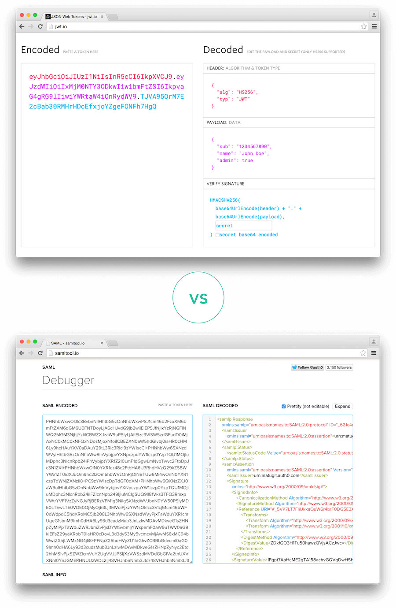
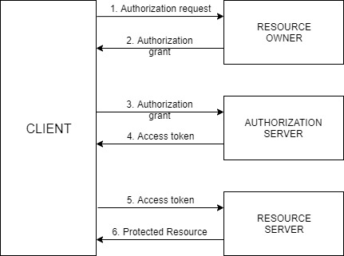
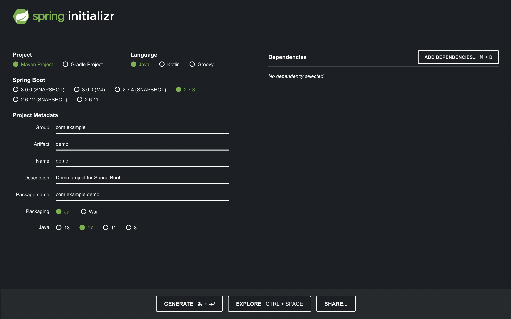
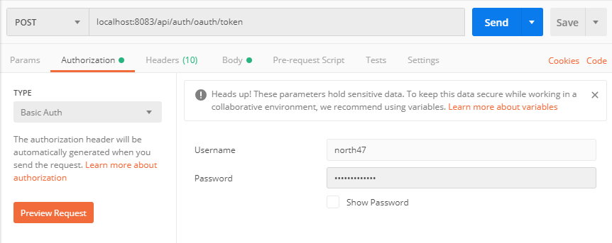
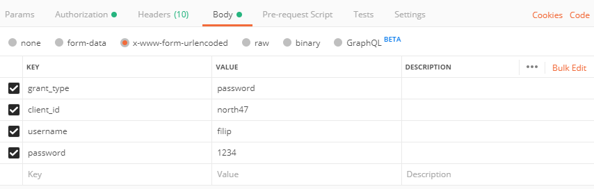
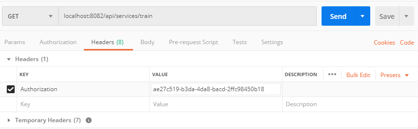

# Table of Content

 - [Securing Microservices with OAuth 2.0](#securing-microservices-with-oauth-20)
 - [JSON Web Tokens](#json-web-tokens)
 - [Securing your microservices with OAuth 2.0. Building Authorization and Resource server](#securing-your-microservices-with-oauth-20-building-authorization-and-resource-server)
 - [Related reading](#related-reading)
 - [Questions](#questions)
 
# Securing Microservices with OAuth 2.0

As MicroServices are becoming the new norm for the enterprise application development, securing those services is also becoming a challenging task. Thanks to OAuth 2.0 protocol which greatly simplified the work involved in developing and managing security services. This blog talks about the steps we need to follow to secure a microservice using OAuth 2.0

**Technology/Tools**

 - Spring Boot 
 - Maven 

**What is OAuth 2?** 

OAuth 2 is an authorization framework, a security concept for rest API( Read as MicroService), about how you authorize a user to get access to a resource from your resource server by using token.

**OAuth 2 has 4 different roles in this process.**

 - Resource Owner 
 - Client 
 - Authorization Server 
 - Resource Server

**Resource Owner**: Resource owner is the user, who authorizes an application to access their account.
**Client**: Client is the application, which is used by the user to get resources from the resource server.
**Authorization Server**: Authorization server will issue access tokens by authenticating the user and obtain authorization grant.

Authorization server issues two type of tokens, access_token and referesh_token.

The responsibility of access token is to access resource before it gets expired.
The responsibility of Refresh Token is to request for a new access token when the access token is expired. An authorization grant is a credential representing the resource owner’s authorization (to access its protected resources) used by the client to obtain an access token.
The specification defines 4 grant types:

 - Authorization code 
 - Implicit 
 - Resource owner password credentials 
 - Client credentials

[Which oauth flow to use?](https://auth0.com/docs/api-auth/which-oauth-flow-to-use)

Implicit grant type will not give refresh token. So you have to handle token renewal process, at the client side. Please check below link for how to implement silent authentication for different client applications(Angular, React,etc..).

[Silent authentication](https://auth0.com/docs/api-auth/tutorials/silent-authentication)

**Resource Server:** Resource server will be the host, where resources are deployed. Sometimes authorization and resource server will be the same server. The following diagram will tell about the flow.

Maven Dependency Configuration

In your spring boot application `pom.xml`, please add the following dependency.

```xml
<dependency>
    <groupId>org.springframework.cloud</groupId>
    <artifactId>spring-cloud-starter-oauth2</artifactId>
</dependency>
```

If you are using the in-memory client to store tokens using Redis server, then add the following dependency.

```xml
<dependency>
    <groupId>org.springframework.boot</groupId>
    <artifactId>spring-boot-starter-data-redis</artifactId>
</dependency>
```

**Authorization Server Configuration**

The authorization server is the one responsible for verifying credentials and if credentials are OK, providing the tokens. It also contains information about registered clients and possible access scopes and grant types. In this article, tokens are saving to an in-memory token store using Redis server. @EnableAuthorizationServer annotation enables an Authorization Server (i.e. an Authorization Endpoint and a TokenEndpoint) in the current application context. Class AuthServerConfig extends AuthorizationServerConfigurerAdapter which provides all the necessary methods to configure an Authorization server. CustomTokenEnricher class will provide the facility to enrich the response of OAuth/token endpoint. CustomAuthenticationProvider will be the authentication provider where you will authenticate the user.

```java
@EnableAuthorizationServer
@Configuration
public class AuthServerConfig extends AuthorizationServerConfigurerAdapter {

	@Autowired
	TokenStore tokenStore;

	@Autowired
	private AuthenticationManager authenticationManager;

	@Autowired
	private CustomTokenEnricher customTokenEnricher;

	@Autowired
	CustomUserDetailService userDetailsService;

	@Value(“${oauth.redirectUrl}”)
	String redirectUri;

	@Value(“${oauth.clientId}”)
	String clientId;

	@Value(“${oauth.scope}”)
	String scope;

	@Value(“${oauth.grantType}”)
	String grantType;

	@Value(“${oauth.accessTokenValidity.inSeconds}”)
	String accessTokenValidityInSeconds;

	@Value(“${oauth.secret}”)
	String secret;

	@Value(“${oauth.authorties}”)
	String authroties;

	@Override
	public void configure(AuthorizationServerEndpointsConfigurer endpoints) {
		endpoints.tokenStore(tokenStore).authenticationManager(authenticationManager)
			.userDetailsService(userDetailsService).tokenEnhancer(customTokenEnricher);
	}

	@Override
	public void configure(AuthorizationServerSecurityConfigurer security) throws Exception {
		security.tokenKeyAccess(“permitAll()”).checkTokenAccess(“hasRole(‘TRUSTED_CLIENT’)”)
			.allowFormAuthenticationForClients();
	}

	@Override
	public void configure(ClientDetailsServiceConfigurer clients) throws Exception {
		clients.inMemory().withClient(clientId).secret(secret).authorizedGrantTypes(grantType.split(“,”))
			.scopes(scope.split(“,”)).redirectUris(redirectUri).authorities(authroties)
			.accessTokenValiditySeconds(Integer.parseInt(accessTokenValidityInSeconds)).autoApprove(true);
	}

	public class CustomAuthenticationProvider implements AuthenticationProvider {

		@Autowired
		UserService userService;

		@Override
		public Authentication authenticate(Authentication authentication) throws AuthenticationException {
			UserTO user;
			String userName = authentication.getName();
			String password = authentication.getCredentials().toString();
			if (userName.contains(“@”) && userName.contains(“.”)) {
				user = userService.getUserByEmailId(userName);
			} else {
				user = userService.getUserByUsername(userName);
			}
			if (user == null) {
				throw new OAuth2Exception(“Invalid login credentials”);
			}
			BCryptPasswordEncoder bcrypt = new BCryptPasswordEncoder();
			if (bcrypt.matches(password, user.getPassword())) {
				List<GrantedAuthority> grantedAuths = new ArrayList<>();
				SecureUser secureUser = new SecureUser(user);
				UsernamePasswordAuthenticationToken usernamePasswordAuthenticationToken = new UsernamePasswordAuthenticationToken(secureUser, password, grantedAuths);
				return usernamePasswordAuthenticationToken;
			}
			return null;
		}

		@Override
		public boolean supports(final Class<?> authentication) {
			return authentication.equals(UsernamePasswordAuthenticationToken.class);
		}
	}
}
```

**Resource Server configuration**
Create a bean `ResourceServerConfig` that extends `ResourceServerConfigurerAdapter` and override `configure(HttpSecurity security)` method. Annotate it with `@EnableResourceServer` annotation. Here configured resource server is configured for this endpoints starting with `/user`. To skip authentication for user creation, override `configure(WebSecurity security)` method.

```java
@Configuration
@EnableWebSecurity
@EnableGlobalMethodSecurity(prePostEnabled = true)
@EnableResourceServer
public class SecurityConfig extends WebSecurityConfigurerAdapter {
	
	@Autowired
	CustomAuthentcationProvider authenticationProvider;

	@Override
	public void configure(AuthenticationManagerBuilder auth) {
		auth.authenticationProvider(authenticationProvider);
	}

	@Override
	public void configure(WebSecurity security) throws Exception {
		security.ignoring().antMatchers(“/user/create”);
	}

	@Override
	protected void configure(HttpSecurity http) throws Exception {
		http.requestMatchers().antMatchers(“/login”, “/oauth/authorize”,”/oauth/token”).and()
			.authorizeRequests().anyRequest().authenticated().and().formLogin().permitAll();
	}
}
```

# JSON Web Tokens

JSON web token (JWT), pronounced "jot", is an open standard ([RFC 7519](https://datatracker.ietf.org/doc/html/rfc7519)) that defines a compact and self-contained way for securely transmitting information between parties as a JSON object. Again, JWT is a standard, meaning that all JWTs are tokens, but not all tokens are JWTs.

Because of its relatively small size, a JWT can be sent through a URL, through a POST parameter, or inside an HTTP header, and it is transmitted quickly. A JWT contains all the required information about an entity to avoid querying a database more than once. The recipient of a JWT also does not need to call a server to validate the token.

## Benefits

There are benefits to using JWTs when compared to simple web tokens (SWTs) and Security Assertion Markup Language (SAML) tokens.

 - **More compact**: JSON is less verbose than XML, so when it is encoded, a JWT is smaller than a SAML token. This makes JWT a good choice to be passed in HTML and HTTP environments.



 - **More secure**: JWTs can use a public/private key pair in the form of an X.509 certificate for signing. A JWT can also be symmetrically signed by a shared secret using the HMAC algorithm. And while SAML tokens can use public/private key pairs like JWT, signing XML with XML Digital Signature without introducing obscure security holes is very difficult when compared to the simplicity of signing JSON. Read more about JWT [signing algorithms](https://auth0.com/docs/get-started/applications/signing-algorithms).
 - **More common**: JSON parsers are common in most programming languages because they map directly to objects. Conversely, XML doesn't have a natural document-to-object mapping. This makes it easier to work with JWT than SAML assertions.
 - **Easier to process**: JWT is used at internet scale. This means that it is easier to process on user's devices, especially mobile.

## Use

JWTs can be used in various ways:

 - **Authentication**: When a user successfully logs in using their credentials, an [ID token](https://auth0.com/docs/secure/tokens/id-tokens) is returned. According to the [OpenID Connect (OIDC) specs](https://openid.net/specs/openid-connect-core-1_0.html#IDToken), an ID token is always a JWT.
 - **Authorization**: Once a user is successfully logged in, an application may request to access routes, services, or resources (e.g., APIs) on behalf of that user. To do so, in every request, it must pass an Access Token, which may be in the form of a JWT. Single Sign-on (SSO) widely uses JWT because of the small overhead of the format, and its ability to easily be used across different domains.
 - **Information Exchange**: JWTs are a good way of securely transmitting information between parties because they can be signed, which means you can be sure that the senders are who they say they are. Additionally, the structure of a JWT allows you to verify that the content hasn't been tampered with.

## Security

The information contained within the JSON object can be verified and trusted because it is digitally signed. Although JWTs can also be encrypted to provide secrecy between parties, Auth0-issued JWTs are JSON Web Signatures (JWS), meaning they are signed rather than encrypted. As such, we will focus on signed tokens, which can verify the integrity of the claims contained within them, while encrypted tokens hide those claims from other parties.

In general, JWTs can be signed using a secret (with the HMAC algorithm) or a public/private key pair using RSA or ECDSA (although Auth0 supports only HMAC and RSA). When tokens are signed using public/private key pairs, the signature also certifies that only the party holding the private key is the one that signed it.

Before a received JWT is used, it should be [properly validated using its signature](https://auth0.com/docs/secure/tokens/json-web-tokens/validate-json-web-tokens). Note that a successfully validated token only means that the information contained within the token has not been modified by anyone else. This doesn't mean that others weren't able to see the content, which is stored in plain text. Because of this, you should never store sensitive information inside a JWT and should take other steps to ensure that JWTs are not intercepted, such as by sending JWTs only over HTTPS, following [best practices](https://auth0.com/docs/secure/tokens/token-best-practices), and using only secure and up-to-date libraries.

## Learn more

 - [JSON Web Token Structure](https://auth0.com/docs/secure/tokens/json-web-tokens/json-web-token-structure) 
 - [JSON Web Token Claims](https://auth0.com/docs/secure/tokens/json-web-tokens/json-web-token-claims)
 - [Validate JSON Web Tokens](https://auth0.com/docs/secure/tokens/json-web-tokens/validate-json-web-tokens)
 - [Signing Keys](https://auth0.com/docs/get-started/tenant-settings/signing-keys)
 - [JSON Web Key Sets](https://auth0.com/docs/secure/tokens/json-web-tokens/json-web-key-sets)
 - [Get Access Tokens](https://auth0.com/docs/secure/tokens/access-tokens/get-access-tokens)

# Securing your microservices with OAuth 2.0. Building Authorization and Resource server

We live in a world of microservices. They give us an easy opportunity to scale our application. But as we scale our application it becomes more and more vulnerable. We need to think of a way of how to protect our services and how to keep the wrong people from accessing protected resources. One way to do that is by enabling user authorization and authentication. With authorization and authentication, we need a way to manage credentials, check the access of the requester and make sure people are doing what they suppose to.

When we speak about Spring (Cloud) Security, we are talking about Service authorization powered by OAuth 2.0. This is how it exactly works:



The actors in this OAuth 2.0 scenario that we are going to discuss are:

 - **Resource Owner** – Entity that grants access to a resource, usually you!
 - **Resource Server** – Server hosting the protected resource
 - **Client** – App making protected resource requests on behalf of a resource owner
 - **Authorization server** – server issuing access tokens to clients

The client will ask the resource owner to authorize itself. When the resource owner will provide an authorization grant with the client will send the request to the authorization server. The authorization server replies by sending an access token to the client. Now that the client has access token it will put it in the header and ask the resource server for the protected resource. And finally, the client will get the protected data.

Now that everything is clear about how the general OAuth 2.0 flow is working, let’s get our hands dirty and start writing our resource and authorization server!

## Building OAuth2.0 Authorization server

Let’s start by creating our authorization server using the [Spring Initializr](https://start.spring.io/). Create a project with the following configuration:

 - **Project**: Maven Project
 - **Artefact**: auth-server
 - **Dependencies**: Spring Web, Cloud Security, Cloud OAuth2



Download the project, copy it into your workspace and open it via your IDE. Go to your main class and add the `@EnableAuthorizationServer` annotation.

```java
@SpringBootApplication
@EnableAuthorizationServer
public class AuthServerApplication {
 
    public static void main(String[] args) {
        SpringApplication.run(AuthServerApplication.class, args);
    }
 
}
```

Go to the application.properties file and make the following modification:

 - Change the server port to 8083 
 - Set the context path to be “/api/auth” 
 - Set the client id to “north47” 
 - Set the client secret to “north47secret” 
 - Enable all authorized grant types 
 - Set the client scope to read and write

```yaml
server.port=8083
 
server.servlet.context-path=/api/auth
 
security.oauth2.client.client-id=north47
security.oauth2.client.client-secret=north47secret
security.oauth2.client.authorized-grant-types=authorization,password,refresh_token,password,client_credentials
security.oauth2.client.scope=read,write
```

The client id is a public identifier for applications. The way that we used it is not a good practice for the production environment. It is usually a 32-character hex string so it won’t be so easy guessable.

Let’s add some users into our application. We are going to use in-memory users and we will achieve that by creating a new class `ServiceConfig`. Create a package called `config` with the following path: `com.north47.authserver.config` and in there create the above-mentioned class:

```java
@Configuration
public class ServiceConfig extends GlobalAuthenticationConfigurerAdapter {
 
    @Override
    public void init(AuthenticationManagerBuilder auth) throws Exception {
        auth.inMemoryAuthentication()
                .withUser("filip")
                .password(passwordEncoder().encode("1234"))
                .roles("ADMIN");
    }
 
    @Bean
    public BCryptPasswordEncoder passwordEncoder() {
        return new BCryptPasswordEncoder();
    }
}
```

With this we are defining one user with username: `filip` and password: `1234` with a role `ADMIN`. We are defining that `BCryptPasswordEncoder` bean so we can encode our password.

In order to authenticate the users that will arrive from another service we are going to add another class called UserResource into the newly created package resource (`com.north47.autserver.resource`):

```java
@RestController
public class UserResource {
 
    @RequestMapping("/user")
    public Principal user(Principal user) {
        return user;
    }
}
```

When the users from other services will try to send a token for validation the user will also be validated with this method.

And that’s it! Now we have our authorization server! The authorization server is providing some default endpoints which we are going to see when we will be testing the resource server.

## Building Resource Server

Now let’s build our resource server where we are going to keep our secure data. We will do that with the help of the [Spring Initializr](https://start.spring.io/). Create a project with the following configuration:

 - **Project**: Maven Project
 - **Artefact**: resource-server
 - **Dependencies**: Spring Web, Cloud Security, Cloud OAuth2


Download the project and copy it in your workspace. First, we are going to create our entity called Train. Create a new package called domain into `com.north47.resourceserver` and create the class there.

```java
public class Train {
 
    private int trainId;
    private boolean express;
    private int numOfSeats;
 
    public Train(int trainId, boolean express, int numOfSeats) {
        this.trainId = trainId;
        this.express = express;
        this.numOfSeats = numOfSeats;
    }
 
   public int getTrainId() {
        return trainId;
    }
 
    public void setTrainId(int trainId) {
        this.trainId = trainId;
    }
 
    public boolean isExpress() {
        return express;
    }
 
    public void setExpress(boolean express) {
        this.express = express;
    }
 
    public int getNumOfSeats() {
        return numOfSeats;
    }
 
    public void setNumOfSeats(int numOfSeats) {
        this.numOfSeats = numOfSeats;
    }
 
}
```

Let’s create one resource that will expose an endpoint from where we can get the protected data. Create a new package called resource and there create a class TrainResource. We will have one method only that will expose an endpoint behind we can get the protected data.

```java
@RestController
@RequestMapping("/train")
public class TrainResource {
 
 
    @GetMapping
    public List<Train> getTrainData() {
 
        return Arrays.asList(new Train(1, true, 100),
                new Train(2, false, 80),
                new Train(3, true, 90));
    }
}
```

Let’s start the application and send a GET request to [http://localhost:8082/api/services/train](http://localhost:8082/api/services/train). You will be asked to enter a username and password. The username is user and the password you can see from the console where the application was started. By entering this credentials will give the protected data.

Let’s change the application now to be a resource server by going to the main class `ResourceServerApplication` and adding the annotation `@EnableResourceServer`.

```java
@SpringBootApplication
@EnableResourceServer
public class ResourceServerApplication {
 
    public static void main(String[] args) {
        SpringApplication.run(ResourceServerApplication.class, args);
    }
 
}
```

Go to the application properties file and do the following changes:

```yaml
server.port=8082
server.servlet.context-path=/api/services
security.oauth2.resource.user-info-uri=http://localhost:8083/api/auth/user 
```

What we have done here is:

 - Changed our server port to 8082 
 - Set context path: /api/services 
 - Gave user info URI where the user will be validated when he will try to pass a token

Now if you try to get the protected data by sending a GET request to [http://localhost:8082/api/services/train](http://localhost:8082/api/services/train) the server will return to you a message that you are unauthorized and that full authentication is required. That means that without a token you won’t be able to access the resource.

So that means that we need a fresh new token in order to get the data. We will ask the authorization server to give us a token for the user that we previously created. Our client in this scenario will be the postman. The authorization server that we previously created is exposing some endpoints out of the box. To ask the authorization server for a fresh new token send a POST request to the following URL: localhost:8083/api/auth/oauth/token.

As it was said previously that postman in this scenario is the client that is accessing the resource, it will need to send the client credentials to the authorization server. Those are the client id and the client secret. Go to the authorization tab and add as a username the client id (north47) and the password will be the client secret (north47secret). On the picture below is presented how to set the request:



What is left is to say the username and password of the user. Open the body tab and select x-www-form-urlencoded and add the following values:

 - key: ‘grant_type’, value: ‘password’
 - key: ‘ client_id’, value: ‘north47’
 - key: ‘ username’, value: ‘filip’
 - key: ‘password’, value ‘1234’



Press send and you will get a response with the access_token:

```json
{
    "access_token": "ae27c519-b3da-4da8-bacd-2ffc98450b18",
    "token_type": "bearer",
    "refresh_token": "d97c9d2d-31e7-456d-baa2-c2526fc71a5a",
    "expires_in": 43199,
    "scope": "read write"
}
```

Now that we have the access token we can call our protected resource by inserting the token into the header of the request. Open postman again and send a GET request to localhost:8082/api/services/train. Open the header tab and here is the place where we will insert the access token. For a key add “Authorization” and for value add “Bearer ae27c519-b3da-4da8-bacd-2ffc98450b18”.



And there it is! You have authorized itself and got a new token which allowed you to get the protected data.

You can find the projects in our repository:

 - [Resource server](https://gitlab.com/47northlabs/public/spring-oauth2/resource-server)
 - [Authorization server](https://gitlab.com/47northlabs/public/spring-oauth2/auth-server)

# Related reading

 - [Securing Microservices with OAuth 2.0](https://walkingtreetech.medium.com/securing-microservices-with-oauth-2-0-49be2db8d832)
 - [JSON Web Tokens](https://auth0.com/docs/secure/tokens/json-web-tokens)
 - [Securing your microservices with OAuth 2.0. Building Authorization and Resource server](https://www.north-47.com/knowledge-base/securing-your-microservices-with-oauth-2-0-building-authorization-and-resource-server/)
 - [Spring Security With Auth0](https://www.baeldung.com/spring-security-auth0)
 - [Secure Spring Boot RESTful Service using Auth0 JWT](https://o7planning.org/11677/secure-spring-boot-restful-service-using-auth0-jwt)
 - [JWT Token Debugger](https://jwt.io/)
 - [The OAuth 2.0 Authorization Framework](https://datatracker.ietf.org/doc/html/rfc6749)
 - [JSON Web Token (JWT)](https://datatracker.ietf.org/doc/html/rfc7519)
 - [The OAuth 2.0 Authorization Framework: Bearer Token Usage](https://datatracker.ietf.org/doc/html/rfc6750)
 - [OAuth 2.0 Security Best Current Practice](https://datatracker.ietf.org/doc/html/draft-ietf-oauth-security-topics-15)
 - [Spring: Spring Security](https://www.linkedin.com/learning/spring-spring-security/welcome?autoAdvance=true&autoSkip=false&autoplay=true&resume=true&u=2113185) [Video course]

# Questions

 - What is the difference between Authorization and Authentication?
 - What is OAuth 2?
 - Should OAuth 2.0 Require HTTPS for Any Unsigned Request?
 - Should the Normalized Request String Get Sent with the Request?
 - What is JWT token?
 - What are the main parts of the JWT token? 