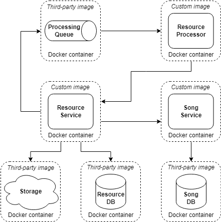

# Module 4: Containerization

## Table of contents

- [What to do](#what-to-do)
- [Sub-task 1: Dockerfiles](#sub-task-1-dockerfiles)
- [Sub-task 2: Docker Compose](#sub-task-2-docker-compose)

## What to do

This module focuses on containerizing services and configuring them with Docker Compose, including databases, a message broker, and cloud storage emulation. You need to create Dockerfiles for all microservices (if not already present) and configure a containerized environment using Docker Compose, integrating databases, a message broker, and S3 emulation.

As part of this setup, include health checks for both services and resources to ensure that each component is fully operational before dependent services start. Use `depends_on` with conditions like `service_healthy` to control startup order and improve reliability, but also remember that `depends_on` itself doesn’t wait for services to be fully ready; health checks ensure this readiness.

All services and resources should be deployable using `docker compose up -d --build` and functional without extra manual setup.

## Sub-task 1: Dockerfiles

### 1. Create Dockerfiles for each microservice (if not already present)

- Use **two-stage builds** to separate build and runtime environments, optimizing image size.
- Use **dependency caching**.
- Use `WORKDIR` to set the working directory.
- Use `COPY` for file transfers.
- Use `EXPOSE` to define the application port.
- Avoid hardcoding file names (e.g., use wildcards for JAR files).
- Set the default command with `CMD`.

### 2. Test docker images

- Build Docker images for each microservice.
- Verify each service starts and responds on its defined port using Postman or other tool.


## Sub-task 2: Docker Compose

### 1. Resource containers

Set up additional containers for required resources:

- **Database (PostgreSQL)**:
    - Use [Alpine-based PostgreSQL](https://hub.docker.com/_/postgres/tags?name=17-alpine).
    - Define configuration in `.env`.
    - Mount `initdb` directory to `docker-entrypoint-initdb.d` for automatic schema setup.
    - Add a health check to confirm service readiness.

- **S3 emulator (LocalStack)**:
    - Use [LocalStack](https://hub.docker.com/r/localstack/localstack) with only the `S3` service enabled.
    - Define configuration in `.env`.
    - Add a health check to confirm service readiness.

- **Message broker (ActiveMQ or RabbitMQ)**:
    - **ActiveMQ option**:
        - Use the [ActiveMQ Docker image](https://hub.docker.com/r/rmohr/activemq).
        - Define configuration in `.env`.
        - Expose ActiveMQ’s ports (e.g., 8161 for the web console, 61616 for messaging).
        - Add a health check to ensure ActiveMQ is running.

    - **RabbitMQ option**:
        - Use the [RabbitMQ Docker image](https://hub.docker.com/_/rabbitmq).
        - Define configuration in `.env`.
        - Expose RabbitMQ’s ports (e.g., 5672 for messaging, 15672 for the web console).
        - Add a health check to verify RabbitMQ is operational.

### 2. Microservice containers

Define each microservice in `docker-compose.yml` and configure dependencies as shown:

- **Environment variable management**:
    - Define environment variables in `.env`.
    - Avoid hardcoding values in `application.properties` or `application.yml`.

- **Health checks**:
    - Add health checks for each microservice to ensure they are fully operational.

- **Dependency management with `depends_on`**:
    - Use `depends_on` with `condition: service_healthy` to ensure critical services (like databases, message brokers, and Eureka server) are ready before starting dependent microservices. For example:
      ```yaml
      depends_on:
        postgres:
          condition: service_healthy
      ```
    - **Note**: `depends_on` controls only the order of container startup, not waiting for services to be fully ready. Therefore, include health checks for each service to ensure they are operational before starting dependent services.


   

### 3. Execution requirements

Although the primary goal of this task is **full containerization** of all services and resources, the applications should also be able to run locally for **testing and debugging purposes**. This flexibility allows services to be executed on the local machine while still connecting to containerized resources.

Ensure the application can be executed both **locally** and entirely within **Docker Compose** without requiring configuration changes or profile switching:

- **Local execution**: Only the **resource containers** (database, message broker, S3 emulator) should run in Docker, while each **microservice** should run directly on the local machine. The application should use default values specified in `application.properties` or `application.yml` to connect to the resource containers.

- **Docker execution**: In this mode, both **microservices** and **resource containers** run fully within Docker Compose. Docker Compose should pull configuration values from the `.env` file automatically, allowing the containerized environment to use the necessary settings without manual adjustments.

This approach supports a flexible setup for development and testing while ensuring consistent configuration in both local and fully containerized environments.

### 4. Final testing

1. Use `docker compose up -d --build` to start both microservices and resource containers in Docker.
2. Use Postman or another tool to verify that all services are operational and interacting correctly.


