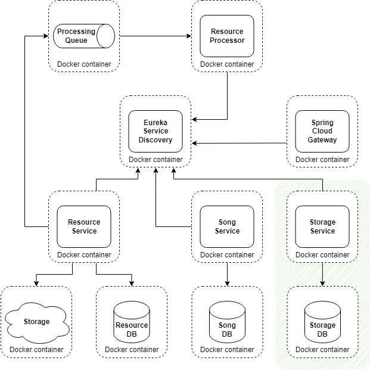
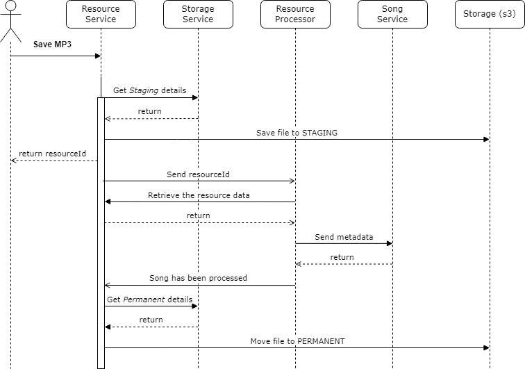

# Module 6: Fault tolerance in microservices environment

## Table of contents

- [What to do](#what-to-do)
- [Sub-task 1: Implement Storage Service](#sub-task-1-implement-storage-service)
- [Sub-task 2: Implement Circuit Breaker](#sub-task-2-implement-circuit-breaker)

## What to do

In this module, you will implement fault tolerance in microservices communications by introducing a circuit breaker. The following steps guide you through the process:

1. Introduce an element to simulate near-static data, as the current implementation lacks such functionality. This will emulate the behavior of a stubbed circuit breaker.
2. Files must be categorized into specific states based on the processing phase:
   - **STAGING**: File is in processing.
   - **PERMANENT**: File has been successfully processed.
3. A dedicated **Storage Service** must be created to store and manage these states. The **Resource Service** will interact with the **Storage Service** to retrieve state details.
4. In the event of **Storage Service** unavailability, the **Resource Service** must implement a fault tolerance pattern to ensure continuous operation.


## Sub-task 1: Implement Storage Service

### 1. Create the service

Develop and implement an independent microservice with a CRUD API to represent the Storage concept. This service will manage **storage** types.

Previously, the **Resource Service** utilized its own configuration to access data stores (**S3 buckets**). This configuration must now be migrated to the new service.

Upon starting the **Storage Service**, at least two different storage types (**Storage objects**) must be pre-created in the database. These will be utilized by the **Resource Service**. Corresponding storage buckets must also be created in **localstack**.

A **Storage object** is restricted to the following **storageType** values:
- **STAGING**: Represents staging storage.
- **PERMANENT**: Represents permanent storage.

Each type must have a unique bucket path. Additional storage types can be created via the Storage Service API.


### 2. Storage Service API

#### 1. Create storage

```
POST /storages
```

**Description**: Adds a new storage entry.

**Request:**

- **Content-Type:** application/json
- **Body:** JSON object representing storage details

```json
{
  "storageType": "PERMANENT",
  "bucket": "bucket_name",
  "path": "/files"
}
```

**Response:**

```json
{
    "id": 1
}
```

- **Description:** Returns the ID of successfully created storage.

**Status Codes**:

- **200 OK** – Storage created successfully.
- **400 Bad Request** – Validation errors in the request body.
- **500 Internal Server Error** – An error occurred on the server.

---

#### 2. Get all storages

```
GET /storages
```

**Description**: Retrieves the list of all storage entries.

**Response**:

```json
[
  {
    "id": 1,
    "storageType": "PERMANENT",
    "bucket": "bucket_name",
    "path": "/files"
  }
]
```

**Status Codes**:

- **200 OK** – Storages retrieved successfully.
- **500 Internal Server Error** – An error occurred on the server.

---

#### 3. Delete storages

```
DELETE /storages?id=1,2
```

**Description:** Deletes specified  storages by their IDs. If a storage does not exist, it is ignored without causing an error.

**Parameters:**

- `id` (String): Comma-separated list of storage IDs to remove.
- **Restriction:** CSV string length must be less than 200 characters.

- **Description:** Returns an array of the IDs of successfully deleted storages.

**Status codes:**

- **200 OK** – Request successful, storages deleted as specified.
- **400 Bad Request** – CSV string format is invalid or exceeds length restrictions.
- **500 Internal Server Error** – An error occurred on the server.

> **Note**: In the local database, only general information about storage types is stored, not the state of individual files.

### 3. Enable interaction with the Storage Service

The system must be updated to interact with the new **Storage Service** as follows:

- Depending on the file processing state, files will be stored in different locations (paths or folders). The **Storage Service** must be queried to retrieve details about each state and the corresponding storage path.
- When a new file is received by the **Resource Service** for processing, it must be saved in **STAGING** storage. The file state and path must then be updated in the Resource Service database before sending the file for further processing.
- After successfully processing a file, the **Resource Processor** must send an asynchronous message to the **Resource Service** to indicate the song file has been successfully processed.
- Upon receiving a notification from the **Resource Processor**, the **Resource Service** must:
   - Query the **Storage Service** to retrieve details for the **PERMANENT** storage location.
   - Update the file state to **PERMANENT**.
   - Move the file from its current location to the **PERMANENT** storage location.
   - Update the file's storage details in the Resource Service database.

Refer to the diagrams below for clarification:



<hr>



> **Note**: Additional file states can be implemented based on system requirements. However, start with two states to minimize complexity.


## Sub-task 2: Implement Circuit Breaker

If the **Storage Service** becomes unavailable, the system must continue to operate without significant disruption. In such cases, stub data should be stored in the **Resource Service** to emulate the response from the **Storage Service**. The emulated response must match the structure and format of the actual response from the **Storage Service**.

Implement the circuit breaker pattern to ensure fault tolerance:

1. Integrate the [Resilience4j](https://mvnrepository.com/artifact/io.github.resilience4j/resilience4j-circuitbreaker) library into the **Resource Service**.
2. Configure the circuit breaker for operations involving calls to the **Storage Service** (e.g., retrieving storage details).
3. Implement logic to return stub data if the **Storage Service** is unavailable. The stub response should mimic the structure of the actual service's response.
4. Simulate service failure by shutting down the **Storage Service**, and test the circuit breaker functionality to ensure proper fallback mechanisms are in place.
