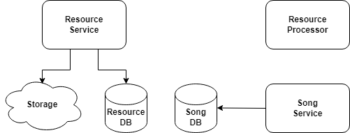

# Module 1: Microservice architecture overview

## Table of contents

- [What to do](#what-to-do)
- [Sub-task 1: Resource Service](#sub-task-1-resource-service)
- [Sub-task 2: Resource Processor](#sub-task-2-resource-processor)

## What to do

This task involves enhancing an existing microservices architecture by modifying the current **Resource Service** and adding a new microservice called **Resource Processor**. The starting point for this work is an artifact from the [Introduction to Microservices](https://git.epam.com/epm-cdp/global-java-foundation-program/java-courses/-/tree/main/introduction-to-microservices) program.

The main objectives are:

1. Make structural changes to the existing **Resource Service**.
2. Develop a new microservice called **Resource Processor**.

## Sub-task 1: Resource Service

For the **Resource Service**, you need to implement the following modifications:

1. **Use Cloud Storage**: Replace the current database storage for resource files with a cloud storage solution, such as an emulator (e.g., [S3 emulator](https://github.com/localstack/localstack)). The resource files were previously saved in the service database.

2. **Resource Tracking**: Update the underlying database to track the resource by storing its location in the cloud storage.

3. **Upload Process**: When a user uploads an MP3 file, the **Resource Service** should:
    - Store the original MP3 file in the cloud storage (or its emulation).
    - Save the file's location (i.e., the link in cloud storage) in the database.
    - Note: In the current module, the **Resource Service** should not call any other services during this process.

## Sub-task 2: Resource Processor

The **Resource Processor** microservice will be responsible for processing MP3 files in the upcoming modules. It will not have a web interface and, in the current module, should be implemented as a basic Spring Boot application with minimal configuration.

- **Initial Functionality**: The service should be able to extract metadata from an MP3 file for future use with the **Song Service** API. You can use an external library like [Apache Tika](https://www.tutorialspoint.com/tika/tika_extracting_mp3_files.htm) to handle the metadata extraction.

- **Basic Spring Boot Setup**: Implement the initial version of the service as a standard Spring Boot project.

The diagram below illustrates the overall microservice architecture:

