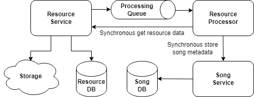
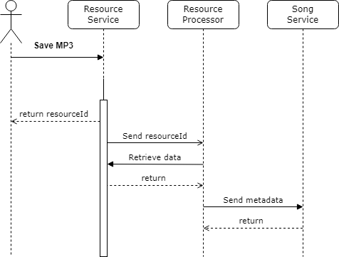

# Module 2: Microservices communication

## Table of contents

- [What to do](#what-to-do)
- [Sub-task 1: Asynchronous communication](#sub-task-1-asynchronous-communication)
- [Sub-task 2: Event handling](#sub-task-2-event-handling)
- [Sub-task 3: Retry mechanism](#sub-task-3-retry-mechanism)

## What to do

This module aims to enhance the existing microservices by introducing cross-service communication. This involves integrating **Resource Service** and **Resource Processor** using both asynchronous messaging and synchronous calls.

## Sub-task 1: Asynchronous communication

1. **Add asynchronous messaging**: Set up asynchronous communication between the **Resource Service** and **Resource Processor** using a messaging broker.
2. **Send resource details**: Upon successful resource upload, the **Resource Service** should send a message to the **Resource Processor** containing the `resourceId`.

   You can use any messaging broker, such as [RabbitMQ](https://hub.docker.com/_/rabbitmq), [ActiveMQ](https://hub.docker.com/r/rmohr/activemq), or another broker of your choice. It is recommended to consult an expert for the best fit for your use case.

## Sub-task 2: Event handling

1. **Event-triggered processing**: When the **Resource Processor** receives a message from the queue, it should:
    - Make a **synchronous call** to the **Resource Service** to retrieve the resource data (in binary format).
    - Extract the metadata from the resource.
    - Make another **synchronous call** to the **Song Service** to save the extracted song metadata.

2. **Queue listening/subscription**: Implement a mechanism for listening to events in the queue. For example, you could use [Spring Cloud Stream with RabbitMQ](https://docs.spring.io/spring-cloud-stream-binder-rabbit/docs/current/reference/html/spring-cloud-stream-binder-rabbit.html).

## Sub-task 3: Retry mechanism

Implement a **retry mechanism** to enhance the reliability of communication between services. This applies to both asynchronous and synchronous communications, ensuring that temporary issues do not result in permanent failures.

Options for implementing the retry mechanism include:

1. **Retry Pattern**: Use a [Retry Pattern](https://docs.microsoft.com/en-us/azure/architecture/patterns/retry) to handle transient failures gracefully.
2. **Spring Retry Tools**:
   - Utilize [Spring Retry Template](https://docs.spring.io/spring-batch/docs/current/reference/html/retry.html) to implement retry logic for communication issues.
   - Alternatively, use annotations such as `@Retryable` to simplify retry implementation.

Refer to the diagrams below for clarification:

