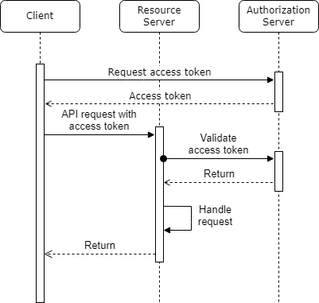

# Module 8: Security

## Table of contents

- [What to do](#what-to-do)
- [Sub-task 1: Security](#sub-task-1-security)
- [Sub-task 2: UI Application (Optional)](#sub-task-2-ui-application-optional)
- [Useful links](#useful-links)

## What to do

In this module, you need to implement OAuth security for a microservice architecture. You can choose to use an external
authentication provider or create your own authorization server using Spring Authorization Server or Keycloak. Discuss
with the experts the best approach based on your project requirements.

## Sub-task 1: Security

1. **Implement two roles:**
    - **Admin**: Full access to all actions (POST, DELETE, GET).
    - **User**: Limited to GET requests only.

2. **Protect API endpoints**:
    - Protect **Storage API**'s POST and DELETE methods, allowing access only for **Admin** users.
    - Ensure **User** role can only access **GET** requests for retrieving resources, not modifying them.
    - Implement security mechanisms using **JWT tokens** to control access to these endpoints.

3. **Authentication provider**:
   Choose and configure an authentication provider:
    - Use an **external OAuth2 provider** (e.g., Google, Auth0) or
    - Set up your own provider using **Spring Authorization Server** or **Keycloak**.
      Ensure the authentication provider supports issuing and validating **JWT tokens** for secure API access.

4. **JWT token verification**:
   Implement a mechanism to validate JWT tokens for both **Admin** and **User** roles.
    - Ensure that the system checks if the token is valid, and extracts user roles from the token.
    - If necessary, create a custom filter to handle JWT validation before the request reaches your endpoints.

5. **Access verification**:
    - Use **Postman** or another API client tool to test the API:
        - Verify that **Admin** users can access POST and DELETE methods.
        - Verify that **User** users can only access GET methods.
        - Ensure that any unauthorized request (e.g., without a valid JWT) receives the appropriate **401 Unauthorized**
          or **403 Forbidden** response.
    - Ensure the API behaves as expected when a user tries to access an endpoint they do not have permissions for.

### OAuth 2.0 authentication flow

The diagram below illustrates the OAuth 2.0 authentication flow:

1. **Client** requests an access token from the **Authorization Server**.
2. The **Authorization Server** responds with an **access token**.
3. The **Client** sends an **API request** with the **access token** to the **Resource Server**.
4. The **Resource Server** validates the token with the **Authorization Server**.
5. If the token is valid, the **Resource Server** handles the request and returns the response.

## Sub-task 2: UI Application (Optional)

1. **Develop a simple UI application**:
    - Create a user interface that includes:
        - **Storages table**:
            - Display a table for both **Users** and **Admins**, listing existing storage entries (e.g., storage type,
              bucket name, path).
            - Include options for **Admins** to delete entries.
        - **Storage form**:
            - Allow **Admins** to add new storage entries with fields such as storage type, bucket name, and path.

2. **Integrate with the Authentication Provider**:
    - Connect the UI with an **authentication provider** (e.g., Spring Authorization Server, Keycloak, or another
      external provider).
    - Add login and logout functionality. Redirect unauthenticated users to the login page.
    - Secure communication with the API using **JWT tokens**:
        - Include the token in the authorization header for all API requests.

---

## Useful Links

### **Spring Authorization Server**
- [Spring Security OAuth Authorization Server](https://www.baeldung.com/spring-security-oauth-auth-server)  
  A tutorial by **Baeldung** that provides a step-by-step guide to setting up your own OAuth 2.0 Authorization Server using Spring Security OAuth, covering server configuration and OAuth2 protocols.

### **Keycloak samples**
- [A Quick Guide to OAuth2 With Spring Boot And Keycloak](https://www.baeldung.com/spring-boot-keycloak)  
  A **Baeldung** tutorial explaining how to secure Spring Boot applications using Keycloak, covering OAuth2 and OpenID Connect integration.
- [Secure Spring Boot Application With Keycloak](https://dzone.com/articles/secure-spring-boot-application-with-keycloak)  
  A guide on **DZone** that demonstrates how to integrate Keycloak into a Spring Boot application for authentication and authorization, securing the app with OAuth2.

### **General**
- [The OAuth 2.0 Authorization Framework](https://datatracker.ietf.org/doc/html/rfc6749)  
  The official **IETF** specification for OAuth 2.0, offering detailed insights into OAuth2 protocols and authorization flows.
- [OAuth2 Boot](https://docs.spring.io/spring-security-oauth2-boot/docs/current/reference/html5/)  
  A reference guide by **Spring** providing documentation on configuring and integrating OAuth2 with Spring Boot applications.
