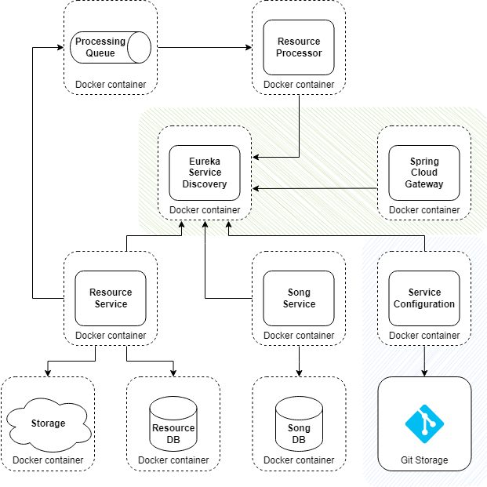

# Module 5: Service discovery

## Table of contents

- [What to do](#what-to-do)
- [Sub-task 1: Service Registry](#sub-task-1-service-registry)
- [Sub-task 2: API Gateway](#sub-task-2-api-gateway)
- [Sub-task 3: Configuration Service (Optional)](#sub-task-3-configuration-service-optional)

## What to do

In this module, you will enhance the application’s architecture by configuring an **API Gateway** and optionally implementing a centralized **Configuration Service**. This builds upon the **Service Registry (Eureka)** already implemented in the third module of the "Introduction to Microservices" course. The goal is to ensure seamless service discovery, client-side load balancing, and centralized configuration management. Sample implementation: [Spring Cloud Tutorial - Spring Cloud Gateway + Netflix Eureka Example](https://www.javainuse.com/spring/cloud-gateway-eureka).

## Sub-task 1: Service Registry

This sub-task builds upon the Service Registry (Eureka) introduced in the third module of the "Introduction to Microservices" course. All foundational implementations, such as service registration and discovery, should already be in place. Ensure that the setup is properly configured and fully operational both locally and in Docker environments. Make the necessary adjustments if any configurations or dependencies require updates to align with the new services being added.

## Sub-task 2: API Gateway

1. **Develop and configure the API Gateway application**:

   - Develop a **Spring Cloud Gateway** application that will serve as a single entry point for all external traffic.
   - Configure the API Gateway to run in the local environment, ensuring it works seamlessly with local services.
   - Once the local setup is confirmed, add a container for the API Gateway in the Docker Compose setup to handle traffic when running in Docker.
   - Define routing rules in the API Gateway to forward requests to the appropriate service. Use service names registered in Eureka to dynamically resolve destinations.
   - Ensure the API Gateway is registered with Eureka and can dynamically route traffic based on service discovery, both in the local and Docker environments.

2. **Handle errors**:

   - Implement global error handling in the API Gateway for scenarios such as service unavailability or undefined routes.
   - Return user-friendly error responses to external clients.

3. **Test API Gateway**:

   - Verify that all external requests are routed through the API Gateway, whether the application is running in Docker or locally.
   - Ensure proper load balancing and routing logic are applied for services with multiple instances in Docker environment.

## Sub-task 3: Configuration Service (Optional)

1. **Centralized configuration repository**:

    - Create a Git repository to store all service configuration files in one place.

2. **Set up configuration service**:

    - Use Spring Cloud Config Server to serve configurations from the Git repository.
    - Add the Config Server as a container in Docker Compose and register it with Eureka.

3. **Configure client services**:

    - Update one or more services to fetch their configurations from the Config Server.
    - Use Spring Boot’s `spring-cloud-starter-config` dependency to enable this functionality.

4. **Enable dynamic refresh**:

    - Implement the Spring Boot Actuator endpoint `/actuator/refresh` to allow runtime configuration refresh without restarting the application.

5. **Test configuration management**:

    - Change a configuration in the Git repository and verify that it propagates to the client services.
